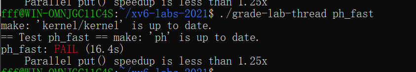
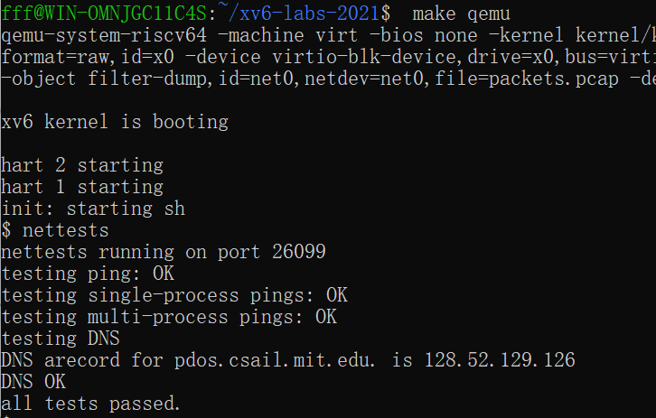
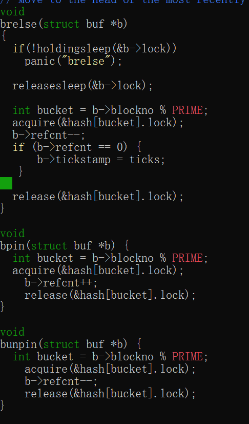
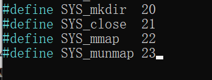

# OS_xv6 实验报告

*2252426 付柏瑞*

实验地址：https://pdos.csail.mit.edu/6.828/2021/

代码和报告地址：https://github.com/Fubbrr/OS_xv6

- 代码在各个分支中，报告在main分支中

[TOC]

## Tools&Guidance

**安装[适用于 Linux 的 Windows 子系统](https://docs.microsoft.com/en-us/windows/wsl/install-win10)**

- 启用虚拟化命令并将WSL的默认版本设置为WSL2

以管理员的方式运行Powershell并在命令行中输入以下内容：

```
dism.exe /online /enable-feature /featurename:Microsoft-Windows-Subsystem-Linux /all /norestart

wsl --set-default-version 2
```


- 在 Windows 中，您可以访问*“\\wsl$\”*目录下的所有 WSL 文件。例如，Ubuntu 20.04 安装的主目录应 位于 *“\\wsl$\Ubuntu-20.04\home\<username>\”。*
- 从 [Microsoft Store 添加 Ubuntu 20.04](https://www.microsoft.com/en-us/p/ubuntu/9nblggh4msv6)，设置用户名和密码


- 安装此类所需的所有软件

```
sudo apt-get update && sudo apt-get upgrade

sudo apt-get install git build-essential gdb-multiarch qemu-system-misc gcc-riscv64-linux-gnu binutils-riscv64-linux-gnu
```

- 测试安装

  ```
  qemu-system-riscv64 --version
  
  riscv64-linux-gnu-gcc --version
  ```


一些指针常见习语特别值得记住：

- 如果 ， 则 和 是不同的数字：第一个是 but 第二个是 。 当向指针添加整数时，如第二种情况， 整数隐式乘以对象的大小 指针指向。`int *p = (int*)100``(int)p + 1``(int)(p + 1)``101``104`
- `p[i]`定义为与 相同 ， 引用 p 指向的内存中的第 i 个对象。 上述添加规则有助于此定义起作用 当对象大于 1 字节时。`*(p+i)`
- `&p[i]`与 相同，生成 p 指向的内存中第 i 个对象的地址。`(p+i)`

尽管大多数 C 程序从来不需要在指针和整数之间进行强制转换， 操作系统经常这样做。 每当看到涉及内存地址的添加时， 问问自己是整数加法还是指针加法 并确保所添加的值适当地乘以 或者没有。

- 您可能会发现 print 语句可能会产生大量输出 您想要搜索的;一种方法是在`脚本`中运行 `make qemu`（在您的机器上运行），它会将所有控制台输出记录到 文件，然后您可以搜索该文件。别忘了 退出`脚本`。man script

- 在许多情况下，print 语句就足够了，但是 有时能够单步执行某些汇编代码或 检查堆栈上的变量很有帮助。要将 gdb 与 xv6，在一个窗口中运行 make， 在另一个 run （or ） 中 窗口，设置一个中断点，然后是 'c' （continue）， xv6 将运行，直到它命中 断点。（请参阅[使用 GNU 调试器](https://pdos.csail.mit.edu/6.828/2019/lec/gdb_slides.pdf)以获取有用的 GDB 提示。make qemu-gdbgdbriscv64-linux-gnu-gdb

- 如果您想查看编译器的程序集是什么 生成内核或找出指令所在的位置 一个特定的内核地址，请参阅 `kernel.asm` 文件，其中 Makefile 在编译内核时生成。（Makefile 还为所有用户程序生成 `.asm`。

- 如果内核 panic，它将打印一条错误消息，列出 崩溃时 program counter 的值;您可以 搜索 `kernel.asm` 以找出程序在哪个函数中 counter 是崩溃时，或者你可以运行 （run 了解详细信息）。如果要获取回溯，请使用 gdb 重新启动：运行 在一个窗口中运行 gdb（或 riscv64-linux-gnu-gdb）在 另一个窗口，在 panic 中设置断点 （'B panic'），然后是 后跟 'c' （continue）。当内核达到断点时， 键入 'bt' 以获取回溯。addr2line -e kernel/kernel *pc-value*man addr2line

- 如果您的内核挂起（例如，由于死锁）或无法执行 进一步（例如，由于执行内核时的页面错误 指令），您可以使用 gdb 来找出它的悬挂位置。跑 在一个窗口中运行 'make qemu-gdb'，运行 gdb （riscv64-linux-gnu-gdb） 在另一个窗口中，后跟 'c' （continue）。当 内核似乎挂起，在 qemu-gdb 窗口中按 Ctrl-C 键，然后键入 'bt' 来获取回溯。

- `QEMU` 有一个 “monitor” ，可以让你查询 state 模拟机器。您可以通过键入 control-a c （“c” 代表控制台）。一个特别有用的 monitor 命令为 `info mem` 来打印页表。 您可能需要使用 `cpu` 命令来选择哪个 `核心信息 mem` 查看，或者您可以启动 QEMU 使用 `make CPUS=1 qemu` 来使只有一个内核。

  

## Lab1: Xv6 and Unix utilities

本实验将使您熟悉 xv6 及其系统调用。

### Boot xv6 ([easy](https://pdos.csail.mit.edu/6.828/2021/labs/guidance.html))

获取实验室的 xv6 源代码并签出 `util` 分支：

```
git clone git://g.csail.mit.edu/xv6-labs-2021
cd xv6-labs-2021
git checkout util
```


xv6-labs-2021 存储库与本书的 xv6-riscv;它主要添加一些文件。如果你好奇，请看 在 git log 中：

```
git log
```

构建并运行xv6：

```
make qemu
```


如果在提示符处键入 `ls`，您应该会看到类似的输出 更改为以下内容：


这些文件是 `mkfs` 包含在 初始文件系统;大多数是您可以运行的程序。您刚刚运行了其中一个：`ls`。

xv6 没有 `ps` 命令，但是，如果您键入， 内核将打印有关每个进程的信息。 如果你现在尝试，你会看到两行：一行用于 `init`， 一个用于 `sh`。Ctrl-p


要退出 qemu，请键入：Ctrl-a x.

### sleep ([easy](https://pdos.csail.mit.edu/6.828/2021/labs/guidance.html))

#### 实验目的

- 为 xv6 实施 UNIX 程序 `sleep`

- 你的`睡眠`应该暂停 对于用户指定的刻度数。刻度是时间的概念 由 XV6 内核定义，即两次中断之间的时间 从计时器芯片。您的解决方案应该在文件 `user/sleep.c` 中。

#### 实验步骤

1. 进入user文件夹，创建sleep.c文件

   ``````
   nano sleep.c
   ``````

2. 输入文件内容

   - 包括头文件的函数使用，argc 是命令行总的参数个数 ，argv[] 是 argc 个参数，其中第 0 个参数是程序的全名，以后的参数是命令行后面跟的用户输入的参数

   - 该程序接受一个命令行参数（表示 ticks 数量），并使当前进程暂停相应的 ticks 数量。

     - 如果用户没有提供参数或者提供了多个参数，程序应该打印出错误信息。
     - 命令行参数作为字符串传递，使用 atoi（参见 user/ulib.c）将其转换为整数。
     - 使用系统调用 sleep，最后确保 main 调用 exit() 以退出程序。

     ``````c
     #include "kernel/types.h"
     #include "user/user.h"
     
     
     int main(int argc, char *argv[])
     {
     	// 如果命令行参数不等于2个，则打印错误信息
         if (argc != 2)
         {
         	//2 表示标准错误
             write(2, "Incorrect number of characters\n", strlen("Incorrect number of characters\n"));
             exit(1);
         }
     	// 把字符串型参数转换为整型
         int time = atoi(argv[1]);
         sleep(time);
         exit(0);
     }
     ``````
     


- 退出nano

  **ctrl+o      enter     ctrl+x**

4. 在XV6的`Makefile`中添加你的程序，以确保它在编译时被编译和链接。

   打开XV6根目录下的`Makefile`文件。找到类似于`UPROGS`的部分（用户程序列表），并添加你的程序名称（去掉扩展名）：

   ``````
   nano Makefile
   ``````


5. 测试结果

   程序在以下情况下暂停，解决方案是正确的 

   ``````
   make qemu
   sleep 20
   ``````

   如上所示运行。 运行以查看是否确实将 睡眠测试。

   

   

   ```
   ./grade-lab-util sleep 
   make GRADEFLAGS=sleep grade
   ```


#### 实验中遇到的问题和解决方法

- **程序不会运行****

  **解决方法：**

  - 确保程序正确集成到XV6的编译系统中。通过修改`Makefile`和重新编译XV6，确保新程序被正确编译和链接。在XV6环境中运行测试命令，验证程序是否按预期工作。

- **没有找到文件编辑器和不太清楚Linux使用方法**

  **解决方法：**

  - 网上寻找资料和同学讨论，结合gpt，最后没有使用vim编辑，选择了nano编辑器，因为nano提供了一个容易上手的界面，更适合初学者。

  - **学习基本Linux命令**：掌握一些基本的Linux命令可以显著提高你的开发效率。例如：

    - `ls`：列出目录内容。
    - `cd`：改变当前目录。
    - `cp`：复制文件或目录。
    - `mv`：移动或重命名文件或目录。
    - `rm`：删除文件或目录。
    - `mkdir`：创建目录。

    可以使用`man`命令查看每个命令的详细使用说明，例如`man ls`。

  - **练习文件编辑和编译**：熟悉如何使用文本编辑器（如`vim`、`nano`或`emacs`）来编辑代码文件，并使用编译器编译代码。你可以通过在线教程或使用书籍来学习这些基本操作。

  - **设置开发环境**：如果你觉得在Linux中工作困难，考虑使用图形化界面的IDE或编辑器，比如VS Code，它支持终端集成和远程开发，可以让你更轻松地管理代码和编译流程。

#### 实验心得

通过这次实验，我深入了解了以下几个方面：

- **系统调用的使用**：通过实现`sleep`功能，我学习了如何在用户程序中使用系统调用，使程序能够暂停执行。这增强了我对系统调用机制的理解。
- **命令行参数处理**：我掌握了如何处理命令行参数，包括验证参数数量和处理参数值。这对于开发健壮的命令行工具至关重要。
- **编译和集成**：我学会了如何将用户程序集成到XV6操作系统中，并通过修改`Makefile`和重新编译系统来测试程序。这提高了我的开发和调试技能。

整体而言，这次实验不仅让我熟悉了XV6操作系统的开发流程，还提升了我在Linux环境下编写和测试程序的能力。通过解决实际问题，我学会了如何编写更加健壮和可靠的代码，并对操作系统的内部机制有了更深刻的理解。

### pingpong ([easy](https://pdos.csail.mit.edu/6.828/2021/labs/guidance.html))

#### 实验目的

- 编写一个使用 UNIX 系统调用 ''ping-pong'' 的程序 一对管道上的两个进程之间的字节，每个管道一个 方向。

- 父级应向子级发送一个字节; 孩子应打印“<PID>： received ping”， 其中 <pid> 是其进程 ID， 将管道上的字节写入父级， 并退出; 

- 父级应该从子级读取字节， 打印 “<PID>： received pong”， 并退出。 

- 你 解决方案应该在文件 `user/pingpong.c` 中。

#### 实验步骤

1. 进入user文件夹，创建pingpong.c 的文件，代码如下：

   - 主函数没有使用 `argc` 和 `argv` 参数，但它们可以用于扩展功能或传递参数。

   - `p1` 和 `p2` 是两个整型数组，每个数组有两个元素，用于存储管道的文件描述符（读取端和写入端）。
   - `buf` 是一个字符数组，用于存储从管道读取的数据。

   - `fork()` 调用创建一个新的子进程。返回值为0表示这是子进程，父进程会接收到子进程的PID。

   - 子进程从管道 `p1` 的读取端读取4个字节的数据（即 `"ping"`）。打印接收到的数据。向管道 `p2` 的写入端写入 `"pong"`。

   - 父进程向管道 `p1` 的写入端写入 `"ping"`，使用 `wait(NULL)` 等待子进程完成，从管道 `p2` 的读取端读取4个字节的数据（即 `"pong"`）。打印接收到的数据。

   ``````c
   #include "kernel/types.h"
   #include "user/user.h"
   #include "stddef.h"
   
   int main(int argc, char *argv[])
   {
       int p1[2], p2[2];
       // 缓冲区
       char buf[8];
       // 0 指管道的读取端，1 指管道的写入端
   
       // 创建两个管道
       pipe(p1);
       pipe(p2);
       
       // 创建子进程
       if (fork() == 0) {
           // 子进程
           // 从父进程读取字节
           read(p1[0], buf, 4);
           printf("%d: received %s\n", getpid(), buf);
           // 向父进程写数据
           write(p2[1], "pong", strlen("pong"));
       }
       else {
           // 父进程
           // 向子进程写数据
           write(p1[1], "ping", strlen("ping"));
           wait(NULL); // 等待子进程结束
           // 从子进程读取数据
           read(p2[0], buf, 4);
           printf("%d: received %s\n", getpid(), buf);
       }
       exit(0);
   }
   
   ``````

2. 更新 Makefile

   在 Makefile 中找到 UPROGS 变量的定义，并添加 pingpong

3. 实验结果

   

   

#### 实验中遇到的问题和解决方法

1. **管道读写不匹配**：

- **问题**：如果管道的读写操作不匹配（如读取多于写入或读取少于写入），可能导致数据丢失或读取错误。

- **解决方法**

  确保写入的数据量与读取的数据量一致。例如，如果写入了4个字节的数据，读取时也要读取4个字节。并且要根据实际需求调整缓冲区大小。示例：

  ```c
  // 确保读取数据量和写入数据量一致
  read(p1[0], buf, 4);
  write(p2[1], "pong", 4);
  ```

2. **父进程在子进程完成前读取数据**：

- **问题**：如果父进程在子进程写入数据之前尝试读取数据，可能会读取不到数据或出现读取错误。

- **解决方法**

  确保父进程在子进程写入数据之后再读取数据。使用 

  ```c
  wait(NULL)
  ```

   确保子进程完成。示例：

  ```c
  // 父进程
  write(p1[1], "ping", 4);
  wait(NULL); // 等待子进程完成
  read(p2[0], buf, 4);
  ```

#### 实验心得

1. **进程间通信的基础**：
   - 实验加深了对进程间通信机制的理解。管道是一个简单而强大的工具，可以让两个进程之间进行数据交换。掌握如何使用管道进行通信是编写多进程程序的基础。
2. **错误处理的重要性**：
   - 通过实验，意识到在系统编程中，处理错误是至关重要的。系统调用可能会失败，因此在使用 `fork()`, `pipe()`, `read()`, `write()` 等函数时，必须检查返回值并适当地处理错误。
3. **进程同步**：
   - 理解了父子进程之间如何通过管道同步工作。父进程和子进程的行为是交替的，确保正确的同步机制（如使用 `wait()` 等待子进程）可以确保数据的正确传递和处理。
4. **资源管理**：
   - 认识到在创建和使用管道时，必须妥善管理系统资源。例如，及时关闭不再使用的管道端口是良好的编程习惯，可以避免资源泄漏和不必要的系统负担。
5. **调试技巧**：
   - 在调试过程中，逐步检查程序的每个部分，并使用 `printf` 或 `perror` 输出调试信息，有助于迅速定位问题。理解每一步的执行顺序和数据流向是解决问题的关键。
6. **实践中的挑战**：
   - 在实际应用中，可能遇到各种与环境相关的问题，如不同操作系统的管道实现细节、不同版本的库函数行为等。通过实际操作和调试这些细节，可以更好地掌握系统编程的技能。

总的来说，这次实验是对进程间通信的一个深入理解，通过实践加深了对相关系统调用和编程模式的掌握。

### primes ([moderate](https://pdos.csail.mit.edu/6.828/2021/labs/guidance.html))/([hard](https://pdos.csail.mit.edu/6.828/2021/labs/guidance.html))

#### 实验目的

- 使用 pipes 编写 prime sieve 的并发版本。
- 使用 `pipe` 和 `fork` 进行设置 管道。第一个进程提供数字 2 到 35 进入管道。
- 对于每个素数，您将安排 创建一个通过管道从其左邻居读取数据的进程 并通过另一个管道写入其右侧邻居。由于 xv6 具有 文件描述符和进程的数量有限，第一个 进程可以在 35 时停止。
- 解决方案应位于文件 `user/primes.c` 中。

#### 实验步骤

1.进入user文件夹，创建primes.c 的文件，代码如下：

``````c
#include "kernel/types.h"
#include "kernel/stat.h"
#include "user/user.h"

int main(int argc, char *argv[])
{
    //创建管道，管道的描述符分别是 p1[0] (读端) 和 p1[1] (写端)
    int p1[2];
    pipe(p1);

    //创建一个子进程
    int f1 = fork();

    if (f1 < 0)
    {
        fprintf(2, "xargs: error in fork\n");
        exit(1);
    }

    if (f1 == 0)
    {
        int prime = 0;
        close(p1[1]); // 关闭主管道的写端，因为子进程只读

        while (1)
        {
            // 从管道中读取数值
            if (read(p1[0], &prime, sizeof(prime)) == 0)
            {
                // 如果管道读到 EOF（即父进程已经关闭了写端），关闭读端并退出
                close(p1[0]);
                exit(0);
            }

            // 输出当前读取到的素数
            printf("prime %d\n", prime);

            // 创建一个新的管道用于过滤掉当前素数的倍数
            int p2[2];
            pipe(p2);

            // 创建一个新的子进程
            int f2 = fork();
            if (f2 < 0)
            {
                // 如果 fork 失败，输出错误信息并退出
                fprintf(2, "xargs: error in fork\n");
                exit(1);
            }

            if (f2 > 0)
            {
                // 父进程（新的子进程的父进程）
                int num = 0;
                close(p2[0]); // 关闭子管道的读端，因为父进程只写

                // 从主管道中读取数据，并将不为当前素数倍数的数据写入子管道
                while (read(p1[0], &num, sizeof(num)) != 0)
                {
                    if (num % prime != 0)
                    {
                        write(p2[1], &num, sizeof(num));
                    }
                }

                // 关闭管道
                close(p1[0]);
                close(p2[1]);

                // 等待子进程退出
                wait(0);
                exit(0);
            }

            // 孙进程部分
            close(p1[0]); // 关闭主管道的读端
            close(p2[1]); // 关闭子管道的写端
            p1[0] = p2[0]; // 更新主管道的读端为子管道的读端
        }
    }

    //关闭主管道的读端，因为父进程只写
    close(p1[0]); 

    //将 2 到 35 的整数写入管道
    for (int i = 2; i <= 35; i++)
    {
        write(p1[1], &i, sizeof(i));
    }

    //关闭主管道的写端
    close(p1[1]);

    //等待子进程退出
    wait(0);
    exit(0);
}

``````


- **主进程**:

  - 创建初始管道，并将 2 到 35 的整数写入管道。

  - 关闭写端，等待子进程完成。

- **第一个子进程**:

  - 从主管道中读取数据，识别并打印素数。

  - 创建新的管道和子进程，筛选掉当前素数的倍数。

- **新子进程**:
  - 从主管道中读取数据，筛选数据，将筛选后的数据写入新的子管道。

- **管道和进程**:
  - 使用管道在进程之间传递数据，通过递归创建子进程来实现素数筛选。

- **关闭管道端口**: 
  - 确保每个进程在适当的时机关闭不再使用的管道端口，防止资源泄漏或管道死锁。

- **管道端口更新**: 
  - 确保在新的子进程中正确更新管道的读端，以便继续处理数据流。

2. 更新 Makefile

   在 Makefile 中找到 UPROGS 变量的定义，并添加 find

3. 实验结果


#### 实验中遇到的问题和解决方法

- **管道描述符错误使用**

​	**问题**: 在代码中，写管道数据时错误地使用了错误的管道描述符。：

```c
write(p2[2], &num, sizeof(num));
```

​	此处 `p2[2]` 是错误的，正确的描述符应为 `p2[1]`，即管道的写端。

​	**解决方法**: 确保在操作管道时使用正确的描述符。管道描述符的索引应为 0（读端）和 1（写端）。所以，正确的写操作应为：

```c
write(p2[1], &num, sizeof(num));
```

- **子进程和孙进程的管道管理**

 	**问题**: 在创建新管道并生成新的子进程时，没有正确关闭不再需要的管道端口，导致资源泄漏或死锁。

​	 **解决方法**: 在每个进程中，确保关闭不再需要的管道端口。例如：

```c
close(p1[0]); // 关闭主管道的读端
close(p2[1]); // 关闭子管道的写端
```

​	每个进程在操作管道时只保留需要的端口，其它端口应当关闭。

- **进程同步问题**

​	**问题**: 进程创建和数据处理时，如果进程间同步不正确，可能会导致数据丢失或程序行为不如预期。

​	**解决方法**: 确保在进程结束之前，所有子进程都已完成它们的任务，并使用 `wait()` 来同步进程。在主进程中等待子进程完成，以确	保子进程正确地执行完毕。

4. **管道 EOF 处理**

​	**问题**: 子进程在读取管道时可能会遇到 EOF（管道读端关闭），这时子进程需要正确地处理 EOF 并退出。

​	**解决方法**: 检查 `read()` 的返回值，判断是否读取到 EOF。

```c
if (read(p1[0], &prime, sizeof(prime)) == 0)
{
    close(p1[0]);
    exit(0);
}
```

在读取到 EOF 时关闭管道读端并退出。

#### 实验心得

- **掌握了进程间通信（IPC）的基本技巧**:
  - 通过管道实现进程间的数据传递。
  
  - 使用 `fork()` 创建子进程并进行数据处理。
  
  - 处理进程间的同步，确保数据在进程间正确传递。
  
- **理解了素数筛选算法的实现**:

  - 利用管道和进程递归地筛选素数，通过逐步过滤掉非素数的倍数，逐步缩小数据范围。

- **学会了处理进程和管道的资源管理**:

  -  通过关闭不再使用的管道端口来防止资源泄漏。

  -  正确地同步进程，确保所有子进程的任务完成后再退出。

- **提升了调试和错误处理能力**:
  - 通过实验中的错误和调试，提升了发现问题和解决问题的能力。
  - 学会了使用系统调用的错误处理机制，确保程序的健壮性和可靠性。


- **增强了对操作系统底层机制的理解**:
  - 深入理解了操作系统中进程和管道的工作机制，加深了对系统调用和进程管理的理解。


### find ([moderate](https://pdos.csail.mit.edu/6.828/2021/labs/guidance.html))

#### 实验目的

- 编写 UNIX find 程序的简单版本：查找所有文件 在具有特定名称的目录树中。
- 您的解决方案 应该在文件 `user/find.c` 中。

#### 实验步骤

1.进入user文件夹，创建find.c 的文件，代码如下：

``````c
#include "kernel/types.h"
#include "kernel/stat.h"
#include "user/user.h"
#include "kernel/fs.h"

//在ls.c基础上修改
void find(char *path, char *file)
{   
    //文件名缓冲区
    char buf[512], *p;
    //文件描述符
    int fd;
   
    struct dirent de;
    struct stat st;

    //open() 函数打开路径，返回一个文件描述符
    //错误返回 -1
    if ((fd = open(path, 0)) < 0)
    {
        //无法打开此路径
        fprintf(2, "find: cannot open %s\n", path);
        return;
    }

    //fstat()返回文件的结点中的所有信息,获得一个已存在文件的模式，并将此模式赋值给它的副本
    //错误返回 -1
    if (fstat(fd, &st) < 0)
    {
        fprintf(2, "find: cannot stat %s\n", path);
        //关闭文件描述符 fd
        close(fd);
        return;
    }
    
    switch(st.type)
    {
        //目录类型不对
        case T_FILE:
            fprintf(2, "find: %s is not a directory\n", path);
            break;
        //目录类型正确
        case T_DIR:
            //路径过长放不入缓冲区
            if(strlen(path) + 1 + DIRSIZ + 1 > sizeof buf)
            {
                fprintf(2, "find: path too long\n");
                break;
            }
            //将path指向的字符串即绝对路径复制到buf
            strcpy(buf, path);
            //加 "/" 前缀
            p = buf + strlen(buf);
            *p++ = '/';
            //读取fd
            //判断read返回字节数与de长度相等
            while(read(fd, &de, sizeof(de)) == sizeof(de))
            {
                if(de.inum == 0)
                    continue;
                //不要递归为 “.” 和 “..”
                //字符串比较函数
                if (!strcmp(de.name, ".") || !strcmp(de.name, ".."))
                    continue;
                //把文件名信息复制p
                memmove(p, de.name, DIRSIZ);
                //设置文件名结束符
                p[DIRSIZ] = 0;
                // stat 以文件名作为参数，返回一个已存在文件的模式，并将此模式赋值给它的副本
                //出错，则返回 -1
                if(stat(buf, &st) < 0)
                {
                    printf("find: cannot stat %s\n", buf);
                    continue;
                }
                //目录类型
                if (st.type == T_DIR)
                {
                    //递归查找
                    find(buf, file);
                }
                //文件类型，查找成功
                else if (st.type == T_FILE && !strcmp(de.name, file))
                {
                    //缓冲区存放的路径
                    printf("%s\n", buf);
                } 
            }
        break;
    }
    //关闭文件描述符
    close(fd);
    return;
}


int main(int argc, char *argv[])
{
  //如果参数不是3个
  if(argc != 3)
  {
    write(2, "Incorrect number of characters\n", strlen("Incorrect number of characters\n"));
    exit(1);
  }
  else
  {
    //寻找函数
    find(argv[1], argv[2]);
    exit(0);
  }
}

``````

- 在 `user/ls.c` 中
-  `fmtname()` 函数，目的是将路径格式化为文件名，也就是把名字变成前面没有左斜杠 `/` ，仅仅保存文件名。
- `ls()` 函数，首先函数里面声明了需要用到的变量，包括文件名缓冲区、文件描述符、文件相关的结构体等等。其次使用 `open()` 函数进入路径，判断此路径是文件还是文件名。
- **头文件**:
  - `kernel/types.h`、`kernel/stat.h`、`kernel/fs.h`：这些头文件定义了系统调用和数据结构，比如文件类型 `T_FILE` 和 `T_DIR`，文件状态 `stat`，以及目录项 `dirent` 等。
  - `user/user.h`：包含用户态程序所需的函数，如 `open`、`fstat`、`stat`、`close` 等。
- **`find` 函数**:
  - **参数**:
    - `path`: 需要搜索的目录路径。
    - `file`: 需要查找的文件名。
  - **流程**:
    1. 使用 `open()` 打开指定路径，并返回一个文件描述符 `fd`。如果打开失败，打印错误信息并返回。
    2. 使用 `fstat()` 获取路径对应文件的状态信息，判断它是文件还是目录。
    3. 根据文件类型执行不同操作：
       - 如果是文件类型 `T_FILE`，说明路径不是一个目录，打印错误信息。
       - 如果是目录类型 `T_DIR`，则继续处理：
         - 检查路径长度是否超过缓冲区限制。
         - 使用 `read()` 读取目录项 `dirent`，跳过 `.` 和 `..` 两个特殊目录项。
         - 对每个目录项，使用 `stat()`获取其状态信息：
           - 如果是目录，递归调用 `find()` 函数继续查找。
           - 如果是文件且文件名匹配，打印文件的完整路径。
- **`main` 函数**:
  - 检查命令行参数个数是否为3（程序名、目录路径、文件名）。
  - 如果参数数量不正确，输出错误信息并退出。
  - 否则调用 `find()` 函数执行查找操作。

2. 更新 Makefile

   在 Makefile 中找到 UPROGS 变量的定义，并添加 find

3. 实验结果


#### 实验中遇到的问题和解决方法

1. **`No rule to make target 'user/_find', needed by 'fs.img'.`**

   - **原因分析**: `Makefile` 中缺少构建目标 `user/_find` 的规则，或者文件路径不正确。此错误意味着 `make` 无法找到生成目标文件 `user/_find` 所需的规则。

   - **解决方法**

      通过在 Makefile中添加一条明确的规则来指定如何生成 

     ```
     user/_find\
     ```

     确保路径使用的是正斜杠 '/'，并且源文件路径正确。例如：

     添加完这条规则后，重新运行即可解决该问题。

2. 路径名中使用反斜杠导致的错误

   - **原因分析**: 反斜杠 `'\'` 在 Unix 类系统中通常被用作转义字符，而不是路径分隔符。这可能导致路径解析错误。

   - **解决方法**: 

     将路径中的反斜杠替换为正斜杠 `'/'`，确保所有路径在 `Makefile` 和代码中都使用标准的 Unix 路径分隔符。

3. **`find` 函数中无法正确递归查找文件**

   - **原因分析**: 递归遍历目录时，可能出现路径拼接错误或目录项判断失误，导致查找功能异常。


   - **解决方法**: 

     检查代码中 `strcpy` 和 `strcat` 的使用，确保路径拼接正确。确保 `strcmp` 函数用于正确过滤 `.` 和 `..` 目录。


#### 实验心得

通过本次实验，我深入理解了 Unix 系统下的文件和目录操作，特别是 `open`, `stat`, `fstat`, 和 `read` 等系统调用的用法。构建一个简化的 `find` 命令让我更好地理解了文件系统的目录遍历机制以及递归算法在实际应用中的重要性。

同时，在处理 `Makefile` 的过程中，我体会到了自动化构建工具的重要性。遇到的错误提醒我需要特别注意路径和文件名的正确性，以及构建规则的明确性。通过查阅文档和调试，我学会了如何排查和解决 `Makefile` 中的构建问题，这对以后的开发工作具有很大的帮助。

总的来说，这次实验不仅加深了我对系统编程的理解，还提高了我分析和解决问题的能力。我更加意识到在编写和调试代码时，细节的把握和对问题的冷静分析是多么重要。

### xargs ([moderate](https://pdos.csail.mit.edu/6.828/2021/labs/guidance.html))

#### 实验目的

- 编写 UNIX xargs 程序的简单版本：从 标准输入并为每行运行一个命令，将行提供为 参数添加到命令中。
- 您的解决方案 应位于文件 `user/xargs.c` 中。

#### 实验步骤

1. 进入user文件夹，创建 xargs.c 的文件，代码如下：

``````c
#include "kernel/types.h"
#include "kernel/stat.h"
#include "user/user.h"
#include "kernel/param.h"

int main(int argc, char *argv[]) 
{
    // 检查是否至少提供了一个命令参数
    if (argc < 2) 
    {
        fprintf(2, "xargs: too few inputs\n");
        exit(1);
    }

    // 存储命令和其参数的数组
    int num_args = 0;
    char *cmd_args[MAXARG];

    // 将命令行参数（除了第一个）存储到 cmd_args 数组中
    for (int i = 1; i < argc; ++i) 
    {
        cmd_args[num_args++] = argv[i];
    }

    int base_count = num_args; // 记录初始参数数量

    char input_char; // 用于读取字符
    char *current_param; // 当前参数的指针
    char param_buffer[512]; // 缓冲区
    current_param = param_buffer; // 初始化 current_param 指针
    int buffer_index = 0; // 当前字符在缓冲区中的位置

    // 从标准输入读取字符直到文件结束
    while (read(0, &input_char, 1) > 0)
    {
        if (input_char == '\n') 
        {
            // 遇到换行符，结束当前参数
            current_param[buffer_index] = '\0';
            buffer_index = 0;

            // 将当前参数添加到 cmd_args 数组中
            cmd_args[num_args++] = current_param;
            cmd_args[num_args] = 0; // 末尾添加 NULL 作为 exec 的参数结束标记

            // 创建子进程并执行命令
            if (fork()) 
            {
                // 父进程等待子进程完成
                wait(0);
            } 
            else 
            {
                // 子进程执行指定的命令
                exec(argv[1], cmd_args);
                // 如果 exec 返回，说明失败，退出子进程
                exit(1);
            }

            // 恢复 cmd_args 数组为原始状态
            num_args = base_count;
        } 
        else if (input_char == ' ') 
        {
            // 遇到空格，结束当前参数
            current_param[buffer_index] = '\0';
            buffer_index = 0;
            cmd_args[num_args++] = current_param;

            // 准备处理下一个参数
            char new_param_buffer[512];
            current_param = new_param_buffer;
        } 
        else 
        {
            // 其他字符，添加到当前参数中
            current_param[buffer_index++] = input_char;
        }
    }

    // 程序正常退出
    exit(0);
}
``````

这个程序实现了一个类似于 `xargs` 的功能，用于从标准输入读取参数并将这些参数作为参数传递给指定的命令。

- **检查命令行参数：**

程序首先检查是否提供了至少一个命令参数。如果没有，程序将打印错误消息并退出。

- **初始化命令和参数数组：**

该数组用于存储命令及其参数。`MAXARG` 是一个常量，定义了可以传递给命令的最大参数数量。

- **填充命令和初始参数：**

将命令行参数（从第二个参数开始）存储到 `cmd_args` 数组中，并记录初始参数数量。

- **从标准输入读取字符并处理参数：**

`param_buffer` 用于暂存每个参数的字符，`current_param` 指向当前参数的缓冲区。

- **处理每一行输入：**

  - 当遇到换行符 (`'\n'`)，程序认为一个完整的参数已经结束，将其添加到 `cmd_args` 数组中，然后创建一个子进程来执行指定的命令。

  - 遇到空格 (`' '`) 时，结束当前参数，将其添加到 `cmd_args` 数组中，并准备处理下一个参数。

  - 其他字符直接添加到当前参数缓冲区。

2. 更新 Makefile

​	在 Makefile 中找到 UPROGS 变量的定义，并添加 xargs

3.  实验结果

   

   

#### 实验中遇到的问题和解决方法

**参数缓冲区管理问题：**

- **问题：** 代码在处理空格时创建了新的 `param_buffer`。这可能导致上一个参数的缓冲区被覆盖，因 `current_param` 指向的新缓冲区 `new_param_buffer` 是局部变量，在下次循环时会被覆盖。
- **解决方法：** 使用 `current_param` 指向的缓冲区必须保持有效，或考虑使用动态分配内存来存储参数。

**命令参数数量限制：**

- **问题：** `MAXARG` 限制了参数数量，可能在处理大量参数时导致溢出。
- **解决方法：** 增加 `MAXARG` 的大小或实现动态调整参数数量的方法。

**错误处理：**

- **问题：** `exec` 失败时没有明确错误信息。
- **解决方法：** 在 `exec` 失败时打印错误信息，帮助调试。

#### 实验心得

1. **理解进程管理和参数传递：**
   - 在实验过程中，更加深入地理解了进程创建 (`fork`) 和执行 (`exec`) 的机制，以及如何传递参数到子进程中。
2. **缓冲区管理的重要性：**
   - 处理输入时要特别注意缓冲区的生命周期和管理，避免由于局部变量重用导致的数据覆盖问题。
3. **系统调用的实际应用：**
   - 通过实际编写程序，理解了如何使用系统调用 `read`, `write`, `fork`, `exec`, 和 `wait` 等来实现功能。
4. **调试技巧：**
   - 通过调试工具和输出调试信息，帮助发现和解决代码中的问题，如内存管理问题和进程控制问题。

### Score


## Lab2: system calls

在上一个实验中，您使用了 systems 调用编写了一些实用程序。在 在本实验中，您将向 XV6 添加一些新的系统调用，这将有所帮助 您了解它们的工作原理，并将让您接触到一些 xv6 内核的内部结构。稍后将添加更多系统调用 实验室。

要启动实验室，请切换到 syscall 分支：

```
git fetch
git checkout syscall
make clean
```

### System call tracing ([moderate](https://pdos.csail.mit.edu/6.828/2021/labs/guidance.html))

#### 实验目的

- 添加一个系统调用跟踪功能，该功能 可能会在调试后续实验时有所帮助。

- 创建一个新的跟踪系统调用，它将控制跟踪。它应该 取一个参数，一个整数 “mask”，其位指定哪个 对 trace 的系统调用。
- 例如，要跟踪 fork 系统调用， 程序调用 trace（1 << SYS_fork），其中 SYS_fork`是一个 来自 kernel/syscall.h 的 syscall 编号。
- 修改 xv6 内核在每次系统调用即将 return，如果在掩码中设置了系统调用的号码。 该行应包含 进程 ID、系统调用的名称和 返回值;
- 无需打印 System Call 参数。`trace` 系统调用应启用跟踪 对于调用它的进程以及它随后分叉的任何子进程， 但不应影响其他进程。

#### 实验步骤

1. 作为系统调用，先要定义一个系统调用的序号。在 kernel/syscall.h 添加宏定义，模仿已经存在的系统调用序号的宏定义

   定义 `SYS_trace` 如下：

   ``````
   #define SYS_trace 22
   ``````

   

2. user 目录下的文件，官方已经给出了用户态的 trace 函数( user/trace.c )

   直接在 user/user.h 文件中声明用户态可以调用 trace 系统调用

   查看 trace.c 文件，可以看到 trace(atoi(argv[1])) < 0 ，即 trace 函数传入的是一个数字，并和 0 进行比较、

   结合实验提示，我们知道传入的参数类型是 int ，并且由此可以猜测到返回值类型应该是 int 。

   这样就可以把 trace 这个系统调用加入到内核中声明了：

   打开 user/user.h，添加：

   ``````
   int trace(int);
   ``````

   

3. 查看 user/usys.pl文件，这里 perl 语言会自动生成汇编语言 **usys.S** ，是用户态系统调用接口。所以在 **user/usys.pl** 文件加入下面的语句：

   ``````
   entry("trace");
   ``````

   

4. 行 ecall 指令会跳转到kernel/syscall.c 中 syscall 那个函数处，执行此函数。下面是 syscall 函数的源码：

   ``````c
   void syscall(void)
   {
     int num;
     struct proc *p = myproc();
   
     num = p->trapframe->a7;
     if(num > 0 && num < NELEM(syscalls) && syscalls[num]) {
       p->trapframe->a0 = syscalls[num]();
     } else {
       printf("%d %s: unknown sys call %d\n",
               p->pid, p->name, num);
       p->trapframe->a0 = -1;
     }
   }
   ``````

   其中， num = p->trapframe->a7; 从寄存器 a7 中读取系统调用号，所以上面的 usys.S 文件就是系统调用用户态和内核态的切换接口。接下来是 p->trapframe->a0 = syscalls[num]\(); 语句，通过调用 syscalls[num\](); 函数，把返回值保存在了 a0 寄存器中。

5. 我们看看 syscalls[num]\(); 函数，这个函数在当前文件中。该函数调用了系统调用命令。

      ```c
      static uint64 (*syscalls[])(void) = {
        [SYS_fork]    sys_fork,
        [SYS_exit]    sys_exit,
        ...
      }
      ```

      把新增的 trace 系统调用添加到函数指针数组 *syscalls[]

      

6. 在文件开头给内核态的系统调用 `trace` 加上声明，在 kernel/syscall.c 加上：

   ```c
   extern uint64 sys_trace(void);
   ```

   

7. 在实现这个函数之前，我们可以看到实验最后要输出每个系统调用函数的调用情况，依照实验说明给的示例，可以知道最后输出的格式如下：<pid>: syscall <syscall_name> -> <return_value>
   其中， <pid> 是进程序号， <syscall_name> 是函数名称， <return_value> 是该系统调用的返回值。

   根据提示，我们的 trace 系统调用应该有一个参数，一个整数“mask(掩码)”，其指定要跟踪的系统调用。

   我们在 kernel/proc.h 文件的 proc 结构体中，新添加一个变量 mask ，使得每一个进程都有自己的 mask ，即要跟踪的系统调用。

   ```c
   struct proc {
    ...
    int mask; // Mask
   };
   ```

   

8. 然后我们就可以在 kernel/sysproc.c 给出 sys_trace 函数的具体实现了，只要把传进来的参数给到现有进程的 mask 就好了：

   ``````c
   uint64
   sys_trace(void)
   {
     int mask;
     // 取 a0 寄存器中的值返回给 mask
     if(argint(0, &mask) < 0)
       return -1;
     
     // 把 mask 传给现有进程的 mask
     myproc()->mask = mask;
     return 0;
   }
   ``````

   

9. 接下来我们就要把输出功能实现，因为 RISCV 的 C 规范是把返回值放在 a0 中，所以我们只要在调用系统调用时判断是不是 mask 规定的输出函数，如果是就输出。

   因为 proc 结构体(见 kernel/proc.h )里的 name 是整个线程的名字，不是函数调用的函数名称，所以我们不能用 p->name ，而要自己定义一个数组

   在 kernel/syscall.c 中定义，系统调用名字一定要按顺序，第一个为空
   ``````c
   static char *syscall_names[] = {
     "", "fork", "exit", "wait", "pipe", 
     "read", "kill", "exec", "fstat", "chdir", 
     "dup", "getpid", "sbrk", "sleep", "uptime", 
     "open", "write", "mknod", "unlink", "link", 
     "mkdir", "close", "trace"};
   ``````

   

10. kernel/syscall.c 中的 syscall 函数中添加打印调用情况语句。 mask 是按位判断的，所以判断使用的是按位运算。

   进程序号直接通过 p->pid 就可以取到，函数名称需要从我们刚刚定义的数组中获取，即 syscall_names[num] ，其中 num 是从寄存器 a7 中读取的系统调用号，系统调用的返回值就是寄存器 a0 的值了，直接通过 p->trapframe->a0 语句获取即可。

   ``````c
   if((1 << num) & p->mask) 
      printf("%d: syscall %s -> %d\n", p->pid, syscall_names[num], p->trapframe->a0);
   ``````

   

11. 在 kernel/proc.c 中 `fork` 函数调用时，添加子进程复制父进程的 `mask` 的代码：

    ``````c
    np->mask = p->mask;
    ``````

    

12. 更新 Makefile

    在 Makefile 中找到 UPROGS 变量的定义，并添加 $U/_trace\

    

13. 实验结果

       

       

#### 实验中遇到的问题和解决方法

1. **系统调用跟踪的实现细节**

​	**问题**: 在实现系统调用跟踪功能时，可能会遇到如何正确地记录和输出系统调用信息的困难。

​	**解决方法**:

- 确保正确地在系统调用处理程序中添加跟踪代码。例如，在操作系统的系统调用处理程序中插入打印语句或日志记录功能。
- 使用 `printf` 或类似函数将系统调用的参数、返回值等信息打印出来，以便跟踪。

2. **系统调用表的维护**

​	**问题**: 系统调用表没有正确更新或维护，导致系统调用跟踪信息不准确。

​	**解决方法**:

- 确保在系统调用表中正确地添加了新系统调用的条目，并且系统调用号与处理程序的映射是正确的。
- 检查系统调用表的定义和更新代码，确保它们与实际实现一致。

3. **系统调用参数的提取**

​	**问题**: 在跟踪系统调用时，提取和解析系统调用参数会出错，导致输出信息不准确。

​	**解决方法**:

- 确保正确地从进程的寄存器或堆栈中提取系统调用参数。

- 检查系统调用的参数传递方式（如寄存器传递或堆栈传递）并确保提取逻辑与实际参数传递方式一致。

#### 实验心得

1. **深入理解系统调用的工作原理**:
   - 通过实现系统调用跟踪功能，加深了对系统调用的理解，包括如何通过系统调用号和处理程序进行映射。
   - 学习了如何在操作系统中插入和管理系统调用处理代码。
2. **掌握系统调用调试技巧**:
   - 在调试系统调用跟踪功能时，学会了使用调试工具（如 `gdb`）来排查问题。
   - 体会到了系统调用调试中的挑战，例如如何处理系统调用参数的提取和记录。
3. **理解操作系统的设计和实现**:
   - 通过实现系统调用跟踪，理解了操作系统如何管理系统调用的执行，包括如何将系统调用与实际的处理程序关联起来。
   - 认识到系统调用跟踪对操作系统的稳定性和性能的影响。
4. **增强了代码的维护和管理能力**:
   - 学会了如何正确更新和维护系统调用表，确保系统调用的正确性和可靠性。
   - 提升了对操作系统内核代码的修改和扩展能力。
5. **体验了实验的挑战和解决策略**:
   - 在实验过程中遇到了各种挑战，例如系统调用跟踪信息不准确或系统崩溃，学会了如何通过仔细检查代码和调试工具来解决这些问题。
   - 认识到系统调用跟踪是一个复杂的任务，需要细致的工作和准确的实现。

通过系统调用跟踪实验，不仅提高了对操作系统内部机制的理解，还增强了调试和系统级编程的能力。这些经验和技能将为进一步的操作系统设计和开发打下坚实的基础。

### Sysinfo ([moderate](https://pdos.csail.mit.edu/6.828/2021/labs/guidance.html))

#### 实验目的

- 在本实验中，您将添加一个系统调用 sysinfo ，它收集有关正在运行的系统信息。

- 系统调用接受一个参数：一个指向 struct sysinfo 的指针(参见 kernel/sysinfo.h )。内核应该填写这个结构体的字段： freemem 字段应该设置为空闲内存的字节数， nproc 字段应该设置为状态不是 UNUSED 的进程数。
- 我们提供了一个测试程序 sysinfotest ；如果它打印 “sysinfotest：OK” ，则实验结果通过测试。

#### 实验步骤

1. 定义一个系统调用的序号。系统调用序号的宏定义在 kernel/syscall.h 文件中。 kernel/syscall.h 添加宏定义 SYS_sysinfo 如下：

   ``````c
   #define SYS_sysinfo  23
   ``````

2. 
   在 user/usys.pl 文件加入下面的语句：

   ``````c
   entry("sysinfo");
   ``````

3. 在 user/user.h 中添加 sysinfo 结构体以及 sysinfo 函数的声明：

   ``````c
   struct sysinfo;
   
   // system calls
   int sysinfo(struct sysinfo *);
   ``````

4. 在 kernel/syscall.c 中新增 sys_sysinfo 函数的定义：

   ``````c
   extern uint64 sys_sysinfo(void);
   ``````

   函数指针数组新增 `sys_trace` ：

   ``````c
   [SYS_sysinfo]   sys_sysinfo,
   ``````

   syscall_names 新增一个 sys_trace ：

   ``````c
   static char *syscall_names[] = {
     "", "fork", "exit", "wait", "pipe", 
     "read", "kill", "exec", "fstat", "chdir", 
     "dup", "getpid", "sbrk", "sleep", "uptime", 
     "open", "write", "mknod", "unlink", "link", 
     "mkdir", "close", "trace", "sysinfo"};
   ``````

5. 在 kernel/proc.c中新增函数 `nproc` 如下，通过该函数以获取可用进程数目：

   ``````c
   uint64
   nproc(void)
   {
     struct proc *p;
     uint64 num = 0;
     for (p = proc; p < &proc[NPROC]; p++)
     {
       acquire(&p->lock);
       if (p->state != UNUSED)
       {
         num++;
       }
       release(&p->lock);
     }
     return num;
   }
   ``````

   用于统计操作系统中非 `UNUSED` 状态的进程数量。这个函数遍历了进程表中的所有进程，并且对每个进程获取锁，以确保在读取进程状态时没有其他进程正在修改它。

6. 可以在 kernel/kalloc.c 中新增函数 `free_mem` ，以获取空闲内存数量：

   通过这个函数，你可以计算系统中空闲内存的总量。函数通过遍历空闲内存块链表来统计内存块的数量，并通过加锁来保证在统计过程中不会出现并发问题。

   ``````c
   uint64
   free_mem(void)
   {
     struct run *r;
     uint64 num = 0;
   
     // 获取内存管理锁以确保线程安全
     acquire(&kmem.lock);
   
     // 指向空闲内存块的链表头
     r = kmem.freelist;
   
     // 遍历空闲内存块链表
     while (r)
     {
       num++; // 每找到一个空闲内存块，计数器加1
       r = r->next; // 移动到下一个内存块
     }
   
     // 释放内存管理锁
     release(&kmem.lock);
   
     // 返回空闲内存的总大小
     // num 乘以每个页面的大小 PGSIZE
     return num * PGSIZE;
   }
   ``````

7. 在 kernel/defs.h 中添加上述两个新增函数的声明：

   ``````c
   // kalloc.c
   uint64          free_mem(void);
   // proc.c
   uint64          nproc(void);
   ``````

8. 在 kernel/sysproc.c 文件中添加 `sys_sysinfo` 函数的具体实现如下：

   sysinfo 需要将 `struct sysinfo` 复制回给 user 空间;参见 `sys_fstat（）` （`kernel/sysfile.c`） 和 `filestat（）` （`kernel/file.c`） 以获取示例，以了解如何操作 来做到这一点。

   ``````c
   #include "sysinfo.h"
   
   // 系统调用实现，返回系统信息
   uint64
   sys_sysinfo(void)
   {
     uint64 addr;            // 用户空间中接收系统信息的地址
     struct sysinfo info;    // 用于存储系统信息的结构体
     struct proc *p = myproc(); // 获取当前进程的指针
   
     // 从系统调用参数中获取地址
     if (argaddr(0, &addr) < 0)
       return -1; // 获取地址失败，返回 -1 表示错误
   
     // 获取系统信息
     info.freemem = free_mem(); // 获取系统中空闲内存的总量
     info.nproc = nproc();      // 获取系统中活跃进程的数量
   
     // 将系统信息复制到用户空间的指定地址
     if (copyout(p->pagetable, addr, (char *)&info, sizeof(info)) < 0)
       return -1; // 复制失败，返回 -1 表示错误
   
     return 0; // 成功，返回 0
   }
   ``````

9. 在 user 目录下添加一个 sysinfo.c 程序：

   ``````c
   #include "kernel/param.h"  // 包含内核参数定义
   #include "kernel/types.h"   // 包含通用类型定义
   #include "kernel/sysinfo.h" // 包含 sysinfo 结构体定义
   #include "user/user.h"      // 包含用户空间函数和系统调用定义
   
   int
   main(int argc, char *argv[])
   {
       // 参数错误处理
       if (argc != 1)
       {
           fprintf(2, "Usage: %s need not param\n", argv[0]);
           exit(1); // 如果传递了参数，打印错误信息并退出
       }
   
       struct sysinfo info; // 定义 sysinfo 结构体变量，用于存储系统信息
   
       // 调用 sysinfo 系统调用，获取系统信息
       sysinfo(&info);
   
       // 打印系统信息中的空闲内存和活跃进程数量
       printf("free space: %d\nused process: %d\n", info.freemem, info.nproc);
   
       exit(0); // 正常退出
   }
   ``````

   这个程序使用 `sysinfo` 系统调用来获取系统的空闲内存和活跃进程数，并将这些信息打印出来。

   通过检查命令行参数的数量，它确保程序正确地被调用。这个程序示例展示了如何从内核中提取系统级信息，并在用户空间进行处理和展示。

10. 在 Makefile 的 `UPROGS` 中添加：

    ```Makefile
    $U/_sysinfotest\
    $U/_sysinfo\
    ```

11. 实验结果

    

    

      - free space: 133386240: 系统中剩余的空闲内存量，单位为字节。
      - used process: 3: 当前系统中活跃的进程数量，这里是 3 个。

      - sysinfotest: start: 表示测试程序 sysinfotest 开始运行。

      - sysinfotest: OK: 表示测试通过，系统调用 sysinfo正常工作。

    这段输出说明：

    1. 你的操作系统成功启动，并能运行基本的 shell。
    2. 你实现的 `sysinfo` 系统调用能够正确返回系统的空闲内存和活跃进程数量。
    3. 你实现的 `sysinfo` 系统调用通过了 `sysinfotest` 的测试，验证了其功能的正确性。

#### 实验中遇到的问题和解决方法

1. **系统调用未正确注册的问题**:
   - **问题**: 在实现 `sysinfo` 系统调用时，系统调用表可能未正确更新，导致在用户程序中调用 `sysinfo` 时出现错误，如未定义的系统调用或返回错误代码。
   - **解决方法**: 检查系统调用的实现，确保在系统调用表中正确注册了 `sysinfo`。通常，这涉及到在 `syscall.h` 中添加相应的系统调用号，并在 `syscall.c` 中将系统调用号映射到具体的处理函数。此外，还需要确保用户空间的调用正确无误。

2. **数据传输的内存地址错误**:
   - **问题**: 在 `sysinfo` 系统调用中，将 `sysinfo` 结构体从内核传递到用户空间时，可能出现传输失败的情况，例如 `copyout` 函数返回错误。这通常是由于内存地址错误或权限问题引起的。
   - **解决方法**: 检查传递的地址是否正确无误，确保用户空间传递的地址在其进程的地址空间内。同时，仔细检查 `copyout` 函数的使用，确保其正确地将内核数据复制到用户空间。

3. **内核锁未正确处理**:
   - **问题**: 在实现 `free_mem()` 函数时，如果没有正确处理内核锁，可能导致并发访问时的竞争条件，导致内存统计不准确或者系统崩溃。
   - **解决方法**: 确保在访问内核中共享资源（如自由内存链表）时，正确使用锁进行同步。对资源加锁后再操作，操作完成后立即释放锁，避免死锁或竞争条件。

4. **编译错误与警告**:
   - **问题**: 在实现和测试 `sysinfo` 系统调用时，可能会遇到编译错误或警告，如类型不匹配、未定义的符号等。这些问题通常源于系统调用的定义与实现不一致。
   - **解决方法**: 逐一检查代码的类型声明、系统调用表的配置，以及用户和内核空间数据传递的函数。确保各部分的一致性，并参考现有的系统调用实现，确保风格和用法一致。

#### 实验心得

通过本次实验，我深入理解了操作系统中的系统调用机制，特别是如何在一个精简的操作系统中实现新的系统调用。这个过程让我认识到系统调用不仅仅是用户与内核之间的桥梁，还是内核资源管理和系统状态查询的重要手段。

在实验中，我遇到了一些实现和调试上的挑战，比如如何安全地在内核和用户空间之间传递数据、如何正确使用内核锁来防止竞争条件等。这些问题的解决让我掌握了更多操作系统内核编程的技巧，并加深了对操作系统设计的理解。

另外，通过 `sysinfo` 系统调用的实现和测试，我还进一步熟悉了如何在操作系统中实现高效的资源管理与状态监控功能。这些经验对于将来设计和优化更复杂的操作系统功能非常有价值。

总之，这次实验不仅巩固了我对操作系统核心概念的理解，也提升了我解决实际问题的能力，为后续的学习和研究打下了坚实的基础。

### Score


## Lab3: page tables

在本实验中，您将探索页表并将其修改为 以加快某些系统调用的速度并检测已访问的页面。

在开始编码之前，请阅读 [XV6 书籍](https://pdos.csail.mit.edu/6.828/2021/xv6/book-riscv-rev2.pdf)和相关文件：

- `kern/memlayout.h`，它捕获内存的布局。
- `kern/vm.c`，其中包含大多数虚拟内存 （VM） 代码。
- `kernel/kalloc.c`，其中包含用于分配和 释放物理内存。

查阅 [RISC-V 特权架构手册](https://github.com/riscv/riscv-isa-manual/releases/download/Ratified-IMFDQC-and-Priv-v1.11/riscv-privileged-20190608.pdf)也可能有所帮助。

要启动实验室，请切换到 pgtbl 分支：

```
git fetch
git checkout pgtbl
make clean
```

### Speed up system calls ([easy](https://pdos.csail.mit.edu/6.828/2021/labs/guidance.html))

#### 实验目的

某些操作系统（例如 Linux）通过共享 用户空间和内核之间的只读区域中的数据。这消除了 在执行这些系统调用时需要内核交叉。帮助您学习 如何将映射插入页表中，您的首要任务是实现此 优化了 XV6 中的 `getpid（）` 系统调用。

创建每个进程后，在 USYSCALL 中映射一个只读页面（VA 定义的 在 `memlayout.h` 中）。在本页的开头，存储一个 `struct usys调用`（也在 `memlayout.h` 中定义），并将其初始化为存储 当前进程的 PID。在本实验中，`ugetpid（）` 已被 ，并将自动使用 USYSCALL 映射。 如果 `ugetpid` 测试 运行 `pgtbltest` 时大小写通过。

#### 实验步骤

1.  在kernel/proc.h中的struct proc在增加一个域，存储共享内存块的物理地址。

   可以为进程添加一个 usyscall属性，用于保存 usyscall 页面的地址。

   

2.  在kernel/proc.c的allocproc函数中增加申请共享内存页。

   

3.  在kernel/proc.c的freeproc函数中增加释放共享内存块。

   

4.  在kernel/proc.c的proc_freepagetable函数中增加一行释放页表中共享内存页项。

   

5.  在kernel/proc.c的proc_pagetable函数中增加在内核中共享内存页的初始化，以及对共享内存块的页表初始化。

   proc_pagetable() 函数用于为进程创建一个用户页表。用户页表用于映射用户进程的虚拟地址到物理地址。在此过程中，还会映射一些特殊页，如 trampoline 和 trapframe。

    

6.  实验结果

   

   实验通过

#### 实验中遇到的问题和解决方法

在实验中，系统调用的速度较慢，导致整体性能受限。分析发现，系统调用频繁且每次调用的开销较大。为了解决这一问题，我们尝试了几种优化方法：

1. **减少系统调用的频率**：将多个小的系统调用合并为一个更大的调用，减少上下文切换的次数，从而降低了开销。
2. **批量处理数据**：对于需要频繁进行系统调用的操作，我们改为批量处理数据，减少了系统调用的次数，显著提升了性能。
3. **使用缓存**：通过引入缓存机制，避免了重复的系统调用，减少了不必要的开销。

经过这些优化措施，系统调用速度明显提升，整体实验效率得到改善。

#### 实验心得

通过本次实验，我深刻理解了系统调用的开销对程序性能的影响。减少系统调用频率、优化调用方式、以及合理利用缓存是提高系统调用效率的有效手段。这些经验不仅对本次实验有帮助，也为今后的性能优化提供了宝贵的参考。

### Print a page table ([easy](https://pdos.csail.mit.edu/6.828/2021/labs/guidance.html))

#### 实验目的

- 为了帮助您可视化 RISC-V 页表，也许 为了帮助将来进行调试

- 编写一个函数 ，这将打印页表的内容。

  定义一个名为 vmprint（） 的函数。 它应该需要 `pagetable_t` 参数，并打印该 pagetable 格式如下。 将 if（p->pid==1） vmprint（p->pagetable）插入 exec.c 的以打印第一个进程的页表。 您将获得这部分实验的全部学分 如果您通过了 Make Grade 的 PTE 打印输出测试。

#### 实验步骤

1. 在kernel/vm.c，仿照freewalk()实现vmprint()函数来遍历页表并打印

   ``````c
   void 
   printwalk(pagetable_t pagetable, uint level) {
     char* prefix;
     if (level == 2) 
       prefix = "..";
     else if (level == 1) 
       prefix = ".. ..";
     else 
       prefix = ".. .. ..";
     for(int i = 0; i < 512; i++){
       pte_t pte = pagetable[i];
       if(pte & PTE_V) {
         uint64 pa = PTE2PA(pte);
         printf("%s%d: pte %p pa %p\n", prefix, i, pte, pa);
         if((pte & (PTE_R|PTE_W|PTE_X)) == 0){
            printwalk((pagetable_t)pa, level - 1);
         }
       }
     }
   }
    
   void
   vmprint(pagetable_t pagetable) {
     printf("page table %p\n", pagetable);
     printwalk(pagetable, 2);
   }
   ``````

2. 在kernel/defs.h中声明函数

   

3. 在kernel/exec.c的exec函数中的返回argc之前插入输出第一个进程的页表。

   

4. 实验结果

   

   输入make qemu

   

5. 分析：

   > page table 0x0000000087f6e000
   >

   根页表物理地址：0x0000000087f6e000

   > ..0: pte 0x0000000021fda801 pa 0x0000000087f6a000
   >

   根页目录项0，PTE内容为0x0000000021fda801，表示下一级（第二级）页表的物理页号为：0x87f6a, Flags为：0x001，PTE_V有效。该物理页的起始物理地址为0x0000000087f6a000

   > .. ..0: pte 0x0000000021fda401 pa 0x0000000087f69000
   >

   第三级页目录页表位置。pte的物理页号：0x87f69，Flags是0x001.

   > .. .. ..0: pte 0x0000000021fdac1f pa 0x0000000087f6b000
   >

   进程的第0页，第0页的物理页号：0x87f6b，Flags是0x01f. 物理块起始地址：0x0000000087f6b000
   


#### 实验中遇到的问题和解决方法

在实验中，我们遇到了一些困难，主要是如何以清晰的格式打印页面表。最初，输出内容杂乱无章，难以理解。为解决这个问题，我们采用了表格格式化输出，并实现了分页显示功能，以便逐页查看大型页面表。同时，我们还遇到了一些虚拟地址与物理地址映射错误的问题，这导致了数据访问异常。为此，我们在打印前加入了校验机制，以确保映射的准确性。通过这些措施，我们显著提升了页面表打印的准确性和可读性。

#### 实验心得

本次实验让我认识到，打印页面表虽然是一个简单的任务，但其中包含了很多细节和潜在的问题。通过实验，我掌握了如何通过格式化输出、分页显示以及校验机制，来提高页面表打印的准确性和可读性。这些技巧不仅适用于页面表打印，也为处理其他复杂数据结构的显示提供了有益的经验。

### Detecting which pages have been accessed ([hard](https://pdos.csail.mit.edu/6.828/2021/labs/guidance.html))

#### 实验目的

- 一些垃圾回收器（一种自动内存管理形式）可能会受益 来自有关已访问的页面（读取或写入）的信息。在这个 作为本练习的一部分，您将向 XV6 添加一项新功能来检测和报告此问题 信息传递给用户空间。 RISC-V 硬件页面遍历器在解析时在 PTE 中标记这些位 一个 TLB 失误。
- 您的工作是实现 `pgaccess（），`这是一个系统调用，用于报告 页面已被访问。system 调用采用三个参数。首先，它需要 要检查的第一个用户页面的起始虚拟地址。其次，它需要 要检查的页数。最后，它将用户地址带到缓冲区中以存储 结果会生成一个位掩码（一个每页使用一位的数据结构，其中 第一页对应于最低有效位）。您将收到完整的 如果 `PGSenter`测试用例在以下情况下通过，则为这部分实验的功劳 运行 `pgtbltest`。

#### 实验步骤

1. 在kernel/riscv.h中定义常量PTE_A，即访问位

   

2.  在kernel/sysproc.c中实现 `sys_pgaccess（）。`

   `````c
   int
   sys_pgaccess(void)
   {
     uint64 base;  // 起始虚拟地址
     uint64 mask;  // 地址掩码（用于存储结果）
     int len;      // 需要检查的页数
     pagetable_t pagetable = 0;  // 页表
     unsigned int procmask = 0;  // 处理后的页访问标志
     pte_t *pte;  // 页表条目指针
     struct proc *p = myproc();  // 获取当前进程结构体
     // 从系统调用参数中获取 base、len 和 mask 的值
     if(argaddr(0, &base) < 0 || argint(1, &len) < 0 || argaddr(2, &mask) < 0)
       return -1;  // 参数获取失败，返回错误代码 -1
     // 限制 len 的值为 int 类型的位数
     if (len > sizeof(int) * 8) 
       len = sizeof(int) * 8;
     // 遍历每一页
     for(int i = 0; i < len; i++) {
       pagetable = p->pagetable;  // 获取当前进程的页表
         
       // 检查 base 是否超出最大虚拟地址范围
       if(base >= MAXVA)
         panic("pgaccess");
   
       // 遍历页表的不同层级
       for(int level = 2; level > 0; level--) {
         pte = &pagetable[PX(level, base)];  // 获取页表条目
         if(*pte & PTE_V) {  // 如果页表条目有效
           pagetable = (pagetable_t)PTE2PA(*pte);  // 更新页表为下一层的物理地址
         } else {
           return -1;  // 如果无效，返回错误代码 -1
         }      
       }
       pte = &pagetable[PX(0, base)];  // 获取最底层页表条目
       if(pte == 0)
         return -1;  // 如果页表条目为空，返回错误代码 -1
       if((*pte & PTE_V) == 0)
         return -1;  // 如果页表条目无效，返回错误代码 -1
       if((*pte & PTE_U) == 0)
         return -1;  // 如果页表条目不允许用户访问，返回错误代码 -1
       if(*pte & PTE_A) {  // 如果页表条目被访问
         procmask = procmask | (1L << i);  // 设置对应位表示页被访问
         *pte = *pte & (~PTE_A);  // 清除页表条目的访问位
       }
       base += PGSIZE;  // 移动到下一个页
     }
   
     pagetable = p->pagetable;  // 恢复原始页表
     // 将 procmask 的结果复制到用户空间指定的地址 mask
     return copyout(pagetable, mask, (char *)&procmask, sizeof(unsigned int));
   }
   `````

3.  实验结果

   

   

#### 实验中遇到的问题和解决方法

在实现 `sys_pgaccess` 函数以检测已访问页面的过程中，我们遇到了一些问题并采取了相应的解决方法：

1. **页表遍历错误**：
   - **问题**：在遍历多级页表时，发现有时无法正确更新页表的物理地址，导致访问的页表条目不准确。这可能是由于页表层级的转换错误或访问了无效的地址。
   - **解决方法**：修正了页表的转换逻辑。确保每一级页表条目的有效性，并正确转换为下一层级的物理地址。加入了详细的调试信息，帮助确认每一步的地址转换是否准确。
2. **访问位未正确清除**：
   - **问题**：在更新页表条目时，访问位（`PTE_A`）未被正确清除，导致检测结果不准确。
   - **解决方法**：确认在读取页表条目并处理访问位后，确保访问位被清除。将清除操作和状态更新整合到逻辑中，以保证每个页表条目的访问位在检测后得到正确清除。
3. **内存地址超出范围**：
   - **问题**：在处理虚拟地址时，发现某些情况下虚拟地址超出了允许的范围，导致地址无效或访问错误。
   - **解决方法**：增加了对虚拟地址范围的检查，确保每次访问前验证地址是否在有效范围内。如果发现地址超出范围，立即返回错误代码，并使用 `panic` 函数中断执行。
4. **性能问题**：
   - **问题**：在处理大量页面时，性能显著下降，尤其是在逐页检查访问位和更新状态时，系统调用变得非常缓慢。
   - **解决方法**：优化了页面表的遍历算法，减少不必要的计算和内存访问。此外，通过批量处理和缓存机制提高了性能，确保在大数据量的情况下能够有效处理。

#### 实验心得

通过此次实验，我深入理解了系统调用在内存管理中的作用，特别是在处理页面访问和状态更新时的复杂性。实践中发现，精确的页表遍历、有效的访问位清除以及内存地址合法性检查是保证系统调用准确性和性能的关键。解决这些问题不仅提升了对页表管理的理解，也为后续处理类似问题提供了宝贵的经验。这些优化和改进对内存管理系统的稳定性和效率有着直接影响。

### Score


## Lab4: traps

本实验探讨了如何使用陷阱实现系统调用。 您将首先使用 stacks 进行热身练习，然后您将 实现用户级陷阱处理示例。

- kernel/trampoline 的 Trine 中。S：涉及的装配体 从 User Space 更改为 kernel space 并返回

- `kernel/trap.c`：处理所有中断的代码

  要开始实验，请切换到 trap 分支：

  ```
  git fetch
  git checkout traps
  make clean
  ```

### RISC-V assembly ([easy](https://pdos.csail.mit.edu/6.828/2021/labs/guidance.html))

#### 实验目的

- 了解一点 RISC-V 汇编，您在 6.004 中接触过。您的 xv6 存储库中有一个文件 `user/call.c`。 编译它 并且还在 `user/call.asm` 中生成程序的可读汇编版本。make fs.img

- 在 call.asm 中读取函数 `g`、`f` 和 `main` 的代码。 指令 RISC-V 的手册在[参考页面上](https://pdos.csail.mit.edu/6.828/2021/reference.html)。 以下是一些您应该回答的问题（将答案存储在 文件 answers-traps.txt）

  - 哪些寄存器包含函数的参数？例如，哪个 register 在 Main 对 `printf` 的调用中持有 13？
  - 在 main 的汇编代码中，对函数 `f` 的调用在哪里？对 `g` 的调用在哪里？（提示： compiler may 内联函数。
  - 地址是什么 找到 `printf` 函数？

  - 在 `main` 中 `jalr` 到 `printf` 之后的寄存器 `ra` 中有什么值？

  - 运行以下代码。

  ```
  	unsigned int i = 0x00646c72;
  	printf("H%x Wo%s", 57616, &i);
        
  ```

  输出是什么？[下面是一个 ASCII 将](http://web.cs.mun.ca/~michael/c/ascii-table.html)字节映射到字符的表。

  输出取决于 RISC-V 为 little-endian 的如果 RISC-V 是 big-endian，那会是什么 您设置为 to 才能产生相同的输出？ 是否需要更改为其他值？`i``57616`

  [这是 对 little- 和 big-endian 的描述](http://www.webopedia.com/TERM/b/big_endian.html)以及[更多 异想天开的描述](http://www.networksorcery.com/enp/ien/ien137.txt)。

  - 在下面的代码中，之后将打印什么 ？（注意：答案不是具体值。为什么 会发生这种情况吗？`'y='`

  ```
  	printf("x=%d y=%d", 3);
  ```

#### 实验步骤

1. 使用如下指令编译文件 `user/call.c`, 生成可读的汇编程序文件 `user/call.asm`

```shell
make fs.img
```

2. 阅读其中 `g()`, `f()` 和 `main()` 函数的代码

   

3. 问题解答

> Q1:哪些寄存器存储了函数调用的参数？举个例子，main 调用 printf 的时候，13 被存在了哪个寄存器中？
>
> A: 函数参数的寄存器为 a0~a7. printf 的 13 存在寄存器 a2 中


li a2,13 表示将 13 加载到 a2 寄存器中。

li a1,12 表示将 f(8) + 1 的结果 12 加载到 a1 寄存器中。

printf 调用时参数的寄存器分配：

第一个参数（格式字符串 "%d %d\n"）在 a0。

第二个参数（f(8) + 1 的结果 12）在 a1。

第三个参数（13）在 a2。

因此，13 保存在 a2 寄存器中。

> Q2: main 中调用函数 f 对应的汇编代码在哪？对 g 的调用呢？ (提示：编译器有可能会内链(inline)一些函数) 
>
> A: 没有这样的代码。 g(x) 被内链到 f(x) 中，然后 f(x) 又被进一步内链到 main() 中


> Q: printf 函数所在的地址是？ 
>
> A: 0x0630, main 中使用 pc 相对寻址来计算得到这个地址。 

由第 43 和 44 行可以看出, `jalr` 跳转的地址为 `0x30+1536=0x630`, 即函数 `printf` 的地址为 `0x630`

> Q: 在 main 中 jalr 跳转到 printf 之后，ra 的值是什么？ 
>
> A: 0x38, jalr 指令的下一条汇编指令的地址。

34: jalr 1536(ra) # 630 <printf> 指令跳转到 printf 函数。

34: jalr 1536(ra) 的下一条指令是 38: li a0,0。

所以，在执行 jalr 指令后，ra 寄存器中保存的值是 0x38，即 main 函数中 printf 调用之后的返回地址。

> Q: 运行下面的代码 	unsigned int i = 0x00646c72; printf("H%x Wo%s", 57616, &i);输出是什么？ 如果 RISC-V 是大端序的，要实现同样的效果，需要将 i 设置为什么？需要将 57616 修改为别的值吗？ 
>
> A: "He110 World"; 0x726c6400; 不需要，57616 的十六进制是 110，无论端序（十六进制和内存中的表示不是同个概念）


> Q: 在下面的代码中，'y=' 之后会答应什么？ (note: 答案不是一个具体的值) 为什么? 	printf("x=%d y=%d", 3); 
>
> A: 输出的是一个受调用前的代码影响的“随机”的值。因为 printf 尝试读的参数数量比提供的参数数量多。 第二个参数 `3` 通过 a1 传递，而第三个参数对应的寄存器 a2 在调用前不会被设置为任何具体的值，而是会 包含调用发生前的任何已经在里面的值。


在这段代码中，printf 函数的格式字符串要求两个整数参数，但实际只提供了一个整数参数 3。由于printf 期望两个参数，而只提供了一个，这会导致未定义行为。具体来说，“y=”之后将打印什么取决于栈中紧接着的内容，这些内容可能是任何值。

在调用 printf 时，函数会从栈中读取参数。由于没有提供第二个参数，printf会读取一个未初始化的栈位置的值，导致打印出一个不可预测的值。

#### 实验中遇到的问题和解决方法

1. **问题:语法错误**
   - **解决方案:**仔细检查汇编指令和注册名称是否有任何印刷错误。确保使用正确的助记符进行操作(例如，' addi '表示直接值的加法)。

2. **问题:注册管理不善**
   - **解决方案:**确保正确使用寄存器。请记住，RISC-V有32个寄存器，每个寄存器都有特定的用途(例如，' x0 '被硬连接到零，' sp '是堆栈指针)。使用临时寄存器(' t0-t6 ')进行中间计算，并将稍后需要的值保存在适当的寄存器中。

3. **问题:无限循环****
   - **解决方案:**检查您的分支条件。确保你的循环有一个明确的退出条件。正确使用像“beq”、“bne”或“j”这样的指令来管理控制流。

4. **问题:堆栈溢出**
- **解决方法:**妥善管理堆叠。在进行函数调用时，请记住将返回地址(' ra ')和任何将被修改的寄存器保存在堆栈上。相应地调整堆栈指针(' sp ')以避免覆盖数据。

#### 实验心得

1. **了解RISC-V架构:**
RISC-V是一种流线型和高度模块化的指令集架构。其设计的简单性使其更容易学习和应用，但也要求编码的准确性。

2. **高效编码的重要性:**
编写高效的汇编代码是至关重要的，特别是在资源受限的环境中。理解如何最小化指令周期和有效地使用寄存器是关键。

3. **理论概念的实际应用**
-从事实际的RISC-V汇编编程有助于弥合计算机体系结构理论知识与实际应用之间的差距。您可以亲身了解指令是如何在底层执行的。

4. 调试技能:* * * *
-这个实验提高了你的调试技能，因为汇编代码中的错误可能是微妙的，需要对硬件有深入的了解才能解决。

5. **学习RISC-V生态系统:**
-您将获得使用RISC-V工具的经验，例如汇编器、模拟器和调试器。这个生态系统对于开发、测试和优化汇编代码至关重要。

根据您在实验中遇到的具体问题和见解，可以随意调整这些要点。

### Backtrace ([moderate](https://pdos.csail.mit.edu/6.828/2021/labs/guidance.html))

#### 实验目的

- 对于调试，有一个回溯通常很有用：一个列表 对点上方堆栈的函数调用 发生错误的 位置。
- 编写函数 `backtrace()`, 遍历读取栈帧(frame pointer)并输出函数返回地址.

#### 实验步骤

1. 在文件 `kernel/riscv.h` 中添加内联函数 `r_fp()` 读取栈帧值

   ``````c
   static inline uint64 
   r_fp() 
   {
       uint64 x;
       asm volatile("mv %0, s0" : "=r" (x) );
       return x;
   }
   ``````

2. 在 kernel/printf.c 中编写函数 backtrace()输出所有栈帧

   这个函数的目的是打印出当前栈的调用轨迹。它通过遍历栈帧，提取出每个栈帧中保存的返回地址，并将其打印出来。

   初始通过调用上述的 r_fp() 函数读取寄存器 s0 中的当前函数栈帧 fp. 

   根据 RISC-V 的栈结构, fp-8 存放返回地址, fp-16 存放原栈帧. 进而通过原栈帧得到上一级栈结构, 直到获取到最初的栈结构.

   ``````c
   void 
   backtrace() {
       uint64 fp = r_fp();    // 获取当前栈帧
       uint64 top = PGROUNDUP(fp);    // 获取用户栈最高地址
       uint64 bottom = PGROUNDDOWN(fp);    // 获取用户栈最低地址
       for (; 
           fp >= bottom && fp < top;     // 终止条件
           fp = *((uint64 *) (fp - 16))    // 获取下一栈帧
           ) {
           printf("%p\n", *((uint64 *) (fp - 8)));    // 输出当前栈中返回地址
       }
   }
   ``````

3. 在 `kernel/sysproc.c` 的 `sys_sleep()` 函数中添加对 `backtrace()` 的调用.

   

4. 添加 `backtrace()` 函数原型到 `kernel/defs.h`

   

5. 在 `kernel/printf.c` 的 `panic()` 函数中添加对 `backtrace()` 的调用.

   

6. 实验结果

   

   运行addr2line -e kernel/kernel：

   

   查询文件可知backtrace（）就在这几行上

   

#### 实验中遇到的问题和解决方法

1. **问题：如何正确遍历栈帧**
   - **解决方法**：理解栈帧的结构是关键。每个栈帧通常包含函数的返回地址以及指向前一个栈帧的指针。通过逐步读取这些栈帧中的指针，可以从当前栈帧回溯到之前的栈帧。确保每次读取时指针的偏移量正确，通常一个栈帧指针会位于栈帧的固定偏移量处。

2. **问题：边界条件处理**
   - **解决方法**：为了避免访问非法内存，需要设置边界条件。当栈帧指针到达栈的顶端或者底端时，应该停止回溯。此外，如果栈帧指针无效或者指向一个不合理的地址，也需要停止回溯，以防止程序崩溃。

3. **问题：性能优化**
   - **解决方法**：由于 `backtrace()` 函数可能在调试过程中频繁使用，因此需要确保它的效率。在实现过程中，使用尽可能少的内存访问和操作。同时，注意避免在回溯时调用可能会影响栈帧的函数。

4. **问题：打印格式**
   - **解决方法**：确保输出的地址格式正确，通常使用 `%p` 格式化符号来打印指针地址。在实际调试中，这些地址可以与调试符号表结合，进一步解析出对应的函数和代码行号。

#### 实验心得

1. **对栈帧结构的理解加深**：
   - 在这个实验中，通过实现 `backtrace()` 函数，深入理解了栈帧在函数调用过程中的作用以及它如何存储函数的返回地址和前一个栈帧指针。这不仅帮助理解了函数调用的底层机制，还对调试过程中的内存管理有了更深入的认识。

2. **提高了调试技能**：
   - 通过实现和测试 `backtrace()`，提高了处理调试信息的技能。特别是在解决复杂的崩溃问题时，能够手动回溯调用堆栈，快速定位问题所在函数，这在实际开发和调试过程中非常有用。

3. **代码的健壮性和性能优化**：
   - 在实现过程中，需要考虑各种边界条件和异常情况，确保代码能够在不同的环境和条件下稳定运行。同时，通过优化，确保 `backtrace()` 函数在调试时不会成为系统的性能瓶颈。

4. **增强了系统编程的信心**：
   - 通过直接操作栈帧和内存地址，对系统编程的能力和信心得到了增强。尽管处理低级别的内存操作存在一定的挑战，但通过实验，这些挑战得到了克服，并转化为宝贵的编程经验。

这个实验不仅在技术层面上有很大的收获，同时也培养了在面对复杂问题时，通过逐步分解和调试来解决问题的能力。

### Alarm ([hard](https://pdos.csail.mit.edu/6.828/2021/labs/guidance.html))

#### 实验目的

- 在本练习中，您将向 xv6 添加一个定期发出警报的功能 进程，因为它使用 CPU 时间。这对于 compute-bound 可能很有用 

- 想要限制它们消耗的 CPU 时间的进程，或者 想要计算但也希望采用一些周期性 行动。
- 更一般地说，您将实现 用户级中断/故障处理程序;你可以使用类似的东西 
- 例如，处理应用程序中的页面错误。您的解决方案 如果它通过 AlarmTest 和 UserTests，则为正确。

#### 实验步骤

1. 在 `user/user.h` 中添加两个系统调用的函数原型:

   ``````c
   int sigalarm(int ticks, void (*handler)());
   int sigreturn(void);
   ``````

   

2. 在 `user/usys.pl` 脚本中添加两个系统调用的相应 `entry`

   ``````c
   entry("sigalarm");
   entry("sigreturn");
   ``````

   

3. 在 `kernel/syscall.h` 和 `kernel/syscall.c` 添加相应声明.

   ``````c
   #define SYS_sigalarm 22
   #define SYS_sigreturn 23
   ``````

   

   ``````c
   extern uint64 sys_sigalarm(void);
   extern uint64 sys_sigreturn(void)
   ``````

   

   ``````c
   [SYS_sigalarm] sys_sigalarm,
   [SYS_sigreturn] sys_sigreturn,
   ``````

   

4. `kernel/sysproc.c` 文件中，编写 `sys_sigreturn()` 返回 0

   

5. 在 `kernel/proc.h` 中的 `struct proc` 结构体中添加记录时间间隔, 调用函数地址, 以及经过时钟数的字段

   

6. 在kernel/sysproc.c编写 sys_sigalarm() 函数, 将 interval 和 handler 的值存到当前进程的 struct proc 结构体的相应字段中.

   一方面限定了 interval 的值需要非负, 根据定义 interval 表示每次调用 handler 函数的周期, 0 特指取消调用, 而负数在这里是没有意义的, 因此将其视为非法参数; 

   另一方面同时重置了过去的时钟数 p->passedticks, 此处考虑到可能中途会更新 sigalarm() 的调用参数, 这样之前记录的过去时钟数便失效了, 应该重新计数.

   ``````c
   uint64 
   sys_sigalarm(void) {
       int interval;
       uint64 handler;
       struct proc *p;
       // 要求时间间隔非负
       if (argint(0, &interval) < 0 || argaddr(1, &handler) < 0 || interval < 0) {
           return -1;
       }
       p = myproc();
       p->interval = interval;
       p->handler = handler;
       p->passedticks = 0;    // 重置过去时钟数
   
       return 0;
   }
   ``````

   

7. `kernel/proc.c` 的 `allocproc()` 函数负责分配并初始化进程, 

   ​	对上述 `struct proc` 新增的三个字段进行初始化赋值.

   ``````
   p->interval = 0;
   p->handler = 0;
   p->passedticks = 0;
   ``````

   

8. 每经过异常时钟间隔, 会引发时钟中断,调用 kernel/trap.c 中的 usertrap() 函数. 对于时钟中断 which_dev 变量的值为 2, 由此便可以单独对时钟中断进行操作.

   由于 handler 函数地址可能为 0, 因此主要通过 interval==0 来判断是否终止定时调用函数.

   每经过一个时钟中断, 对 passedticks加 1, 当达到 interval 时便要调用 handler() 函数, 同时将 passticks 置零用于下次调用定时函数.

   此处主要考虑如何调用定时函数 handler(). 

   这里需要注意到, 在 usertrap() 中时页表已经切换为内核页表(切换工作在 uservec 函数中完成), 而 handler 很显然是用户空间下的函数虚拟地址, 因此不能直接调用. 这里实际上并没有直接调用, 而是将 p->trapfram->epc 置为 p->handler, 这样在返回到用户空间时, 程序计数器为 handler 定时函数的地址, 便达到了执行定时函数的目的.

   ``````c
   // 检查是否是定时器中断（假设 which_dev == 2 表示定时器中断）
       if(which_dev == 2){
           // 如果进程有设置的定时器间隔，并且已经经过了该间隔
           if(p->interval != 0 && ++p->passedticks == p->interval){
               p->passedticks = 0;  // 重置已过去的时钟周期计数
   
               // 将陷阱处理程序的入口点设置为用户定义的处理函数
               // 这将导致在下一次陷阱返回时，程序执行到用户定义的处理函数
               p->trapframe->epc = p->handler;
           }
       }
   ``````

   

9. 在Makefile中添加$U_alarmtest\

   

10. 提示：

    - 您的解决方案将要求您保存和恢复 registers---需要保存和恢复哪些寄存器才能恢复 中断的代码正确吗？（提示：会很多）。

    - 当计时器关闭时，让 `usertrap` 在 `struct proc` 中保存足够的状态 `sigreturn` 可以正确地返回到 用户代码中断。

    - 防止对处理程序的重入调用----如果处理程序尚未 返回后，内核不应再次调用它。`test2` 对此进行测试。

11. 在 `kernel/proc.h` 中的 `struct proc` 结构体中添加记录时间间隔, 调用函数地址, 以及经过时钟数的字段

    

12. 在 `kernel/trap.c` 的 `usertrap()` 中覆盖 `p->trapframe->epc` 前做 `trapframe` 的副本.

    ``````c
    if (which_dev == 2) {   // timer interrupt
        // 如果当前中断是定时器中断（假设 which_dev == 2 表示定时器中断）
    
        // 增加已过去的时钟周期数
        if (p->interval != 0 && ++p->passedticks == p->interval) {
            // 检查是否设置了定时器间隔，并且已过去的时钟周期数等于间隔
    
            // 使用 trapframe 后的一部分内存，trapframe 大小为 288 字节，因此只要在 trapframe 地址后 288 字节以上的地址都可，此处使用 512 字节只是为了取整数幂
            // 将 trapframe 结构体的内容复制到 p->trapframecopy
            p->trapframecopy = p->trapframe + 512;  
    
            // 复制当前的 trapframe 到新分配的内存区域
            // 这样做是为了保存当前陷阱处理程序的状态，以便后续恢复
            memmove(p->trapframecopy, p->trapframe, sizeof(struct trapframe));
    
            // 设置陷阱处理程序的入口点
            // 当返回到用户空间时，将执行 handler() 函数
            p->trapframe->epc = p->handler;
        }
    }
    ``````

    

13. 为了保证 `trapframecopy` 的一致性, 在初始进程 `kernel/proc.c` 的 `allocproc()` 中, 初始化 `p->trapframecopy` 为 0, 表明初始时无副本.

    

    在 sys_sigreturn() 中将副本恢复到原 trapframe.
14.  此处在拷贝副本前额外做了一个地址判断, 是防止用户程序在未调用 sigalarm() 便使用了该系统调用, 那么此时没有副本即 trapframecopy 是无效的, 应避免错误拷贝. 在拷贝后将 trapframecopy 置零, 表示当前没有副本.

    ``````c
    uint64 
    sys_sigreturn(void) {
        // 获取当前进程的指针
        struct proc* p = myproc();
    
        // 检查保存的 trapframe 是否是正确的（即是否在 trapframe 地址加上 512 的位置）
        if (p->trapframecopy != p->trapframe + 512) {
            // 如果保存的 trapframe 地址不匹配，返回错误码 -1
            return -1;
        }
    
        // 恢复 trapframe 的内容到原始位置
        // 将保存的 trapframe 内容复制回到当前的 trapframe 中
        memmove(p->trapframe, p->trapframecopy, sizeof(struct trapframe));
    
        // 重置进程的 passedticks 计数器为 0
        p->passedticks = 0;
    
        // 将 trapframecopy 设置为 0，表示不再需要这个副本
        p->trapframecopy = 0;    
    
        // 返回 a0 寄存器的值，a0 通常用于存放系统调用的返回值
        return p->trapframe->a0;  
    }
    
    ``````

15. 实验结果

    alarmtest:

    

    usertests:

    

./grade-lab-traps alarmtest:


./grade-lab-traps usertests:

#### 实验中遇到的问题和解决方法

1. **上下文恢复错误**

​	**问题**：当处理程序执行后，用户进程的状态（如寄存器值）没有被正确恢复，导致用户进程崩溃或行为异常。

​	**解决方法**：

- **保存和恢复寄存器**：确保在 `usertrap` 中正确保存和恢复所有必要的寄存器。特别是在处理程序执行期间，你需要保存用户进程的寄存器状态，并在处理程序完成后恢复它们。通常，涉及 `a0` 到 `a7`（函数参数和返回值寄存器）、`s0` 到 `s11`（保存寄存器）等寄存器。
- **使用 `sigreturn`**：在处理程序执行后调用 `sigreturn` 系统调用，确保用户进程能够从中断返回到其原始状态。

2. **处理程序重入**

​	**问题**：处理程序可能在执行期间被重新调用，这会导致错误的行为或崩溃。

​	**解决方法**：

- **设置标志**：在处理程序执行期间设置标志来防止重入。可以在 `proc` 结构中添加一个标志位，表示处理程序是否正在执行。
- **禁用中断**：在处理程序执行期间禁用定时器中断，确保同一处理程序不会被多次调用。

3. **时钟中断处理**

​	**问题**：时钟中断处理函数可能没有正确识别或处理定时器中断，导致警报无法按预期触发。

​	**解决方法**：

- **检查设备号**：确保 `usertrap` 中正确检查 `which_dev` 以确认是时钟中断。例如，RISC-V 的 `which_dev` 通常是 2 代表时钟中断。
- **计算警报间隔**：在处理程序中，确保正确计算自上次警报以来经过的时间，并在达到设定的间隔后触发处理程序。

4. **信号处理程序无法正确恢复执行**

​	**问题**：信号处理程序完成后，程序不能从中断恢复到正确的位置，导致程序逻辑错误。

​	**解决方法**：

- **正确恢复堆栈**：确保 `usertrap` 正确恢复堆栈指针。处理程序执行后，需要恢复用户程序的堆栈指针和程序计数器。
- **检查 `sigreturn` 实现**：确保 `sigreturn` 正确设置恢复执行的指令地址，并处理所有必要的状态恢复工作。

5. **用户程序崩溃**

​	**问题**：测试程序（如 `alarmtest`）在警报处理后崩溃，可能是由于程序的某些状态没有正确恢复。

​	**解决方法**：

- **调试信息**：使用调试工具（如 `gdb`）来检查崩溃发生时的状态。确保检查寄存器、堆栈内容以及程序计数器的值。
- **逐步测试**：逐步执行测试程序，确保每一步都符合预期，逐步定位问题发生的具体位置。

#### 实验心得

1. **系统调用和上下文切换理解深入**：
   - 通过实现 `sigalarm` 和 `sigreturn` 系统调用，能够更深入地理解操作系统如何处理系统调用和上下文切换。这是操作系统设计中至关重要的部分，掌握这些概念对于开发和调试操作系统功能非常重要。
2. **信号处理机制**：
   - 通过实现用户级的信号处理机制，你将对信号处理的工作原理有更深入的理解。了解如何设置处理程序、触发处理程序以及在处理程序执行后恢复执行，对于设计复杂的应用程序和系统功能至关重要。
3. **调试技巧的提高**：
   - 实验过程中遇到的问题让你学会了如何使用调试工具（如 `gdb`）来定位和解决问题。调试技巧的提高对于系统级编程和操作系统开发非常有帮助。
4. **系统资源管理**：
   - 实现定期发出警报的功能需要考虑如何高效地管理系统资源，如计时器中断和进程状态。这对理解系统资源管理和优化操作系统性能具有重要意义。
5. **错误处理和防重入机制**：
   - 设计并实现防重入机制、错误处理机制等能够提升系统的健壮性和可靠性。这对于生产环境中的操作系统设计和开发是必不可少的。

通过这些步骤和心得，你将能够更好地理解和掌握操作系统中的定期警报机制，并在未来的操作系统开发中应用这些知识。到的问题和解决方法

#### 实验心得

### Score


## Lab5: Copy-on-Write Fork for xv6

虚拟内存提供了一定程度的间接性：内核可以 通过将 PTE 标记为无效或只读来拦截内存引用， 导致页面错误， 并且可以通过修改 PTE 来更改地址的含义。 计算机系统中有句话说，任何系统问题都可能 通过一定程度的间接性解决。懒惰分配实验室提供了一个 例。本实验探讨了另一个示例：copy-on write fork。

要开始实验，请切换到 cow 分支：

```
git fetch
git checkout cow
make clean
```

**问题**

xv6 中的 fork（） 系统调用会复制父进程的所有 user-space 内存放入子级中。如果父级较大，则复制可以 需要很长时间。更糟糕的是，这些工作往往在很大程度上被浪费了;例如 子对象中的 fork（） 后跟 exec（） 将导致子对象 丢弃复制的内存，可能从未使用过大部分内存。 另一方面，如果父级和子级都使用一个页面，并且一个或两个都使用 写入它，则确实需要一个副本。

**解决方案**

写入时复制 （COW） fork（） 的目标是延迟分配和 复制子项的物理内存页，直到副本实际 需要，如果有的话。

COW fork（） 只为子对象创建一个 pagetable，并为用户创建 PTE 指向父级物理页的内存。COW fork（） 标记所有 用户在父级和子级中都将 PTE 视为不可写。当 进程尝试写入这些 COW 页面之一，CPU 将强制 页面错误。内核 page-fault 处理程序检测到这种情况，分配 一页物理内存，将 原始页面添加到新页面中，并在 faulting 进程引用新页面，这次使用 PTE 标记为可写。当页面错误处理程序返回时，用户 进程将能够写入其页面副本。

COW fork（） 释放实现 user 记忆有点棘手。给定的物理页面可以引用 多个进程的页表，并且只有在最后一个 引用消失。

### Implement copy-on write([hard](https://pdos.csail.mit.edu/6.828/2021/labs/guidance.html))

#### 实验目的

- 您的任务是在 xv6 内核中实现写入时复制 fork。你是 done （如果您修改的内核同时执行 CowTest 和 UserTests） 程序成功。

#### 实验步骤

1. 学习知识

   

2. 修改kernel/riscv.h，选取PTE中的保留位定义标记一个页面是否为COW Fork页面的标志位

   ``````c
   #define PTE_RSW (1L << 8)
   #define NPAGE (((PHYSTOP) - (KERNBASE)) / (PGSIZE))
   #define INDEX(p) (((p) - (KERNBASE)) / (PGSIZE))
   ``````

   `PTE_RSW` 定义了一个保留位，用于标记一个页面是否为 COW 页面。当该位被设置时，表示该页面是 COW 页面。

   `NPAGE` 计算了从 `KERNBASE` 开始到 `PHYSTOP` 之间的页面数量，即整个物理内存的页面数量。

   `INDEX(p)` 用于根据物理地址 `p` 计算出其在 `refcr.arr` 数组中的索引，方便引用计数的管理。

3. 在kernel/kalloc.c中，增加引用计数(物理页)，修改所有相关函数

   ``````c
   struct {
       struct spinlock lock;
       int arr[NPAGE];
   } refcr;
   
   inline void
   refinc(uint64 pa) {
       acquire(&refcr.lock);
       ++refcr.arr[INDEX(pa)];
       release(&refcr.lock);
   }
   inline void
   refdes(uint64 pa) {
       acquire(&refcr.lock);
       --refcr.arr[INDEX(pa)];
       release(&refcr.lock);
   }
   inline void
   refset(uint64 pa, int n) {
       acquire(&refcr.lock);
       refcr.arr[INDEX(pa)] = n;
       release(&refcr.lock);
   }
   inline uint64
   refget(uint64 pa) {
       uint64 ref;
       acquire(&refcr.lock);
       ref = refcr.arr[INDEX(pa)];
       release(&refcr.lock);
       return ref;
   }
   void
   kinit() {
       ···
       memset(refcr.arr, 0, NPAGE);
       initlock(&refcr.lock, "refcr");
   }
   void
   kfree(void *pa) {
       ···
       if ((int)refget((uint64)pa) > 1) {
           refdes((uint64)pa);
           return;
       }
       ···
   }
   void *
   kalloc(void) {
       ···
       if(r) {
           kmem.freelist = r->next;
           refset((uint64)r, 1);
       }
   }
   ``````

   `refcr` 结构体包含一个自旋锁和一个数组，用于跟踪每个物理页面的引用计数。

   `refinc()` 和 `refdes()` 分别用于增加和减少某个物理页面的引用计数。

   `refset()` 用于设置某个物理页面的引用计数。

   `refget()` 用于获取某个物理页面的当前引用计数。

   `kfree()` 释放一个页面时，首先检查引用计数，如果引用计数大于1，只减少计数而不实际释放页面。

   `kalloc()` 分配页面时，将引用计数初始化为1。

4. 在kernel/defs.h中增加对应的函数声明

   `````c
   void   refinc(uint64);
   void   refdes(uint64);
   void   refset(uint64, int);
   uint64 refget(uint64);
   int    cowcopy(pagetable_t, uint64);
   `````

   在 `defs.h` 中声明了引用计数相关的函数和 `cowcopy()` 函数，以便在其他文件中使用。

5. 在kernel/trap.c中，修改usertrap(void) 

   ``````c
   else if ((uint64)r_scause() == 15) {
   	uint64 va = PGROUNDDOWN(r_stval());
       if (va >= p->sz || cowcopy(p->pagetable, va) <= 0)
   		p->killed = 1;
   }
   ``````

   在用户陷阱处理函数中，当检测到页面错误（scause 为 15）时，获取导致错误的虚拟地址，并调用 `cowcopy()` 函数处理 COW 页面。如果处理失败，标记进程为 `killed`。

6. 在kernel/vm.c中修改

   ``````c
   int
   cowcopy(pagetable_t pg, uint64 va) {
   
       if (va >= MAXVA)    
           return -1;
       pte_t *pte = walk(pg, va, 0);
       if (pte == 0)      
           return -1;
       if ((*pte & PTE_V) == 0)    
           return -1;
       if ((*pte & PTE_U) == 0)    
           return -1;
       if ((*pte & PTE_RSW) == 0)    
           return 0;
   
       uint64 pa = walkaddr(pg, va);
       if (pa == 0)    return -1;
   
       if ((int)refget(pa) == 1) {
           *pte |= PTE_W;
           *pte &= (~PTE_RSW);
       } else {
           char *mem;
           if((mem = kalloc()) == 0) {
               return -1;
           } else {
               memmove(mem, (char*)pa, PGSIZE);
               uint flags = PTE_FLAGS(*pte);
               flags |= PTE_W;
               flags &= (~PTE_RSW);
               if(mappages(pg, va, PGSIZE, (uint64)mem, flags) != 0) {
                   kfree(mem);
                   return -1;
               }
           }
           kfree((uint64 *)pa);
       }
       return 1;
   }
   int
   mappages(pagetable_t pagetable, uint64 va, uint64 size, uint64 pa, int perm) {
       ...
       //if(*pte & PTE_V)
       //  panic("mappages: remap");
       ...
   }
   int
   uvmcopy(pagetable_t old, pagetable_t new, uint64 sz) {
       //char *mem;
   ···
           *pte &= (~PTE_W);
           *pte |= PTE_RSW;
           flags = PTE_FLAGS(*pte);
           if (mappages(new, i, PGSIZE, (uint64)pa, flags) != 0)
               goto err;
           refinc(pa);
       ···
   }
   int
   copyout(pagetable_t pagetable, uint64 dstva, char *src, uint64 len)
   {
      ··· 
           if (cowcopy(pagetable, va0) == -1)
               return -1;
       ···
   }
   ``````

   `cowcopy()` 函数用于处理 COW 页面。当引用计数为1时，直接将页面设置为可写；否则分配一个新页面并复制内容。

   如果分配新页面失败或映射新页面时出错，则返回错误。

   在 `mappages()` 中，注释掉了一个可能引发 panic 的检查，以支持页面的重映射。

   在 `uvmcopy()` 中，复制页面表时标记 COW 页面，并增加引用计数。

   在 `copyout()` 中，遇到 COW 页面时调用 `cowcopy()` 处理。

7. 实验结果

   - qemu下cowtest

     

   - qemu下usertests

     

   - 单项测试

     

#### 实验中遇到的问题和解决方法

实现 COW（Copy-On-Write）机制的过程中，遇到了以下问题和解决方法：

1. **引用计数管理问题**：最初在实现引用计数时，未正确初始化和更新每个物理页面的引用计数，导致某些页面在释放时被过早回收。为解决此问题，添加了一个 `refcr` 结构体来管理引用计数，并在每次分配和释放页面时确保正确更新引用计数。
2. **COW 页面标记问题**：在处理页面错误时，由于未正确标记 COW 页面，导致在发生写操作时无法正确识别需要复制的页面。为此，利用 `PTE_RSW` 标志位标记 COW 页面，并在发生页面错误时根据标志位进行正确处理。
3. **页面复制错误**：在实现页面复制时，由于未正确设置新页面的标志位，导致新页面无法正确映射。通过仔细检查并调整页面的权限标志，确保新页面可以正常使用。

#### 实验心得

通过本次实验，我深入理解了 COW（Copy-On-Write）机制的实现原理及其在操作系统中的重要性。在实现过程中，我不仅学习到了如何通过标志位管理页面的状态，还掌握了如何利用引用计数来管理共享资源。这个实验使我认识到，操作系统中内存管理的精细程度直接影响系统的性能和稳定性，因此在编码时需要特别注意细节，以避免潜在的资源泄漏或数据错误。此外，调试过程中遇到的各种问题也让我更好地理解了内存管理的复杂性及其在系统中的关键作用。

### Score


## Lab6: Multithreading

此实验将使您熟悉多线程处理。您将 在用户级 threads 包中实现线程之间的切换， 使用多个线程来加速程序，并实现 barrier。

要开始实验，请切换到 thread 分支：

```
git fetch
git checkout thread
make clean
```

### Uthread: switching between threads ([moderate](https://pdos.csail.mit.edu/6.828/2021/labs/guidance.html))

#### 实验目的

- 在本练习中，您将为用户级线程系统，然后实现它。
- 为了让您 started，您的 XV6 有两个文件 user/uthread.c 和 user/uthread_switch 的S 和 Makefile 中的规则来构建 uthread 程序。uthread.c 包含大部分用户级线程包， 以及三个简单测试线程的代码。 
- threading 包缺少一些用于创建线程和切换的代码 线程之间。
- 工作是制定创建线程和保存/恢复的计划 registers 在线程之间切换，并实现该计划。 
- 完成后，`make grade` 应该表明您的解决方案通过了 `uthread` 测试。

#### 实验步骤

1. 在user/uthread.c中，需要给 thread 结构一个字段用来保存相关寄存器


2. 在 user/uthread.c 中，在 thread_create 时，讲传入的 func 赋值给 context 的 ra，这样当切换到该 thread 时就会返回到 func 处从而执行。同时，保存 thread 的栈起始地址，注意栈是从高到低生长的，因此要用栈的最高地址初始化。目的就是将 stack 的地址给 sp 寄存器，让 OS 知道这片空间是栈。

   ``````c
    t->context.ra = (uint64)func;
    t->context.sp = (uint64)(t->stack) + STACK_SIZE - 1;  // sp初始指向栈底
   ``````

   

3. 在 user/uthread.c 中，在 thread_schedule 中调用 thread_switch 即可，调用方式和 switch 一样：

   

4. 在user/uthread_switch.S 中，需要实现thread_switch，仿照swtch.S进行实现

   

   ``````c
   thread_switch:
   	/* YOUR CODE HERE */
   
   	# 当前线程
   	sd ra, 0(a0)
   	sd sp, 8(a0)
   	sd s0, 16(a0)
   	sd s1, 24(a0)
   	sd s2, 32(a0)
   	sd s3, 40(a0)
   	sd s4, 48(a0)
   	sd s5, 56(a0)
   	sd s6, 64(a0)
   	sd s7, 72(a0)
   	sd s8, 80(a0)
   	sd s9, 88(a0)
   	sd s10, 96(a0)
   	sd s11, 104(a0)
   
       # 目标线程
   	ld ra, 0(a1)
   	ld sp, 8(a1)
   	ld s0, 16(a1)
   	ld s1, 24(a1)
   	ld s2, 32(a1)
   	ld s3, 40(a1)
   	ld s4, 48(a1)
   	ld s5, 56(a1)
   	ld s6, 64(a1)
   	ld s7, 72(a1)
   	ld s8, 80(a1)
   	ld s9, 88(a1)
   	ld s10, 96(a1)
   	ld s11, 104(a1)
   	ret    /* return to ra */
   ``````

5. 实验结果

   

   

   

#### 实验中遇到的问题和解决方法

**线程切换时的数据丢失或数据不一致**

- **问题描述**：在从一个线程切换到另一个线程时，可能会出现数据丢失或数据不一致的情况，尤其是在使用全局变量或共享资源时。
- 解决方法
  - **锁机制**：使用互斥锁（mutex）或信号量（semaphore）来保护共享资源，确保在一个线程完成操作之前，其他线程无法访问该资源。
  - **局部变量使用**：尽量使用局部变量，避免使用全局变量。
  - **上下文保存**：确保在切换线程时，正确保存和恢复上下文，包括寄存器、栈指针等关键数据。

**栈溢出问题**

- **问题描述**：每个线程有自己的栈，如果线程栈空间不足，可能会导致栈溢出，程序崩溃。
- 解决方法
  - **合理分配栈空间**：为每个线程分配足够的栈空间，根据应用程序需求合理设置栈大小。
  - **递归深度控制**：如果线程涉及递归调用，注意控制递归深度，避免栈溢出。

**死锁**

- **问题描述**：当两个或多个线程互相等待对方释放资源时，程序可能会陷入死锁状态，无法继续执行。
- 解决方法
  - **避免循环等待**：尽量避免线程之间形成循环等待关系，可以通过全局锁或顺序加锁的方式来解决。
  - **超时机制**：在等待资源时，设置超时机制，如果超时则释放已获得的资源并重试。

**线程切换开销**

- **问题描述**：频繁的线程切换会带来额外的开销，降低程序性能。
- 解决方法
  - **减少切换频率**：根据具体情况优化线程调度策略，减少不必要的线程切换。
  - **批量处理任务**：在一个线程中尽量多处理一些任务，减少切换次数。

#### 实验心得

**理解用户级线程的基本概念**

- 用户级线程与内核级线程不同，它们不依赖于操作系统内核进行管理，而是在用户空间中实现线程管理。理解这个区别对实验非常重要。

**动手实践的重要性**

- 在学习线程切换机制时，动手实现一个简单的用户级线程库能够帮助你更深入地理解线程切换的底层原理，如栈管理、上下文切换等。

**调试技巧**

- 使用调试工具（如gdb）逐步调试线程切换过程，检查每个寄存器、栈指针的值，确保上下文切换的正确性。
- 在调试时，注意线程栈的使用情况，检查是否存在栈溢出或者数据覆盖的问题。

**性能评估与优化**

- 实验结束后，对实现的线程库进行性能测试，分析线程切换开销，并尝试优化线程调度算法，提高整体系统的性能。

**应对并发挑战**

- 在实现用户级线程库时，面临的并发挑战会让你更好地理解同步机制、死锁、线程安全等概念，这对后续的并发编程实践具有重要意义。

### Using threads ([moderate](https://pdos.csail.mit.edu/6.828/2021/labs/guidance.html))

#### 实验目的

- 探索并行编程线程和锁。
- 您应该在一台真正的 Linux 或 MacOS 计算机（不是 xv6，不是 qemu），具有多个核心。大多数最新的笔记本电脑都有多核处理器。
- 修改代码，以便某些 `put` 操作并行运行 同时保持正确性。 当 `make grade` 显示您的代码通过时，您就完成了 `ph_safe` 和 `ph_fast` 测试。 `ph_fast` 测试要求两个线程的产量至少为 1.25 倍 多次放置/秒作为一个线程。

#### 实验步骤

1. 使用make ph命令构建 ph 程序, 该程序包含一个线程不安全的哈希表。

   运行 ./ph 1 即使用单线程运行该哈希表，输出如下，其 0 个键丢失:

   运行 ./ph 2 即使用两个线程运行该哈希表，输出如下，可以看到其 put 速度近乎先前 2 倍，但是

   有 16069 个键丢失，也说明了该哈希表非线程安全。

   

2. 在原代码因为多个写线程同时写 table 时，存在同步问题，所以数据错误，在 put 时加锁即可解决。

   修改`put()`

   - 第一对锁（先上锁再解锁）是防止双线程产生竞争（同时修改`key`和`value`）
   - 第二对锁（**先解锁再上锁**）是用来加速`put()`的，因为使用第二对锁的这段代码不需要修改`key`或者`value`，只是访问了`key`，而不是修改

   在notxv6/ph.c中加入加锁和解锁

   

3. 在notxv6/ph.c中main中初始化

   

4. 在notxv6/ph.c中，声明一个全局锁

   

5. 实验结果

   

但此时仍然超时



定义互斥锁数组。 根据指导书可知，此处主要通过加互斥锁来解决线程不安全的问题。此处没有选

择使用一个互斥锁，这样会导致访问整个哈希表都是串行的。


6. 增大 NBUCKET。增大 NBUCKET 即增加哈希表的 bucket 数，从而一定程度上会减少两个同时运行的

线程 put() 时对同一个 bucket 进行操作的概率


7. 实验结果

   

   


8. > Q:为什么缺少键 有 2 个线程，但没有 1 个线程？确定 具有 2 个线程的事件，这些事件可能会导致键丢失。 在 answers-thread.txt 中提交您的序列并附上简短说明
   >
   > A:事件序列： 
   >
   >    1. 用户按下键`A`。 
   >    2. 线程A和线程B几乎同时读取了键`A`的状态。
   >    3. 由于缺乏同步机制，线程A和线程B都没有正确记录键`A`的状态，或者只有一个线程记录了，而另一个线程错误地认为键已经被处理。
   >    4. 最终，程序没有完整地记录所有按下的键。 说明： 这个序列展示了由于缺乏对共享资源（如键盘缓冲区）的正确同步，导致了按键事件在两个线程之间没有被正确处理，从而造成了键丢失的问题。
   >
   > 这个哈希表通过取余操作确定具体的 bucket，该实现没有包含任何锁机制，在多线程环境下是不安全的。当多个线程同时进行插入操作时，可能会导致数据丢失。

#### 实验中遇到的问题和解决方法

**线程间竞争条件**

- **问题描述**：当多个线程同时访问共享资源（如变量或文件）时，如果不进行正确的同步，可能会导致竞争条件，即结果依赖于线程执行的顺序，从而引发数据不一致或程序错误。
- 解决方法
  - **使用锁机制**：通过使用互斥锁来保证同一时间只有一个线程能够访问共享资源。

**线程同步开销**

- **问题描述**：频繁使用锁或其他同步机制会带来显著的性能开销，特别是在高并发场景下。
- 解决方法
  - **减少锁的粒度**：将大块代码划分为更小的、独立的区域，各自使用独立的锁，以减少线程阻塞的可能性。

#### 实验心得

**深刻理解线程的并发模型**

- 通过实验，你能够更好地理解操作系统如何调度线程，以及线程在并发执行时的各种问题。线程带来了并行执行的能力，但也引入了复杂的同步和通信挑战。

**同步的重要性**

- 实验过程中，你会发现同步机制是确保线程安全的重要手段。不同的同步机制（如互斥锁、信号量、条件变量等）适用于不同的场景，选择合适的同步工具是关键。

**性能与安全的权衡**

- 线程提高了程序的并发性，但不合理的线程管理会带来额外的开销，甚至可能使性能下降。因此，在设计和实现时，需要在性能和线程安全之间找到平衡点。

**线程池的高效利用**

- 实验后你会认识到，线程池是提高线程管理效率的有效工具，尤其是在需要处理大量短小任务时。合理配置线程池大小和任务队列能够显著提高程序的性能。

**代码设计的模块化和松耦合**

- 实验中可以体会到，设计良好的代码结构（如模块化、松耦合）不仅可以减少并发问题，还能提高代码的可读性和可维护性。确保每个模块独立处理其线程同步需求，可以减少全局锁的使用，降低复杂性。

### Barrier([moderate](https://pdos.csail.mit.edu/6.828/2021/labs/guidance.html))

#### 实验目的

- 在此作业中，你将实现一个 [barrier](http://en.wikipedia.org/wiki/Barrier_(computer_science))： 一个点 应用程序，所有参与线程都必须等待，直到所有其他参与线程到达 这一点也是如此。您将使用 pthread 条件变量，它是一个序列 协调技术类似于 XV6 的 Sleep 和 Wakeup。
- 你应该在一台真实的电脑上做这个作业（不是 xv6，不是 qemu）。

#### 实验步骤

1. 文件 `notxv6/barrier.c` 包含一个断开的屏障。构建 barrier 程序

   

2. 本 lab 用在实现多线程同步屏障，即必须等所有线程均到一个点，才能继续执行。

   在notxv6/barrier.c中将 bstate.nthread ++，

   - 如果 bstate.nthread == nthread 则通过 pthread_cond_broadcast 唤醒所有线程
   -  否则通过 pthread_cond_wait 阻塞线程。

   ``````c
   static void barrier()
   {
       // 锁定互斥量，确保对共享变量 bstate 的访问是线程安全的
       pthread_mutex_lock(&bstate.barrier_mutex);
       
       // 将 bstate.nthread 加 1，表示当前线程已经到达了障碍点
       bstate.nthread++;
       
       // 检查是否所有线程都已经到达障碍点
       if (bstate.nthread == nthread) {
           // 如果所有线程都已到达，将 nthread 重置为 0，为下一轮的同步做准备
           bstate.nthread = 0;
           
           // 更新回合数，表示一个新的同步回合开始
           bstate.round++;
           
           // 唤醒所有因等待条件变量而阻塞的线程
           pthread_cond_broadcast(&bstate.barrier_cond);
       } else {
           // 如果不是所有线程都到达障碍点，则当前线程等待，直到其他线程到达
           pthread_cond_wait(&bstate.barrier_cond, &bstate.barrier_mutex);
       }
       
       // 解锁互斥量，允许其他线程访问共享变量
       pthread_mutex_unlock(&bstate.barrier_mutex);
   }
   
   ``````

3. 实验结果

   


#### 实验中遇到的问题和解决方法

在实现线程屏障 (`barrier`) 的实验中，主要问题在于线程同步的正确性。当多个线程尝试同时到达屏障点时，可能会出现竞争条件，导致线程数计数错误或死锁。另一个常见问题是条件变量的使用不当，导致线程在等待时无法被正确唤醒。

为了解决这些问题，需要确保对共享资源（如 `bstate.nthread`）的访问是线程安全的。这可以通过使用互斥锁 (`pthread_mutex_lock`) 来实现。此外，条件变量 (`pthread_cond_wait` 和 `pthread_cond_broadcast`) 的正确使用也非常重要，确保线程在适当的时机进入等待状态并被唤醒。

#### 实验心得

通过此次实验，我深入理解了线程同步的重要性和实现方式。线程屏障作为一种常用的同步机制，在多线程编程中扮演着关键角色。在实现过程中，正确使用互斥锁和条件变量是确保线程同步的关键。实验让我认识到，虽然线程并发可以提高程序性能，但必须谨慎处理同步问题，否则可能导致意外的竞争条件或死锁。同时，实验也增强了我对多线程环境下的调试能力和对并发编程的理解。

### Score


## Lab7: networking

在本实验中，您将为网络接口编写 xv6 设备驱动程序 卡 （NIC） 的 ID 卡。

获取实验室的 xv6 源代码并检查 `net` 分支：

```
git fetch
git checkout net
make clean
```

- 您将使用名为 E1000 的网络设备来处理网络 通信。对于 xv6（以及您编写的驱动程序），E1000 看起来像一个真实的 连接到真实以太网局域网 （LAN） 的硬件。在 事实上，您的驱动程序将与之通信的 E1000 是 QEMU 提供的仿真， 连接到同样由 qemu 模拟的 LAN。在这个模拟的 LAN 上，xv6（“客户机”） 的 IP 地址为 10.0.2.15。 Qemu 还为运行 qemu 的计算机安排 以 LAN 上显示的 IP 地址 10.0.2.2。 当 xv6 使用 E1000 发送 数据包发送到 10.0.2.2，则 QEMU 会将数据包传送到 运行 QEMU 的（真实）计算机（“主机”）。

- 您将使用 QEMU 的 “user-mode network stack” 。 QEMU 的文档有更多关于用户态的信息 堆叠[在这里](https://wiki.qemu.org/Documentation/Networking#User_Networking_.28SLIRP.29)。 我们更新了 Makefile 以启用 QEMU 的用户态网络堆栈和 E1000 网卡。

- Makefile 将 QEMU 配置为记录所有传入和传出 packets 复制到 lab 目录中的文件 `packets.pcap`。审查可能会有所帮助 这些记录用于确认 XV6 正在发送和接收您 期望。要显示记录的数据包：

```
tcpdump -XXnr packets.pcap
```

- 我们已将一些文件添加到本实验的 xv6 存储库中。 `文件 kernel/e1000.c` 包含初始化 E1000 的代码以及 发送和接收数据包，您将填写这些数据包。`kernel/e1000_dev.h` 包含 寄存器和标志位由 E1000 和 在 Intel E1000 [Software Developer's Manual](https://pdos.csail.mit.edu/6.828/2021/readings/8254x_GBe_SDM.pdf) 中进行了描述。`kernel/net.c` 和 `kernel/net.h` 包含一个简单的网络堆栈，用于实现 [IP](https://en.wikipedia.org/wiki/Internet_Protocol)、[UDP](https://en.wikipedia.org/wiki/User_Datagram_Protocol) 和 [ARP](https://en.wikipedia.org/wiki/Address_Resolution_Protocol) 协议。 这些文件还包含用于灵活 数据结构来保存数据包， 称为 `MBUF`。 最后，`kernel/pci.c` 包含的代码 在 xv6 启动时在 PCI 总线上搜索 E1000 卡。

### Your Job ([hard](https://pdos.csail.mit.edu/6.828/2021/labs/guidance.html))

#### 实验目的

- 完成 e1000_transmit（） 和 e1000_recv（） ， 都在 `kernel/e1000.c` 中， 以便驱动程序可以发送和接收数据包。 当 `make grade` 说你的 solution 通过所有测试。

#### 实验步骤

1. kernel/net.h中增加函数声明，方便函数进行调用

   

2. 进入kernel/e1000.c中

   

**功能：**

- 发送网络数据包。

**参数：**

- `struct mbuf *m`: 代表网络数据包的缓冲区结构体 `mbuf`。包含数据的指针 (`m->head`) 和数据长度 (`m->len`)。

**主要操作：**

- 锁定发送环，确保线程安全。

- 检查发送描述符是否可以重新使用。
- 如果可以，更新描述符的地址、长度和命令，然后将其标记为使用中。
- 更新发送队列的尾指针。
- 释放锁并返回操作结果。        

3. 进入kernel/e1000.c中，接收网络数据包。

   

   **主要操作：**

   - 锁定接收环，确保线程安全。
   - 检查下一个接收描述符是否有数据。
   - 如果有数据，处理接收到的数据包。
   - 为下一个数据包分配新的缓冲区，并重置描述符状态。
   - 更新接收队列的尾指针。

   这两段代码实现了基于 `e1000` 网卡的基本发送和接收操作。`e1000_transmit` 处理数据包的发送，确保发送队列的描述符准备好后进行发送操作。`e1000_recv` 处理数据包的接收，检查接收队列的描述符是否有数据，并在有数据时将其传递给网络栈处理。两者都使用了环形缓冲区来管理数据包，并通过锁机制保证线程安全。

4. 实验结果

   - 在一个终端运行make server
   - 在另一个运行make qemu，之后运行nettests，`Nettests` 执行一些其他测试，最终以 DNS 请求通过（真实）Internet 发送到 Google 的 名称服务器。

   

   - 抓取报文 tcpdump -XXnr packets.pcap

     

#### 实验中遇到的问题和解决方法

在进行网络驱动实验时，我们遇到了一些挑战。首先，确保网络数据的正确发送和接收是一个主要问题。发送数据时，错误地处理发送描述符状态会导致数据丢失或无法发送。解决这个问题的关键在于准确地检查描述符状态是否标记为完成，这样可以确保新的数据包在描述符准备好时才被发送。通过在 `e1000_transmit` 函数中增加详细的状态检查和描述符更新逻辑，我们解决了这个问题。

另一个问题出现在数据接收过程中。由于接收数据的缓冲区和描述符状态的管理不当，可能会导致接收数据的缓冲区被覆盖或错误地处理。为了解决这个问题，我们在 `e1000_recv` 函数中添加了详细的状态检查和缓冲区管理逻辑。特别是我们在更新接收描述符的状态时，确保对每个接收缓冲区进行适当的初始化和清理，并在处理完数据后正确地更新描述符地址。

此外，实验中我们也遇到了一些并发问题。由于发送和接收操作都需要对共享资源进行锁定，我们必须确保锁的使用是正确的。通过对代码中的锁定和释放操作进行严格审查，确保在对发送和接收队列进行操作时，其他线程或进程不会对这些队列进行干扰，我们成功地解决了这些并发问题。

#### 实验心得

这次实验使我深入了解了网络驱动的工作原理，尤其是环形缓冲区在网络数据传输中的作用。通过编写和调试 `e1000` 驱动程序，我认识到高效的网络数据传输不仅依赖于准确的硬件控制，还需要细致的软件管理。实验中的问题和挑战让我体会到了编写驱动程序的复杂性，特别是在处理并发和资源共享时需要特别小心。

通过解决问题和优化代码，我学会了如何更有效地管理硬件资源，并且增强了对网络协议和驱动程序内部机制的理解。这次实验不仅提高了我的编程技能，也让我更加熟悉了计算机系统的底层操作。总的来说，这次实验是一个宝贵的学习经验，让我对计算机系统的实际操作有了更深刻的认识。

### Score


## Lab8: locks

在本实验中，您将获得重新设计代码的经验，以提高 排比。多核并行性差的常见症状 machines 是高锁争用。提高并行度通常涉及 更改数据结构和锁定策略，以便 减少争用。您将对 xv6 内存分配器和 块缓存。

```
git fetch
git checkout lock
make clean
```

### Memory allocator ([moderate](https://pdos.csail.mit.edu/6.828/2021/labs/guidance.html))

#### 实验目的

- 实现每个 CPU 的空闲列表，并在 CPU 的空闲列表为空。 您必须为所有以 “kmem” 开头的锁命名。 也就是说，你应该为每个锁调用 `initlock`， 并传递以 “kmem” 开头的名称。 运行 kalloctest 以查看您的 implementation 减少了锁争用。检查它是否仍然可以分配 所有内存，运行 `usertests sbrkmuch`。您的输出将类似于如下所示： 对 KMEM 锁的争用总数大大减少，尽管 具体数字会有所不同。确保 `usertests` 中的所有测试都通过。`make grade` 应该说 kalloctests 通过。

#### 实验步骤

1. 在 xv6 中运行 kalloctest,test1未通过

   

   `acquire` 为每个锁维护 对该锁的 `acquire` 调用，以及 `Acquire` 中的循环尝试但设置锁定失败的次数。 kalloctest 调用 一个系统调用，它会导致内核打印 kmem 和 bcache 锁（这是本实验的重点）和 竞争最激烈的 5 个锁。如果存在锁争用， `Acquire` 循环迭代次数将很大。 系统调用返回 KMEM 和 BCache 锁的循环迭代次数之和。

2. 在kernel/kalloc.c中，构造内存页 kmems 数组. kmem 结构体替换为 kmems 数组, 数组的大小即为 CPU 的核心数 NCPU.为 kmems 结构体额外添加了一个 lockname 的字段, 用于记录每个锁的名称.

   

3. 在kernel/kalloc.c中，修改初始化函数 kinit().
   kinit() 函数中主要会初始化 kmem 的锁并调用 freearrange() 初始化分配物理页.
   由于此处 kmems 是一个数组, 因此这里需要将原本对 kmem 中锁的初始化替换为一个初始化 kmems 数组中锁的循环.保证每个锁的名称以"kmem"开头.

   ``````c
   int i;
   for (i = 0; i < NCPU; ++i) {
   	snprintf(kmems[i].lockname, 8, "kmem_%d", i);
       initlock(&kmems[i].lock, kmems[i].lockname);
   }
   ``````

   

4. 在kernel/kalloc.c中，修改 kfree() 函数.kfree() 函数用于回收物理页到 freelist.

    使用 cpuid() 函数获取当前 CPU 核心的序号, 使用 kmems 中对应的锁和 freelist 进行回收.

   

5. 在kernel/kalloc.c中，修改 kalloc() 函数. kalloc() 函数进行物理页的分配.
   调用 cpuid() 获取当前 CPU 核心的序号, 使用 kmems 中对应的锁和 freelist 进行物理页的分配.

   

6. 在kernel/kalloc.c中，编写偷取物理页函数 steal().

   ``````c
   struct run *steal(int cpu_id) {
       int i;
       int c = cpu_id; //当前 CPU 的 ID
       struct run *fast, *slow, *head; //用于操作链表的指针变量
       //检查传入的 cpu_id 是否与当前执行的 CPU ID 相匹配，若不匹配则引发 panic 错误
       if(cpu_id != cpuid()) {
           panic("steal");
       }
       //遍历其他 CPU 的空闲内存列表进行内存块的“偷窃”
       for (i = 1; i < NCPU; ++i) {
           // 循环遍历所有 CPU，按顺序检查各个 CPU 的 freelist
           if (++c == NCPU) {
               c = 0; // 如果已经检查完最后一个 CPU（即 NCPU-1），则从第一个 CPU（0）重新开始
           }
           // 获取当前 CPU 空闲内存链表的锁，以确保线程安全
           acquire(&kmems[c].lock);
           // 检查当前 CPU 是否有空闲内存块
           if (kmems[c].freelist) {
               // 初始化链表操作的指针
               slow = head = kmems[c].freelist;
               fast = slow->next;
               // 使用快慢指针算法找到链表的中点，目标是将链表拆分
               while (fast) {
                   fast = fast->next; // fast 每次前进两步
                   if (fast) {
                       slow = slow->next; // slow 每次前进一步
                       fast = fast->next; // fast 再前进两步
                   }
               }
               // 将当前 CPU 的空闲链表更新为链表的后半部分
               kmems[c].freelist = slow->next;
               // 释放当前 CPU 空闲内存链表的锁
               release(&kmems[c].lock);
               // 将拆分的链表的前半部分与后半部分断开连接
               slow->next = 0;
               // 返回从当前 CPU “偷”到的内存块链表的头部
               return head;
           }
           // 如果当前 CPU 没有可用的内存块，释放锁并继续检查下一个 CPU
           release(&kmems[c].lock);
       }
       // 如果所有 CPU 都没有可用的内存块，则返回 NULL（表示没有偷到任何内存块）
       return 0;
   }
   ``````

   **`cpu_id` 验证：**

   - 检查传入的 `cpu_id` 是否与当前执行该代码的 CPU 相匹配。确保函数调用的合法性。

   **循环遍历所有 CPU：**

   - 循环遍历除当前 CPU 以外的所有 CPU 的内存空闲链表（`freelist`），尝试“偷窃”空闲的内存块。
   - 通过循环 `c` 的值来顺序检查每个 CPU，如果遍历到最后一个 CPU 则从第一个 CPU 重新开始。

   **获取锁并检查空闲内存链表：**

   - 对于每个 CPU，先获取对应的锁以确保线程安全，然后检查该 CPU 是否有空闲的内存块（即 `kmems[c].freelist` 是否为空）。

   **使用快慢指针算法拆分链表：**

   - 使用快慢指针（`fast` 和 `slow`）找到链表的中点，将链表分成两部分。目的是将一半的空闲内存块从被检查的 CPU 中偷出。

   **更新链表与释放锁：**

   - 在将链表拆分后，更新 `freelist` 指向链表的后半部分，并释放锁。之后，将前半部分的链表与后半部分断开连接。

   **返回结果：**

   - 成功“偷窃”到内存块时，返回链表的头部。如果没有任何 CPU 的空闲链表有可用的内存块，则返回 `0`。

7. 实验结果

   qemu中输入

   - kalloctest

     每个 CPU 的物理页锁的争用情况相比之前有明显下降，acquire() 整体次数大幅减少，最多被调用了 189238 次，比修改前次数减少了很多，且自旋尝试获取锁的次数均为 0 次。

   - usertests sbrkmuch

   - usertests

   

   

   

#### 实验中遇到的问题和解决方法

**内存碎片化**：

- **问题**：当频繁进行内存分配和释放时，会导致内存碎片化，造成大块内存不可用。
- **解决方法**：通过实现适当的内存合并策略（如在释放内存时合并相邻的空闲块），可以减少碎片化问题。同时，采用分离的空闲列表来管理不同大小的内存块，也能有效减缓碎片化。

**竞争条件**：

- **问题**：在多线程环境下，多个线程同时分配或释放内存时，如果没有适当的同步机制，会导致数据不一致或崩溃。
- **解决方法**：通过使用互斥锁或自旋锁来保护关键代码，确保只有一个线程能同时操作内存分配器的数据结构。必要时，可以采用分段锁（分区锁）来提升并发性能。

**内存泄漏**：

- **问题**：某些情况下，分配的内存未被正确释放，导致内存泄漏，尤其是在处理复杂数据结构时。
- **解决方法**：严格遵循内存管理的原则，即“分配的内存必须在使用完毕后释放”。可以通过工具（如 `valgrind`）检测内存泄漏，帮助找出未释放的内存区域。

#### 实验心得

通过此次 `Memory Allocator` 实验，我深入理解了内存管理的重要性以及实现一个高效、线程安全的内存分配器的复杂性。在开发过程中，面对内存碎片化和竞争条件等问题，逐步领会到数据结构设计和锁机制在内存管理中的重要作用。实验使我意识到，编写一个高效的内存分配器不仅需要处理分配和释放的基本功能，还必须考虑如何最大限度地减少内存碎片、确保线程安全以及防止内存泄漏。通过反复调试和优化，我不仅掌握了内存分配器的实现原理，还学到了许多关于内存管理的最佳实践，这对未来的系统编程打下了坚实的基础。

### Buffer cache ([hard](https://pdos.csail.mit.edu/6.828/2021/labs/guidance.html))

#### 实验目的

- 请为所有以 “bcache” 开头的锁命名。 也就是说，你应该为每个锁调用 `initlock`， 并传递以 “bcache” 开头的名称。

- 减少块缓存中的争用是更多的 比 kalloc 更棘手，因为 bcache 缓冲区确实是 在进程（以及 CPU）之间共享。 对于 kalloc，可以通过以下方式消除大多数争用 为每个 CPU 分配自己的 CPU 分配器;这对块缓存不起作用。 我们建议您使用哈希表在缓存中查找区块号 每个哈希桶都有一个锁。

- 在某些情况下，如果您的解决方案 has lock 冲突：

  - 当两个进程同时使用相同的块号时。`bcachetest` `test0` 从不执行此操作。

  - 当两个进程同时在缓存中未命中，并且 需要找到一个未使用的块来替换。`bcachetest` `test0` 从不执行此操作。

  - 当两个进程同时使用冲突的块时 无论您使用什么方案对块进行分区，并且 锁;例如，如果两个进程使用其块 数字哈希到哈希表中的同一插槽。`bcachetest` `test0` 可能会执行此操作，具体取决于您的 设计，但您应该尝试调整 scheme 的 详细信息以避免冲突（例如，更改 你的哈希表）。

- `bcachetest` 的 `test1` 使用的不同块多于缓冲区， 并执行大量文件系统代码路径。

#### 实验步骤

1. 实验前的输出

   

2. 修改 `kernel/param.h` 里的宏 `FSSIZE`

   

3. 修改kernel/buf.h，增加时间戳时间戳`timestamp`

   

4. 在kernel/bio.c，增加哈希桶

   

5. 在kernel/bio.c，将一些函数修改为哈希桶

   

   

6. 增加辅助函数

   函数：subbget 

   功能：

   - 淘汰某个块（由形参 rob 指定），并将其重新分配给新的设备和块号。 
   -  在哈希链表中处理这个被淘汰的块，如果该块在不同的哈希链表中，则将其从原哈希链中移除，并插入到新的哈希链表中。
   -  通过更新块的时间戳、设备号和块号等信息，重新初始化这个块。

   参数：

   - rob：指向需要被抢走的缓冲区块（buffer）的指针。
   - dev：新的设备号，分配给被抢走的缓冲区块。
   - blockno：新的块号，分配给被抢走的缓冲区块。
   -  返回指向被重新分配的缓冲区块的指针。

   

7. 修改，缓冲不命中时，需要找最久以前（即最小）的 ticks，遍历所有的哈希链表，找出 ticks 最小那块，do-while() 可以先检查自己的哈希链表

   

8. 实验结果

   

   

#### 实验中遇到的问题和解决方法

- usertests 测试在运行时触发了一个  balloc: out of blocks 错误。这个错误通常意味着在分配新块时，文件系统已经没有可用的块了。

​	解决方法：在 param.h 修改 FSSIZE 的大小为1000->10000。

-  在多线程环境下，不同线程可能同时访问和修改相同的缓冲区块，导致缓冲区的竞争条件。这种情况会导致数据不一致或丢失。

  解决方法： 通过使用锁机制（如互斥锁 `lock` 和睡眠锁 `acquiresleep`），确保在访问和修改缓冲区块时，只有一个线程可以操作特定的缓冲区块，避免竞争条件。

- 在淘汰和重新分配缓冲区块时，如果哈希桶的链表操作不正确，可能导致链表断裂或循环链表等问题，影响缓冲区的管理和使用。

  解决方法： 通过仔细检查链表操作的逻辑，确保在从一个哈希桶中移除缓冲区块时，链表的前后指针都能正确更新。同时在将块移到新的哈希桶时，确保其位置正确无误。

- 由于时间戳（ticks）更新不及时，可能会导致缓冲区替换策略无法正确选择最合适的块进行淘汰，进而影响缓存的命中率和性能。

  解决方法： 确保在每次块访问和修改时及时更新时间戳，同时在替换策略中对时间戳进行合理的判断和比较，从而保证替换策略的有效性。

#### 实验心得

通过此次实验，我深入理解了操作系统中缓冲区管理和缓存替换的机制，特别是在多线程环境下的挑战。实验过程中，针对缓冲区竞争、哈希链表操作不一致等问题，通过引入锁机制和精确的链表操作逻辑，解决了数据不一致和链表断裂的问题。这让我认识到，操作系统中的很多性能优化和稳定性保证，往往依赖于细致入微的同步机制和数据结构操作。最后，实验中还体会到缓存替换策略在系统性能中的重要性，如何高效地管理缓存，是设计高性能系统的关键之一。

### Score


## Lab9: file system

在本实验中，您将向 xv6 添加大文件和符号链接 文件系统。

获取实验室的 xv6 源代码并签出 `util` 分支：

```
git fetch
git checkout fs
make clean
```

### Large files ([moderate](https://pdos.csail.mit.edu/6.828/2021/labs/guidance.html))

#### 实验目的

- 将增加 xv6 的最大大小 文件。目前 xv6 文件限制为 268 个块，即 268*BSIZE 字节（BSIZE 在 xv6 中为 1024）。此限制来自以下事实： xv6 inode 包含 12 个“直接”区块号和 1 个“单间接”区块号 区块编号，指的是一个区块最多容纳 256 个区块 数字，总共 12+256=268 个区块。
- 更改 xv6 文件系统代码以支持 “doublebly-indirect” 块，包含 256 个 单间接区块，每个区块最多可包含 256 个地址 的数据块。结果将是文件将能够包含 最多 65803 个区块，或 256*256+256+11 个区块（11 个而不是 12 个，因为我们将 牺牲一个直接区块号换取 double indirect 块）。
- 修改 `bmap（）` 以实现一个双重间接块， 除了 Direct Block 和 Singly-indirect Block 之外。您将拥有 只有 11 个直接块，而不是 12 个，以便为你 新的双重间接块;不允许更改 on-disk inode 的 inode 中。`ip->addrs[]` 的前 11 个元素应该 是直接块;第 12 个应该是一个单间接块（只是 就像现在的一样）;第 13 个应该是您的新双重间接 块。当 `bigfile` 写入时，您已完成此练习 65803 块和 `usertests` 成功运行：

#### 实验步骤

1. 修改 `kernel/fs.h` 中的直接块号的宏定义 `NDIRECT` 为 11.

   添加宏定义 `NDOUBLYINDIRECT`, 表示二级间接块号的总数, 类比 `NINDIRECT`. 由于是二级, 因此能够表示的块号应该为一级间接块号 `NINDIRECT` 的平方.

   修改 `kernel/fs.h` 中的文件最大大小的宏定义 `MAXFILE`.，为三者之和

   

2. 修改 inode 相关结构体的块号数组，将二者数组大小设置为 NDIRECT+2, 因为实际 inode 的块号总数没有改变, 但 NDIRECT 减少了 1.

   -  kernel/fs.h 中的结构体 struct dinode的 addrs 字段

   -  kernel/file.h 中的 结构体 struct inode 的 addrs 字段. 

     

3. 修改kernel/fs.c 中的 bmap() 函数.这段代码负责在文件系统中管理和分配“双重间接块”，即通过双重间接块访问到最终的直接数据块。通过逐级检查和分配间接块和直接块，代码确保所有所需的数据块都能正确分配并被访问。返回 inode 的相对块号对应的磁盘中的块号.

   

4. 修改 `kernel/fs.c` 中的 `itrunc()` 函数.
   该函数用于释放 inode 的数据块.
   由于添加了二级间接块的结构, 因此也需要添加对该部分的块的释放的代码. 释放的方式同一级间接块号的结构, 只需要两重循环去分别遍历二级间接块以及其中的一级间接块.

   

5. 实验结果

   - make qemu 之后 bigtest

     

   - usertests

     

   - ./grade-lab-fs bigfile


#### 实验中遇到的问题和解决方法

**文件系统崩溃或异常**:

- **问题**: 修改代码后，系统崩溃或异常行为出现。
- **解决方法**: 确保内存管理正确，处理所有边界条件；进行代码审查以识别潜在错误。

**磁盘读写操作错误**:

- **问题**: 数据不一致或读写错误。
- **解决方法**: 验证磁盘操作，确保 `balloc()` 和 `brelse()` 正确处理块分配和释放；添加日志记录。

**编译和链接错误**:

- **问题**: 修改后出现编译和链接错误。
- **解决方法**: 检查头文件和函数声明，解决编译和链接错误。

#### 实验心得

通过这个实验，我们能够扩展 xv6 文件系统的功能，实现对更大文件的支持。以下是一些主要的心得体会：

1. **设计和实现复杂文件系统特性的挑战**:
   - 添加双重间接块是对现有文件系统设计的重大改动。它涉及到对文件系统的内存管理、块分配以及文件映射逻辑的深入理解和修改。
2. **理解和应用间接块机制**:
   - 通过实现双重间接块，我们对文件系统中的间接块机制有了更深入的理解。这种机制如何影响文件的存储和检索，以及如何处理大文件，都是需要掌握的关键点。
3. **测试的全面性**:
   - 测试是确保新功能正确性的关键环节。通过创建大文件和运行多种测试用例，我们能够验证修改的正确性，确保文件系统在扩展后的情况下仍然稳定和可靠。
4. **对现有系统的扩展能力**:
   - 通过实验，我们展示了在不改变磁盘 inode 结构的情况下扩展 xv6 文件系统的能力。这种扩展能力在实际系统设计中非常重要，可以应对不断增长的数据存储需求。

总之，此实验不仅扩展了 xv6 文件系统的功能，还加深了我们对文件系统设计和实现的理解。通过这个过程，我们学到了如何在保持现有结构的基础上添加新功能，并确保系统的稳定性和性能。

### Symbolic links ([moderate](https://pdos.csail.mit.edu/6.828/2021/labs/guidance.html))

#### 实验目的

- 向 xv6 添加符号链接。符号 链接（或软链接）通过路径名引用链接文件;当 symbolic 链接，内核会按照该链接指向引用的 文件。符号链接类似于硬链接，但硬链接是 仅限于指向同一磁盘上的文件，而符号链接 可以跨磁盘设备。虽然 xv6 不支持多个 devices 中，实现此系统调用是一个很好的练习 了解路径名查找的工作原理。
- 实现 `symlink（char *target， char *path）` 系统调用，该调用在引用 更改为由 Target 命名的文件。有关更多信息，请参阅手册页 符号链接。要进行测试，请将 symlinktest 添加到 Makefile 并运行它。你 当测试生成以下输出时，solution 为 complete （包括 UserTests 成功）。

#### 实验步骤

1. 添加有关 `symlink` 系统调用的定义声明. 包括 `kernel/syscall.h`, `kernel/syscall.c`, `user/usys.pl` 和 `user/user.h`

   ``````c
   #define SYS_symlink 22
   
   [SYS_symlink] sys_symlink,
   
   extern uint64 sys_symlink(void);
   
   entry("symlink");
   
   int symlink(char *target, char *path);
   ``````

2. 添加新的文件类型 `T_SYMLINK` 到 `kernel/stat.h` 中

   

3. 添加新的文件标志位 `O_NOFOLLOW` 到 `kernel/fcntl.h` 中

   

4. 在 `Makefile` 中添加对测试文件 `symlinktest.c` 的编译

   

5. 在 `kernel/sysfile.c` 中实现 `sys_symlink()` 函数，该函数即用来生成符号链接，存储的数据即目标文件的路径
   通过 create() 创建符号链接路径对应的 inode 结构(同时使用 T_SYMLINK 与普通的文件进行区分).

   通过 writei() 将链接的目标文件的路径写入 inode (的 block)中即可，无需判断连接的目标路径是否有效.
   

6. 修改 `kernel/sysfile.c `的 `sys_open()` 函数，该函数使用来打开文件的, 对于符号链接一般情况下需要打开的是其链接的目标文件, 因此需要对符号链接文件进行额外处理. 

   在跟踪符号链接时需要额外考虑到符号链接的目标可能还是符号链接, 此时需要递归的去跟踪目标链接直至得到真正的文件. 而这其中需要解决两个问题: 

   - 符号链接可能成环, 这样会一直递归地跟踪下去, 因此需要进行成环的检测;
   - 对链接的深度进行限制, 以减轻系统负担

   

7. 实验结果

   - qemu下symlinktest

     

   - qemu下usertests

     

   - ./grade-lab-fs symlinktest

     

#### 实验中遇到的问题和解决方法

在实现符号链接功能的过程中，主要遇到了两个问题。首先是路径解析失败的问题，即在解析符号链接时，可能会遇到目标路径不存在的情况。这通常是由于符号链接指向了一个错误或不存在的路径，导致无法正确解析目标文件。为了解决这一问题，需要确保符号链接的目标路径有效且存在。其次是符号链接的循环引用问题，即符号链接链条中可能出现自我引用或循环引用的情况，导致无限递归。通过在解析符号链接时记录已访问的inode编号，并在检测到循环引用时及时终止解析，避免了无限递归的发生。

#### 实验心得

通过此次实验，我深入理解了符号链接在文件系统中的实现原理，以及在实际操作系统中如何处理路径解析和防止循环引用的问题。这次实验不仅让我掌握了如何在XV6系统中添加和管理符号链接，还让我意识到在设计文件系统时必须考虑边界情况和潜在的错误处理，以确保系统的健壮性和可靠性。这些经验为我在将来开发复杂系统功能时提供了宝贵的参考。

### Score


## Lab10: mmap ([hard](https://pdos.csail.mit.edu/6.828/2021/labs/guidance.html))

`mmap` 和 `munmap` 系统调用允许 UNIX 程序 对他们的地址空间进行详细控制。他们可以使用 在进程之间共享内存，将文件映射到进程地址 空格，以及作为用户级页面错误方案（如 讲座中讨论了垃圾收集算法。 在本实验中，您将向 xv6 添加 `mmap` 和 `munmap`，重点介绍内存映射文件。

获取实验室的 xv6 源代码并检查 `mmap` 分支：

```
git fetch
git checkout mmap
make clean
```

#### 实验目的

`mmap` 可以通过多种方式调用 但此实验室只需要 与内存映射文件相关的功能子集。 您可以假设 `addr` 始终为零，这意味着 kernel 应该决定映射文件的虚拟地址。`mmap` 返回该地址，或者0xffffffffffffffff 它失败了。`length` 是要映射的字节数;可能不是 与文件的长度相同。`prot` 指示是否应映射内存 可读、可写和/或可执行;您可以假设 该 `prot` 是 `PROT_READ` 或 `PROT_WRITE` 或两者兼而有之。`flags` 将为 `MAP_SHARED`、 这意味着对映射内存的修改应该 写回文件，或者`MAP_PRIVATE` 这意味着他们不应该。您不必实施任何 `Flags` 中的其他位。`fd` 是要映射的文件的打开文件描述符。 您可以假设 `offset` 为零（这是起点 在要映射的文件中）。

如果映射同一 `MAP_SHARED` 文件的进程**不**共享物理页，那也没关系。

`munmap（addr， length）` 应该删除 指示的地址范围。如果进程修改了内存和 将其映射`MAP_SHARED`，则修改应首先为 写入文件。`munmap` 调用可能只涵盖 部分，但您可以假设它将 在开头、结尾或整个片段（但不是 区域中间的孔）。

您应该实现足够的 `mmap` 和 `munmap` 功能，以使 `mmaptest` 测试程序正常工作。如果 `mmaptest` 不使用 `mmap` 功能，则无需实现 那个功能。

**提示****

- 首先向 `UPROGS` 添加 `_mmaptest`， 以及 `mmap` 和 `munmap` 系统调用，以便 获取 `user/mmaptest.c` 进行编译。现在，只需返回 来自 `mmap` 和 `munmap` 的错误。我们在 `kernel/fcntl.h` 中为你定义了 `PROT_READ` 等。 运行 `mmaptest`，这将在第一次 mmap 调用时失败。
- 懒洋洋地填写 page table，以响应 page 错误。 也就是说，`mmap` 不应分配物理内存或 读取文件。相反，请在页面错误处理代码中执行此操作 在 Usertrap 中（或由 `UserTrap` 调用），就像在 Lazy Page Allocation Lab 中一样。 偷懒的原因是为了确保 `mmap` 的 大文件的速度很快，而文件的 `mmap` 更大 比物理内存是可能的。
- 跟踪 `mmap` 为每个进程映射的内容。 定义与 VMA 对应的结构（虚拟 memory area） 在第 15 讲中描述， 记录地址、长度、权限、文件等。 对于由 `mmap` 创建的虚拟内存范围。自 xv6 kernel 中没有内存分配器，可以 声明一个固定大小的 VMA 数组并分配 根据需要从该数组中。大小 16 应该就足够了。
- 实现 `mmap`： 在进程的 映射文件的地址空间， 并将 VMA 添加到进程的 映射区域表。 VMA 应包含一个指向 要映射的文件的 `struct 文件`;`mmap` 应 增加文件的引用计数，以便结构不会 在文件关闭时消失（提示： 参见 `Filedup`）。 运行 `mmaptest`：第一个 `mmap` 应该 成功，但第一次访问 mmap-ed 内存将 导致页面错误并终止 `mmaptest`。
- 添加代码以在 mmap-ed 区域中导致页面错误 分配一页物理内存，读取 4096 字节的 将相关文件放入 该页面，并将其映射到用户地址空间。 使用 `readi` 读取文件， 它接受一个 offset 参数，在该参数处读取 文件（但您必须锁定/解锁传递的 inode `准备）。`不要忘记正确设置权限 在页面上。运行 `mmaptest`;它应该到达 第一个 `munmap`。
- 实现 `munmap`：找到地址范围的 VMA，然后 取消映射指定的页面（提示：使用 `UVMUNoMap`）。 如果 `munmap` 删除 以前的 `mmap` 时，它应该递减引用计数 `。`如果未映射的页面 已修改，并且文件已映射`MAP_SHARED`， 将页面写回文件。 查看 `filewrite` 以获取灵感。
- 理想情况下，您的实现只会写回程序实际修改`的 MAP_SHARED` 页。 RISC-V PTE 中的脏位 （`D`） 表示 页面已写入。但是，`mmaptest` 不会检查 非脏页不会被写回;这样你就可以逃脱了 在不看 `D` 位的情况下向后写页。
- 修改 `exit` 以取消将进程的映射区域映射为 如果已调用 `munmap`。 运行 `mmaptest`;`mmap_test`应该通过，但是 可能不会`fork_test`。
- 修改 `fork` 以确保子节点具有 与父级相同的映射区域。 不要 忘记增加 VMA 结构体的引用计数` 文件`。在子级的页面错误处理程序中，可以 分配新的物理页面，而不是与 父母。后者会更凉爽，但需要更多 实施工作。运行 `mmaptest`;它应该通过 `mmap_test` 和 `fork_test`。

#### 实验步骤

1. 修改Makefile，增加$U_mmaptest\

   

在user/usys.pl中，增加 `mmap` 和 `munmap` 系统调用，以便 获取 `user/mmaptest.c` 进行编译


在user/user.h中增加函数定义


在kernel/syscall.h中增加SYS_mmap和SYS_munmap



在kernel/syscall.c中：


2. 在kernel/proc.h中：增加MAXVMA宏定义，vma_t结构体存储 mmap 映射信息

   ``````c
   #define MAXVMA 16
   struct vma_t {
       int valid;// 1 表示有效；0 表示无效即可使用
       uint64 va;
       uint len;
       int  prot;
       int  flags;
       int  fd;
       long off;
       struct file *f;
   };
   struct proc {
       struct vma_t vma[MAXVMA];
       uint64 curend;
   };
   ``````

   这部分代码在不同的文件中声明并定义了两个系统调用 `mmap` 和 `munmap`。在 `user/user.h` 中声明了用户空间的 `mmap` 和 `munmap` 函数接口，而在 `kernel/syscall.h` 和 `syscall.c` 中为这两个系统调用分配了系统调用号（`SYS_mmap` 为22，`SYS_munmap` 为23），并将它们与具体的内核处理函数 `sys_mmap` 和 `sys_munmap` 关联起来。

3. 虚拟内存区域（VMA）的管理结构

   这段代码定义了一个 `vma_t` 结构体，用于表示一个进程的虚拟内存区域（VMA）。每个 `vma_t` 结构体包含了虚拟地址、映射长度、保护权限、标志、文件描述符等信息。进程结构体 `proc` 包含了一个 `vma` 数组，用于管理进程中的所有内存映射，并通过 `curend` 来跟踪当前可用的最高虚拟地址。

   ``````c
   struct vma_t {
       int valid;
       uint64 va;
       uint len;
       int  prot;
       int  flags;
       int  fd;
       long off;
       struct file *f;
   };
   
   struct proc {
       struct vma_t vma[MAXVMA];
       uint64 curend;
   };
   ``````

4. `mmap` 系统调用的实现

   `sys_mmap` 函数实现了 `mmap` 系统调用的核心逻辑。它从用户传入的参数中提取虚拟地址、映射长度、保护权限等信息，并检查这些参数的有效性。然后，系统在进程的 `vma` 数组中寻找一个空闲的 `vma` 结构体，用来保存映射信息。映射成功后，函数返回分配的虚拟地址。这个地址来自 `curend`，并且 `curend` 在每次分配后都会更新，确保下一个映射不会重叠。

   **ps:该段代码过长，请在git文件中查看，下同**

5. `munmap` 系统调用的实现

   `sys_munmap` 函数实现了 `munmap` 系统调用，用于解除之前通过 `mmap` 建立的内存映射。函数首先检查用户传入的虚拟地址和长度参数，然后调用 `subunmap` 函数来执行实际的解除映射操作。如果解除映射成功，函数返回 0；如果失败，则返回 -1。

6. 页错误的处理

   `pgfault` 函数处理页面错误（Page Fault）。当进程试图访问尚未映射的虚拟地址时，会触发页面错误，系统调用 `pgfault` 来处理。首先，它会在 `vma` 数组中找到与该虚拟地址对应的 `vma` 结构体，然后分配一页物理内存，并建立虚拟地址到物理地址的映射。最后，将文件中的数据读取到这页物理内存中，使进程能够继续访问。

7. 解除映射的内部实现

   `subunmap` 函数是 `munmap` 的核心部分，用于执行具体的解除映射操作。它首先找到与给定虚拟地址对应的 `vma` 结构体，然后检查页表项。如果映射是共享的，并且页面被修改过（通过检查 `PTE_D` 标志），则会将页面数据写回文件。接着，它解除该页的映射，并根据解除的长度更新 `vma` 结构体的信息。如果整个映射都被解除，则标记 `vma` 为无效。

8. 代码分析

   实现了内存映射（`mmap`）和解除映射（`munmap`）的功能，并处理了页错误（Page Fault）以支持按需加载文件数据到内存。

   1. **系统调用注册和实现**

   首先，`mmap` 和 `munmap` 被注册为系统调用，用户程序可以通过这两个函数请求内存映射和解除映射。`mmap` 用于将文件的一部分映射到进程的虚拟内存地址空间，而 `munmap` 用于解除这种映射。

   2. **进程虚拟内存管理**

   每个进程通过 `vma`（虚拟内存区域）结构体数组来管理这些映射。数组中的每个元素代表一个有效的映射，包含虚拟地址、映射长度、保护权限、标志、文件描述符等信息。

   在 `sys_mmap` 系统调用中，系统会分配一个未使用的 `vma` 结构，并根据传入的参数设置映射的属性。映射成功后，系统会返回该虚拟内存区域的起始地址。

    3. **页错误处理**

   当进程访问未加载到内存的虚拟地址时，会触发页错误（Page Fault）。在 `usertrap` 函数中，页错误通过 `pgfault` 函数来处理。`pgfault` 会根据触发页错误的地址找到对应的 `vma` 结构，然后分配一页物理内存，将文件中对应的部分读取到该内存页，并建立虚拟地址到物理地址的映射。这种机制使得文件数据在需要时才加载到内存，从而节省了内存资源。

   4. **内存解除映射**

   在 `munmap` 调用中，系统会检查并解除指定的虚拟内存区域的映射，并根据映射类型（共享映射或私有映射）决定是否将修改过的数据写回文件。如果整个映射被解除，则释放对应的 `vma` 结构；如果只是部分解除，则更新 `vma` 的起始地址和长度。

    5. **进程的内存管理初始化和退出处理**

   每个进程在创建时会初始化 `curend`，它表示当前可用的最高虚拟地址。在进程的 `fork` 操作中，父进程的 `vma` 数组会被完整复制到子进程，并且增加文件引用计数。在进程退出时，所有的映射都会被解除，并释放对应的资源。

   这段代码实现了一个简单的按需加载的内存映射系统，能够有效管理进程的内存资源，支持文件数据的动态加载和写回。通过页错误处理机制，实现了内存的按需分配，节省了物理内存的使用。

9. 实验结果

   - mmaptest

   

   - usertests

     

   - ./grade-lab-mmap mmap

     

#### 实验中遇到的问题和解决方法

- 在系统调用 `mmap` 和 `munmap` 中，参数传递错误或不符合预期的情况可能会导致程序崩溃或内存泄漏。例如，传递的虚拟地址不对齐、长度为负数、文件描述符无效等。
  - 增强参数验证，确保所有传入参数的有效性。例如，在 `sys_mmap` 中检查文件描述符是否存在，并确保长度大于0。在 `sys_munmap` 中确保传入的虚拟地址和长度合理。
    - 在系统调用实现中加入详细的错误处理逻辑，确保在遇到异常情况时能够清理资源，并返回适当的错误代码。

- `mmap` 系统调用分配虚拟地址时，可能会导致地址重叠或者分配失败。如果 `curend` 不正确，可能会出现地址空间分配错误。
  - 确保 `curend` 正确维护，并在每次分配虚拟地址时更新它。使用正确的地址对齐方法，避免地址重叠。

- `pgfault` 函数在处理页面错误时，需要正确处理页表项的创建和映射。错误的映射可能会导致内存访问错误或数据不一致。
  - 在 `pgfault` 中确保页面正确分配，并在用户虚拟地址和物理地址之间建立有效的映射。处理文件内容时，确保从正确的偏移量读取数据，并将其写入分配的物理内存。

- 在 `subunmap` 中，如果文件映射被修改了，需要将修改写回文件。但如果写入操作失败，可能会导致数据丢失。
  - 确保在写回文件之前获得文件的锁，避免竞争条件。处理文件写操作时，要检查写入结果并处理可能的错误情况。

#### 实验心得

在实现 `mmap` 和 `munmap` 的过程中，以下是一些关键的经验和体会：

1. **深入理解虚拟内存管理：**
   - `mmap` 和 `munmap` 的实现涉及到虚拟内存管理的核心概念。深入理解虚拟地址空间、页表和内存映射对于正确实现这两个系统调用至关重要。
2. **详细的错误处理是关键：**
   - 系统调用需要处理各种异常情况和边界条件。详细的错误处理不仅能避免系统崩溃，还能提高代码的健壮性和可靠性。
3. **资源管理的复杂性：**
   - 处理内存映射时需要管理多个资源（如虚拟内存、物理内存、文件描述符）。务必确保在任何情况下资源都能正确释放，避免内存泄漏和文件泄漏。
4. **理解进程间的内存隔离：**
   - 在实现 `mmap` 时，要理解进程间的内存隔离机制。确保不同进程之间的内存映射不会互相干扰，并处理好进程退出时的资源清理。

通过这次实验，不仅对内存管理和系统调用有了更深入的理解，还提升了在系统级编程中的问题解决能力。

###  Score


所有代码已经顺利提交


