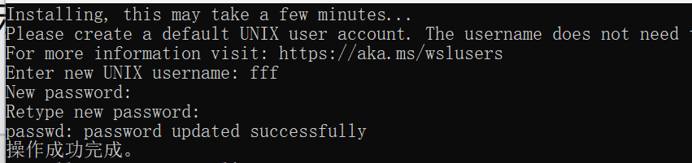
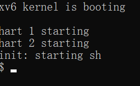
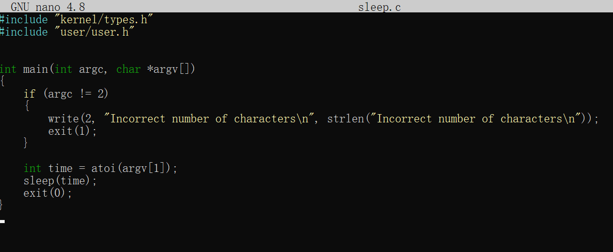
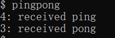
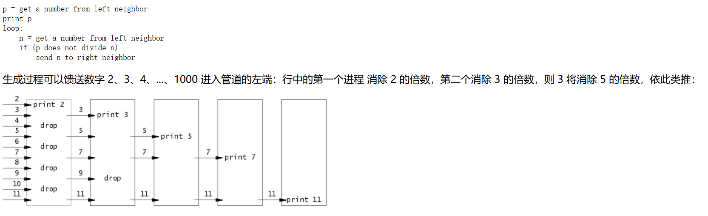

# OS_xv6 实验报告

*2252426 付柏瑞*

## Tools

**安装[适用于 Linux 的 Windows 子系统](https://docs.microsoft.com/en-us/windows/wsl/install-win10)**

- 启用虚拟化命令并将WSL的默认版本设置为WSL2

以管理员的方式运行Powershell并在命令行中输入以下内容：

```
dism.exe /online /enable-feature /featurename:Microsoft-Windows-Subsystem-Linux /all /norestart

wsl --set-default-version 2
```


- 在 Windows 中，您可以访问*“\\wsl$\”*目录下的所有 WSL 文件。例如，Ubuntu 20.04 安装的主目录应 位于 *“\\wsl$\Ubuntu-20.04\home\<username>\”。*
- 从 [Microsoft Store 添加 Ubuntu 20.04](https://www.microsoft.com/en-us/p/ubuntu/9nblggh4msv6)，设置用户名和密码



- 安装此类所需的所有软件

```
sudo apt-get update && sudo apt-get upgrade

sudo apt-get install git build-essential gdb-multiarch qemu-system-misc gcc-riscv64-linux-gnu binutils-riscv64-linux-gnu
```

- 测试安装

  ```
  qemu-system-riscv64 --version
  
  riscv64-linux-gnu-gcc --version
  ```


## Guidance

一些指针常见习语特别值得记住：

- 如果 ， 则 和 是不同的数字：第一个是 but 第二个是 。 当向指针添加整数时，如第二种情况， 整数隐式乘以对象的大小 指针指向。`int *p = (int*)100``(int)p + 1``(int)(p + 1)``101``104`
- `p[i]`定义为与 相同 ， 引用 p 指向的内存中的第 i 个对象。 上述添加规则有助于此定义起作用 当对象大于 1 字节时。`*(p+i)`
- `&p[i]`与 相同，生成 p 指向的内存中第 i 个对象的地址。`(p+i)`

尽管大多数 C 程序从来不需要在指针和整数之间进行强制转换， 操作系统经常这样做。 每当看到涉及内存地址的添加时， 问问自己是整数加法还是指针加法 并确保所添加的值适当地乘以 或者没有。

- 您可能会发现 print 语句可能会产生大量输出 您想要搜索的;一种方法是在`脚本`中运行 `make qemu`（在您的机器上运行），它会将所有控制台输出记录到 文件，然后您可以搜索该文件。别忘了 退出`脚本`。man script

- 在许多情况下，print 语句就足够了，但是 有时能够单步执行某些汇编代码或 检查堆栈上的变量很有帮助。要将 gdb 与 xv6，在一个窗口中运行 make， 在另一个 run （or ） 中 窗口，设置一个中断点，然后是 'c' （continue）， xv6 将运行，直到它命中 断点。（请参阅[使用 GNU 调试器](https://pdos.csail.mit.edu/6.828/2019/lec/gdb_slides.pdf)以获取有用的 GDB 提示。make qemu-gdbgdbriscv64-linux-gnu-gdb

- 如果您想查看编译器的程序集是什么 生成内核或找出指令所在的位置 一个特定的内核地址，请参阅 `kernel.asm` 文件，其中 Makefile 在编译内核时生成。（Makefile 还为所有用户程序生成 `.asm`。

- 如果内核 panic，它将打印一条错误消息，列出 崩溃时 program counter 的值;您可以 搜索 `kernel.asm` 以找出程序在哪个函数中 counter 是崩溃时，或者你可以运行 （run 了解详细信息）。如果要获取回溯，请使用 gdb 重新启动：运行 在一个窗口中运行 gdb（或 riscv64-linux-gnu-gdb）在 另一个窗口，在 panic 中设置断点 （'B panic'），然后是 后跟 'c' （continue）。当内核达到断点时， 键入 'bt' 以获取回溯。addr2line -e kernel/kernel *pc-value*man addr2line

- 如果您的内核挂起（例如，由于死锁）或无法执行 进一步（例如，由于执行内核时的页面错误 指令），您可以使用 gdb 来找出它的悬挂位置。跑 在一个窗口中运行 'make qemu-gdb'，运行 gdb （riscv64-linux-gnu-gdb） 在另一个窗口中，后跟 'c' （continue）。当 内核似乎挂起，在 qemu-gdb 窗口中按 Ctrl-C 键，然后键入 'bt' 来获取回溯。

- `QEMU` 有一个 “monitor” ，可以让你查询 state 模拟机器。您可以通过键入 control-a c （“c” 代表控制台）。一个特别有用的 monitor 命令为 `info mem` 来打印页表。 您可能需要使用 `cpu` 命令来选择哪个 `核心信息 mem` 查看，或者您可以启动 QEMU 使用 `make CPUS=1 qemu` 来使只有一个内核。

  

## Lab1: Xv6 and Unix utilities

本实验将使您熟悉 xv6 及其系统调用。

### Boot xv6 ([easy](https://pdos.csail.mit.edu/6.828/2021/labs/guidance.html))

获取实验室的 xv6 源代码并签出 `util` 分支：

```
git clone git://g.csail.mit.edu/xv6-labs-2021
cd xv6-labs-2021
git checkout util
```

xv6-labs-

2021 存储库与本书的 xv6-riscv;它主要添加一些文件。如果你好奇，请看 在 git log 中：

```
$ git log
```

构建并运行xv6：

```
make qemu
```



如果在提示符处键入 `ls`，您应该会看到类似的输出 更改为以下内容：


这些文件是 `mkfs` 包含在 初始文件系统;大多数是您可以运行的程序。您刚刚运行了其中一个：`ls`。

xv6 没有 `ps` 命令，但是，如果您键入， 内核将打印有关每个进程的信息。 如果你现在尝试，你会看到两行：一行用于 `init`， 一个用于 `sh`。Ctrl-p


要退出 qemu，请键入：Ctrl-a x.

### sleep ([easy](https://pdos.csail.mit.edu/6.828/2021/labs/guidance.html))

#### 实验目的

- 为 xv6 实施 UNIX 程序 `sleep`

- 你的`睡眠`应该暂停 对于用户指定的刻度数。刻度是时间的概念 由 XV6 内核定义，即两次中断之间的时间 从计时器芯片。您的解决方案应该在文件 `user/sleep.c` 中。

#### 实验步骤

1. 进入user文件夹，创建sleep.c文件

   ``````
   nano sleep.c
   ``````

2. 输入文件内容

   - 包括头文件的函数使用，argc 是命令行总的参数个数 ，argv[] 是 argc 个参数，其中第 0 个参数是程序的全名，以后的参数是命令行后面跟的用户输入的参数

   - 该程序接受一个命令行参数（表示 ticks 数量），并使当前进程暂停相应的 ticks 数量。

     - 如果用户没有提供参数或者提供了多个参数，程序应该打印出错误信息。
     - 命令行参数作为字符串传递，使用 atoi（参见 user/ulib.c）将其转换为整数。
     - 使用系统调用 sleep，最后确保 main 调用 exit() 以退出程序。

     ``````c
     #include "kernel/types.h"
     #include "user/user.h"
     
     
     int main(int argc, char *argv[])
     {
     	// 如果命令行参数不等于2个，则打印错误信息
         if (argc != 2)
         {
         	//2 表示标准错误
             write(2, "Incorrect number of characters\n", strlen("Incorrect number of characters\n"));
             exit(1);
         }
     	// 把字符串型参数转换为整型
         int time = atoi(argv[1]);
         sleep(time);
         exit(0);
     }
     ``````
     



- 退出nano

  **ctrl+o      enter     ctrl+x**

4. 在XV6的`Makefile`中添加你的程序，以确保它在编译时被编译和链接。

   打开XV6根目录下的`Makefile`文件。找到类似于`UPROGS`的部分（用户程序列表），并添加你的程序名称（去掉扩展名）：

   ``````
   nano Makefile
   ``````


5. 测试结果

   程序在以下情况下暂停，解决方案是正确的 

   ``````
   make qemu
   sleep 20
   ``````

   如上所示运行。 运行以查看是否确实将 睡眠测试。

   

   

   ```
   ./grade-lab-util sleep 
   make GRADEFLAGS=sleep grade
   ```


#### 实验中遇到的问题和解决方法

- **程序不会运行****

  **解决方法：**

  - 确保程序正确集成到XV6的编译系统中。通过修改`Makefile`和重新编译XV6，确保新程序被正确编译和链接。在XV6环境中运行测试命令，验证程序是否按预期工作。

- **没有找到文件编辑器和不太清楚Linux使用方法**

  **解决方法：**

  - 网上寻找资料和同学讨论，结合gpt，最后没有使用vim编辑，选择了nano编辑器，因为nano提供了一个容易上手的界面，更适合初学者。

  - **学习基本Linux命令**：掌握一些基本的Linux命令可以显著提高你的开发效率。例如：

    - `ls`：列出目录内容。
    - `cd`：改变当前目录。
    - `cp`：复制文件或目录。
    - `mv`：移动或重命名文件或目录。
    - `rm`：删除文件或目录。
    - `mkdir`：创建目录。

    可以使用`man`命令查看每个命令的详细使用说明，例如`man ls`。

  - **练习文件编辑和编译**：熟悉如何使用文本编辑器（如`vim`、`nano`或`emacs`）来编辑代码文件，并使用编译器编译代码。你可以通过在线教程或使用书籍来学习这些基本操作。

  - **设置开发环境**：如果你觉得在Linux中工作困难，考虑使用图形化界面的IDE或编辑器，比如VS Code，它支持终端集成和远程开发，可以让你更轻松地管理代码和编译流程。

#### 实验心得

通过这次实验，我深入了解了以下几个方面：

- **系统调用的使用**：通过实现`sleep`功能，我学习了如何在用户程序中使用系统调用，使程序能够暂停执行。这增强了我对系统调用机制的理解。
- **命令行参数处理**：我掌握了如何处理命令行参数，包括验证参数数量和处理参数值。这对于开发健壮的命令行工具至关重要。
- **编译和集成**：我学会了如何将用户程序集成到XV6操作系统中，并通过修改`Makefile`和重新编译系统来测试程序。这提高了我的开发和调试技能。

整体而言，这次实验不仅让我熟悉了XV6操作系统的开发流程，还提升了我在Linux环境下编写和测试程序的能力。通过解决实际问题，我学会了如何编写更加健壮和可靠的代码，并对操作系统的内部机制有了更深刻的理解。

### pingpong ([easy](https://pdos.csail.mit.edu/6.828/2021/labs/guidance.html))

#### 实验目的

- 编写一个使用 UNIX 系统调用 ''ping-pong'' 的程序 一对管道上的两个进程之间的字节，每个管道一个 方向。

- 父级应向子级发送一个字节; 孩子应打印“<PID>： received ping”， 其中 <pid> 是其进程 ID， 将管道上的字节写入父级， 并退出; 

- 父级应该从子级读取字节， 打印 “<PID>： received pong”， 并退出。 

- 你 解决方案应该在文件 `user/pingpong.c` 中。

#### 实验步骤

1. 进入user文件夹，创建pingpong.c 的文件，代码如下：

   - 主函数没有使用 `argc` 和 `argv` 参数，但它们可以用于扩展功能或传递参数。

   - `p1` 和 `p2` 是两个整型数组，每个数组有两个元素，用于存储管道的文件描述符（读取端和写入端）。
   - `buf` 是一个字符数组，用于存储从管道读取的数据。

   - `fork()` 调用创建一个新的子进程。返回值为0表示这是子进程，父进程会接收到子进程的PID。

   - 子进程从管道 `p1` 的读取端读取4个字节的数据（即 `"ping"`）。打印接收到的数据。向管道 `p2` 的写入端写入 `"pong"`。

   - 父进程向管道 `p1` 的写入端写入 `"ping"`，使用 `wait(NULL)` 等待子进程完成，从管道 `p2` 的读取端读取4个字节的数据（即 `"pong"`）。打印接收到的数据。

   ``````c
   #include "kernel/types.h"
   #include "user/user.h"
   #include "stddef.h"
   
   int main(int argc, char *argv[])
   {
       int p1[2], p2[2];
       // 缓冲区
       char buf[8];
       // 0 指管道的读取端，1 指管道的写入端
   
       // 创建两个管道
       pipe(p1);
       pipe(p2);
       
       // 创建子进程
       if (fork() == 0) {
           // 子进程
           // 从父进程读取字节
           read(p1[0], buf, 4);
           printf("%d: received %s\n", getpid(), buf);
           // 向父进程写数据
           write(p2[1], "pong", strlen("pong"));
       }
       else {
           // 父进程
           // 向子进程写数据
           write(p1[1], "ping", strlen("ping"));
           wait(NULL); // 等待子进程结束
           // 从子进程读取数据
           read(p2[0], buf, 4);
           printf("%d: received %s\n", getpid(), buf);
       }
       exit(0);
   }
   
   ``````

2. 更新 Makefile

   在 Makefile 中找到 UPROGS 变量的定义，并添加 pingpong

3. 实验结果

   

   

#### 实验中遇到的问题和解决方法

1. **管道读写不匹配**：

- **问题**：如果管道的读写操作不匹配（如读取多于写入或读取少于写入），可能导致数据丢失或读取错误。

- **解决方法**

  确保写入的数据量与读取的数据量一致。例如，如果写入了4个字节的数据，读取时也要读取4个字节。并且要根据实际需求调整缓冲区大小。示例：

  ```c
  // 确保读取数据量和写入数据量一致
  read(p1[0], buf, 4);
  write(p2[1], "pong", 4);
  ```

2. **父进程在子进程完成前读取数据**：

- **问题**：如果父进程在子进程写入数据之前尝试读取数据，可能会读取不到数据或出现读取错误。

- **解决方法**

  确保父进程在子进程写入数据之后再读取数据。使用 

  ```c
  wait(NULL)
  ```

   确保子进程完成。示例：

  ```c
  // 父进程
  write(p1[1], "ping", 4);
  wait(NULL); // 等待子进程完成
  read(p2[0], buf, 4);
  ```

#### 实验心得

1. **进程间通信的基础**：
   - 实验加深了对进程间通信机制的理解。管道是一个简单而强大的工具，可以让两个进程之间进行数据交换。掌握如何使用管道进行通信是编写多进程程序的基础。
2. **错误处理的重要性**：
   - 通过实验，意识到在系统编程中，处理错误是至关重要的。系统调用可能会失败，因此在使用 `fork()`, `pipe()`, `read()`, `write()` 等函数时，必须检查返回值并适当地处理错误。
3. **进程同步**：
   - 理解了父子进程之间如何通过管道同步工作。父进程和子进程的行为是交替的，确保正确的同步机制（如使用 `wait()` 等待子进程）可以确保数据的正确传递和处理。
4. **资源管理**：
   - 认识到在创建和使用管道时，必须妥善管理系统资源。例如，及时关闭不再使用的管道端口是良好的编程习惯，可以避免资源泄漏和不必要的系统负担。
5. **调试技巧**：
   - 在调试过程中，逐步检查程序的每个部分，并使用 `printf` 或 `perror` 输出调试信息，有助于迅速定位问题。理解每一步的执行顺序和数据流向是解决问题的关键。
6. **实践中的挑战**：
   - 在实际应用中，可能遇到各种与环境相关的问题，如不同操作系统的管道实现细节、不同版本的库函数行为等。通过实际操作和调试这些细节，可以更好地掌握系统编程的技能。

总的来说，这次实验是对进程间通信的一个深入理解，通过实践加深了对相关系统调用和编程模式的掌握。

### primes ([moderate](https://pdos.csail.mit.edu/6.828/2021/labs/guidance.html))/([hard](https://pdos.csail.mit.edu/6.828/2021/labs/guidance.html))

#### 实验目的

- 使用 pipes 编写 prime sieve 的并发版本。
- 使用 `pipe` 和 `fork` 进行设置 管道。第一个进程提供数字 2 到 35 进入管道。
- 对于每个素数，您将安排 创建一个通过管道从其左邻居读取数据的进程 并通过另一个管道写入其右侧邻居。由于 xv6 具有 文件描述符和进程的数量有限，第一个 进程可以在 35 时停止。
- 解决方案应位于文件 `user/primes.c` 中。

#### 实验步骤

1.进入user文件夹，创建primes.c 的文件，代码如下：

``````c
``````



#### 实验中遇到的问题和解决方法

#### 实验心得

### find ([moderate](https://pdos.csail.mit.edu/6.828/2021/labs/guidance.html))

#### 实验目的

#### 实验步骤

#### 实验中遇到的问题和解决方法

#### 实验心得

### xargs ([moderate](https://pdos.csail.mit.edu/6.828/2021/labs/guidance.html))

#### 实验目的

#### 实验步骤

#### 实验中遇到的问题和解决方法

#### 实验心得


