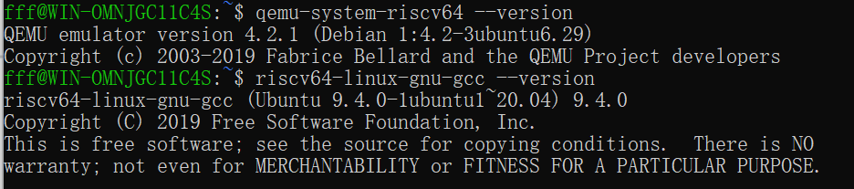
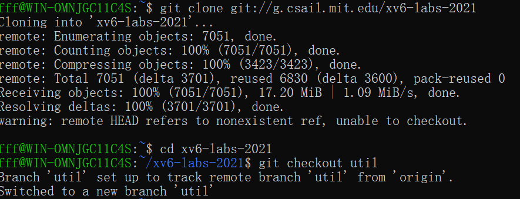
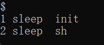
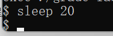
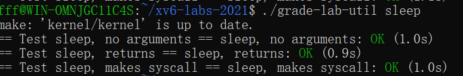
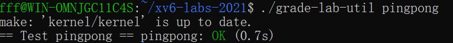

# OS_xv6 实验报告

*2252426 付柏瑞*


## Tools&Guidance

**安装[适用于 Linux 的 Windows 子系统](https://docs.microsoft.com/en-us/windows/wsl/install-win10)**

- 启用虚拟化命令并将WSL的默认版本设置为WSL2

以管理员的方式运行Powershell并在命令行中输入以下内容：

```
dism.exe /online /enable-feature /featurename:Microsoft-Windows-Subsystem-Linux /all /norestart

wsl --set-default-version 2
```


- 在 Windows 中，您可以访问*“\\wsl$\”*目录下的所有 WSL 文件。例如，Ubuntu 20.04 安装的主目录应 位于 *“\\wsl$\Ubuntu-20.04\home\<username>\”。*
- 从 [Microsoft Store 添加 Ubuntu 20.04](https://www.microsoft.com/en-us/p/ubuntu/9nblggh4msv6)，设置用户名和密码


- 安装此类所需的所有软件

```
sudo apt-get update && sudo apt-get upgrade

sudo apt-get install git build-essential gdb-multiarch qemu-system-misc gcc-riscv64-linux-gnu binutils-riscv64-linux-gnu
```

- 测试安装

  ```
  qemu-system-riscv64 --version
  
  riscv64-linux-gnu-gcc --version
  ```



一些指针常见习语特别值得记住：

- 如果 ， 则 和 是不同的数字：第一个是 but 第二个是 。 当向指针添加整数时，如第二种情况， 整数隐式乘以对象的大小 指针指向。`int *p = (int*)100``(int)p + 1``(int)(p + 1)``101``104`
- `p[i]`定义为与 相同 ， 引用 p 指向的内存中的第 i 个对象。 上述添加规则有助于此定义起作用 当对象大于 1 字节时。`*(p+i)`
- `&p[i]`与 相同，生成 p 指向的内存中第 i 个对象的地址。`(p+i)`

尽管大多数 C 程序从来不需要在指针和整数之间进行强制转换， 操作系统经常这样做。 每当看到涉及内存地址的添加时， 问问自己是整数加法还是指针加法 并确保所添加的值适当地乘以 或者没有。

- 您可能会发现 print 语句可能会产生大量输出 您想要搜索的;一种方法是在`脚本`中运行 `make qemu`（在您的机器上运行），它会将所有控制台输出记录到 文件，然后您可以搜索该文件。别忘了 退出`脚本`。man script

- 在许多情况下，print 语句就足够了，但是 有时能够单步执行某些汇编代码或 检查堆栈上的变量很有帮助。要将 gdb 与 xv6，在一个窗口中运行 make， 在另一个 run （or ） 中 窗口，设置一个中断点，然后是 'c' （continue）， xv6 将运行，直到它命中 断点。（请参阅[使用 GNU 调试器](https://pdos.csail.mit.edu/6.828/2019/lec/gdb_slides.pdf)以获取有用的 GDB 提示。make qemu-gdbgdbriscv64-linux-gnu-gdb

- 如果您想查看编译器的程序集是什么 生成内核或找出指令所在的位置 一个特定的内核地址，请参阅 `kernel.asm` 文件，其中 Makefile 在编译内核时生成。（Makefile 还为所有用户程序生成 `.asm`。

- 如果内核 panic，它将打印一条错误消息，列出 崩溃时 program counter 的值;您可以 搜索 `kernel.asm` 以找出程序在哪个函数中 counter 是崩溃时，或者你可以运行 （run 了解详细信息）。如果要获取回溯，请使用 gdb 重新启动：运行 在一个窗口中运行 gdb（或 riscv64-linux-gnu-gdb）在 另一个窗口，在 panic 中设置断点 （'B panic'），然后是 后跟 'c' （continue）。当内核达到断点时， 键入 'bt' 以获取回溯。addr2line -e kernel/kernel *pc-value*man addr2line

- 如果您的内核挂起（例如，由于死锁）或无法执行 进一步（例如，由于执行内核时的页面错误 指令），您可以使用 gdb 来找出它的悬挂位置。跑 在一个窗口中运行 'make qemu-gdb'，运行 gdb （riscv64-linux-gnu-gdb） 在另一个窗口中，后跟 'c' （continue）。当 内核似乎挂起，在 qemu-gdb 窗口中按 Ctrl-C 键，然后键入 'bt' 来获取回溯。

- `QEMU` 有一个 “monitor” ，可以让你查询 state 模拟机器。您可以通过键入 control-a c （“c” 代表控制台）。一个特别有用的 monitor 命令为 `info mem` 来打印页表。 您可能需要使用 `cpu` 命令来选择哪个 `核心信息 mem` 查看，或者您可以启动 QEMU 使用 `make CPUS=1 qemu` 来使只有一个内核。

  

## Lab1: Xv6 and Unix utilities

本实验将使您熟悉 xv6 及其系统调用。

### Boot xv6 ([easy](https://pdos.csail.mit.edu/6.828/2021/labs/guidance.html))

获取实验室的 xv6 源代码并签出 `util` 分支：

```
git clone git://g.csail.mit.edu/xv6-labs-2021
cd xv6-labs-2021
git checkout util
```

xv6-labs-

2021 存储库与本书的 xv6-riscv;它主要添加一些文件。如果你好奇，请看 在 git log 中：

```
$ git log
```

构建并运行xv6：

```
make qemu
```


如果在提示符处键入 `ls`，您应该会看到类似的输出 更改为以下内容：


这些文件是 `mkfs` 包含在 初始文件系统;大多数是您可以运行的程序。您刚刚运行了其中一个：`ls`。

xv6 没有 `ps` 命令，但是，如果您键入， 内核将打印有关每个进程的信息。 如果你现在尝试，你会看到两行：一行用于 `init`， 一个用于 `sh`。Ctrl-p



要退出 qemu，请键入：Ctrl-a x.

### sleep ([easy](https://pdos.csail.mit.edu/6.828/2021/labs/guidance.html))

#### 实验目的

- 为 xv6 实施 UNIX 程序 `sleep`

- 你的`睡眠`应该暂停 对于用户指定的刻度数。刻度是时间的概念 由 XV6 内核定义，即两次中断之间的时间 从计时器芯片。您的解决方案应该在文件 `user/sleep.c` 中。

#### 实验步骤

1. 进入user文件夹，创建sleep.c文件

   ``````
   nano sleep.c
   ``````

2. 输入文件内容

   - 包括头文件的函数使用，argc 是命令行总的参数个数 ，argv[] 是 argc 个参数，其中第 0 个参数是程序的全名，以后的参数是命令行后面跟的用户输入的参数

   - 该程序接受一个命令行参数（表示 ticks 数量），并使当前进程暂停相应的 ticks 数量。

     - 如果用户没有提供参数或者提供了多个参数，程序应该打印出错误信息。
     - 命令行参数作为字符串传递，使用 atoi（参见 user/ulib.c）将其转换为整数。
     - 使用系统调用 sleep，最后确保 main 调用 exit() 以退出程序。

     ``````c
     #include "kernel/types.h"
     #include "user/user.h"
     
     
     int main(int argc, char *argv[])
     {
     	// 如果命令行参数不等于2个，则打印错误信息
         if (argc != 2)
         {
         	//2 表示标准错误
             write(2, "Incorrect number of characters\n", strlen("Incorrect number of characters\n"));
             exit(1);
         }
     	// 把字符串型参数转换为整型
         int time = atoi(argv[1]);
         sleep(time);
         exit(0);
     }
     ``````
     


- 退出nano

  **ctrl+o      enter     ctrl+x**

4. 在XV6的`Makefile`中添加你的程序，以确保它在编译时被编译和链接。

   打开XV6根目录下的`Makefile`文件。找到类似于`UPROGS`的部分（用户程序列表），并添加你的程序名称（去掉扩展名）：

   ``````
   nano Makefile
   ``````


5. 测试结果

   程序在以下情况下暂停，解决方案是正确的 

   ``````
   make qemu
   sleep 20
   ``````

   如上所示运行。 运行以查看是否确实将 睡眠测试。

   

   

   ```
   ./grade-lab-util sleep 
   make GRADEFLAGS=sleep grade
   ```




#### 实验中遇到的问题和解决方法

- **程序不会运行****

  **解决方法：**

  - 确保程序正确集成到XV6的编译系统中。通过修改`Makefile`和重新编译XV6，确保新程序被正确编译和链接。在XV6环境中运行测试命令，验证程序是否按预期工作。

- **没有找到文件编辑器和不太清楚Linux使用方法**

  **解决方法：**

  - 网上寻找资料和同学讨论，结合gpt，最后没有使用vim编辑，选择了nano编辑器，因为nano提供了一个容易上手的界面，更适合初学者。

  - **学习基本Linux命令**：掌握一些基本的Linux命令可以显著提高你的开发效率。例如：

    - `ls`：列出目录内容。
    - `cd`：改变当前目录。
    - `cp`：复制文件或目录。
    - `mv`：移动或重命名文件或目录。
    - `rm`：删除文件或目录。
    - `mkdir`：创建目录。

    可以使用`man`命令查看每个命令的详细使用说明，例如`man ls`。

  - **练习文件编辑和编译**：熟悉如何使用文本编辑器（如`vim`、`nano`或`emacs`）来编辑代码文件，并使用编译器编译代码。你可以通过在线教程或使用书籍来学习这些基本操作。

  - **设置开发环境**：如果你觉得在Linux中工作困难，考虑使用图形化界面的IDE或编辑器，比如VS Code，它支持终端集成和远程开发，可以让你更轻松地管理代码和编译流程。

#### 实验心得

通过这次实验，我深入了解了以下几个方面：

- **系统调用的使用**：通过实现`sleep`功能，我学习了如何在用户程序中使用系统调用，使程序能够暂停执行。这增强了我对系统调用机制的理解。
- **命令行参数处理**：我掌握了如何处理命令行参数，包括验证参数数量和处理参数值。这对于开发健壮的命令行工具至关重要。
- **编译和集成**：我学会了如何将用户程序集成到XV6操作系统中，并通过修改`Makefile`和重新编译系统来测试程序。这提高了我的开发和调试技能。

整体而言，这次实验不仅让我熟悉了XV6操作系统的开发流程，还提升了我在Linux环境下编写和测试程序的能力。通过解决实际问题，我学会了如何编写更加健壮和可靠的代码，并对操作系统的内部机制有了更深刻的理解。

### pingpong ([easy](https://pdos.csail.mit.edu/6.828/2021/labs/guidance.html))

#### 实验目的

- 编写一个使用 UNIX 系统调用 ''ping-pong'' 的程序 一对管道上的两个进程之间的字节，每个管道一个 方向。

- 父级应向子级发送一个字节; 孩子应打印“<PID>： received ping”， 其中 <pid> 是其进程 ID， 将管道上的字节写入父级， 并退出; 

- 父级应该从子级读取字节， 打印 “<PID>： received pong”， 并退出。 

- 你 解决方案应该在文件 `user/pingpong.c` 中。

#### 实验步骤

1. 进入user文件夹，创建pingpong.c 的文件，代码如下：

   - 主函数没有使用 `argc` 和 `argv` 参数，但它们可以用于扩展功能或传递参数。

   - `p1` 和 `p2` 是两个整型数组，每个数组有两个元素，用于存储管道的文件描述符（读取端和写入端）。
   - `buf` 是一个字符数组，用于存储从管道读取的数据。

   - `fork()` 调用创建一个新的子进程。返回值为0表示这是子进程，父进程会接收到子进程的PID。

   - 子进程从管道 `p1` 的读取端读取4个字节的数据（即 `"ping"`）。打印接收到的数据。向管道 `p2` 的写入端写入 `"pong"`。

   - 父进程向管道 `p1` 的写入端写入 `"ping"`，使用 `wait(NULL)` 等待子进程完成，从管道 `p2` 的读取端读取4个字节的数据（即 `"pong"`）。打印接收到的数据。

   ``````c
   #include "kernel/types.h"
   #include "user/user.h"
   #include "stddef.h"
   
   int main(int argc, char *argv[])
   {
       int p1[2], p2[2];
       // 缓冲区
       char buf[8];
       // 0 指管道的读取端，1 指管道的写入端
   
       // 创建两个管道
       pipe(p1);
       pipe(p2);
       
       // 创建子进程
       if (fork() == 0) {
           // 子进程
           // 从父进程读取字节
           read(p1[0], buf, 4);
           printf("%d: received %s\n", getpid(), buf);
           // 向父进程写数据
           write(p2[1], "pong", strlen("pong"));
       }
       else {
           // 父进程
           // 向子进程写数据
           write(p1[1], "ping", strlen("ping"));
           wait(NULL); // 等待子进程结束
           // 从子进程读取数据
           read(p2[0], buf, 4);
           printf("%d: received %s\n", getpid(), buf);
       }
       exit(0);
   }
   
   ``````

2. 更新 Makefile

   在 Makefile 中找到 UPROGS 变量的定义，并添加 pingpong

3. 实验结果

   

   

#### 实验中遇到的问题和解决方法

1. **管道读写不匹配**：

- **问题**：如果管道的读写操作不匹配（如读取多于写入或读取少于写入），可能导致数据丢失或读取错误。

- **解决方法**

  确保写入的数据量与读取的数据量一致。例如，如果写入了4个字节的数据，读取时也要读取4个字节。并且要根据实际需求调整缓冲区大小。示例：

  ```c
  // 确保读取数据量和写入数据量一致
  read(p1[0], buf, 4);
  write(p2[1], "pong", 4);
  ```

2. **父进程在子进程完成前读取数据**：

- **问题**：如果父进程在子进程写入数据之前尝试读取数据，可能会读取不到数据或出现读取错误。

- **解决方法**

  确保父进程在子进程写入数据之后再读取数据。使用 

  ```c
  wait(NULL)
  ```

   确保子进程完成。示例：

  ```c
  // 父进程
  write(p1[1], "ping", 4);
  wait(NULL); // 等待子进程完成
  read(p2[0], buf, 4);
  ```

#### 实验心得

1. **进程间通信的基础**：
   - 实验加深了对进程间通信机制的理解。管道是一个简单而强大的工具，可以让两个进程之间进行数据交换。掌握如何使用管道进行通信是编写多进程程序的基础。
2. **错误处理的重要性**：
   - 通过实验，意识到在系统编程中，处理错误是至关重要的。系统调用可能会失败，因此在使用 `fork()`, `pipe()`, `read()`, `write()` 等函数时，必须检查返回值并适当地处理错误。
3. **进程同步**：
   - 理解了父子进程之间如何通过管道同步工作。父进程和子进程的行为是交替的，确保正确的同步机制（如使用 `wait()` 等待子进程）可以确保数据的正确传递和处理。
4. **资源管理**：
   - 认识到在创建和使用管道时，必须妥善管理系统资源。例如，及时关闭不再使用的管道端口是良好的编程习惯，可以避免资源泄漏和不必要的系统负担。
5. **调试技巧**：
   - 在调试过程中，逐步检查程序的每个部分，并使用 `printf` 或 `perror` 输出调试信息，有助于迅速定位问题。理解每一步的执行顺序和数据流向是解决问题的关键。
6. **实践中的挑战**：
   - 在实际应用中，可能遇到各种与环境相关的问题，如不同操作系统的管道实现细节、不同版本的库函数行为等。通过实际操作和调试这些细节，可以更好地掌握系统编程的技能。

总的来说，这次实验是对进程间通信的一个深入理解，通过实践加深了对相关系统调用和编程模式的掌握。

### primes ([moderate](https://pdos.csail.mit.edu/6.828/2021/labs/guidance.html))/([hard](https://pdos.csail.mit.edu/6.828/2021/labs/guidance.html))

#### 实验目的

- 使用 pipes 编写 prime sieve 的并发版本。
- 使用 `pipe` 和 `fork` 进行设置 管道。第一个进程提供数字 2 到 35 进入管道。
- 对于每个素数，您将安排 创建一个通过管道从其左邻居读取数据的进程 并通过另一个管道写入其右侧邻居。由于 xv6 具有 文件描述符和进程的数量有限，第一个 进程可以在 35 时停止。
- 解决方案应位于文件 `user/primes.c` 中。

#### 实验步骤

1.进入user文件夹，创建primes.c 的文件，代码如下：

``````c
#include "kernel/types.h"
#include "kernel/stat.h"
#include "user/user.h"

int main(int argc, char *argv[])
{
    //创建管道，管道的描述符分别是 p1[0] (读端) 和 p1[1] (写端)
    int p1[2];
    pipe(p1);

    //创建一个子进程
    int f1 = fork();

    if (f1 < 0)
    {
        fprintf(2, "xargs: error in fork\n");
        exit(1);
    }

    if (f1 == 0)
    {
        int prime = 0;
        close(p1[1]); // 关闭主管道的写端，因为子进程只读

        while (1)
        {
            // 从管道中读取数值
            if (read(p1[0], &prime, sizeof(prime)) == 0)
            {
                // 如果管道读到 EOF（即父进程已经关闭了写端），关闭读端并退出
                close(p1[0]);
                exit(0);
            }

            // 输出当前读取到的素数
            printf("prime %d\n", prime);

            // 创建一个新的管道用于过滤掉当前素数的倍数
            int p2[2];
            pipe(p2);

            // 创建一个新的子进程
            int f2 = fork();
            if (f2 < 0)
            {
                // 如果 fork 失败，输出错误信息并退出
                fprintf(2, "xargs: error in fork\n");
                exit(1);
            }

            if (f2 > 0)
            {
                // 父进程（新的子进程的父进程）
                int num = 0;
                close(p2[0]); // 关闭子管道的读端，因为父进程只写

                // 从主管道中读取数据，并将不为当前素数倍数的数据写入子管道
                while (read(p1[0], &num, sizeof(num)) != 0)
                {
                    if (num % prime != 0)
                    {
                        write(p2[1], &num, sizeof(num));
                    }
                }

                // 关闭管道
                close(p1[0]);
                close(p2[1]);

                // 等待子进程退出
                wait(0);
                exit(0);
            }

            // 孙进程部分
            close(p1[0]); // 关闭主管道的读端
            close(p2[1]); // 关闭子管道的写端
            p1[0] = p2[0]; // 更新主管道的读端为子管道的读端
        }
    }

    //关闭主管道的读端，因为父进程只写
    close(p1[0]); 

    //将 2 到 35 的整数写入管道
    for (int i = 2; i <= 35; i++)
    {
        write(p1[1], &i, sizeof(i));
    }

    //关闭主管道的写端
    close(p1[1]);

    //等待子进程退出
    wait(0);
    exit(0);
}

``````


- **主进程**:

  - 创建初始管道，并将 2 到 35 的整数写入管道。

  - 关闭写端，等待子进程完成。

- **第一个子进程**:

  - 从主管道中读取数据，识别并打印素数。

  - 创建新的管道和子进程，筛选掉当前素数的倍数。

- **新子进程**:
  - 从主管道中读取数据，筛选数据，将筛选后的数据写入新的子管道。

- **管道和进程**:
  - 使用管道在进程之间传递数据，通过递归创建子进程来实现素数筛选。

- **关闭管道端口**: 
  - 确保每个进程在适当的时机关闭不再使用的管道端口，防止资源泄漏或管道死锁。

- **管道端口更新**: 
  - 确保在新的子进程中正确更新管道的读端，以便继续处理数据流。

2. 更新 Makefile

   在 Makefile 中找到 UPROGS 变量的定义，并添加 find

3. 实验结果


#### 实验中遇到的问题和解决方法

- **管道描述符错误使用**

​	**问题**: 在代码中，写管道数据时错误地使用了错误的管道描述符。：

```c
write(p2[2], &num, sizeof(num));
```

​	此处 `p2[2]` 是错误的，正确的描述符应为 `p2[1]`，即管道的写端。

​	**解决方法**: 确保在操作管道时使用正确的描述符。管道描述符的索引应为 0（读端）和 1（写端）。所以，正确的写操作应为：

```c
write(p2[1], &num, sizeof(num));
```

- **子进程和孙进程的管道管理**

 	**问题**: 在创建新管道并生成新的子进程时，没有正确关闭不再需要的管道端口，导致资源泄漏或死锁。

​	 **解决方法**: 在每个进程中，确保关闭不再需要的管道端口。例如：

```c
close(p1[0]); // 关闭主管道的读端
close(p2[1]); // 关闭子管道的写端
```

​	每个进程在操作管道时只保留需要的端口，其它端口应当关闭。

- **进程同步问题**

​	**问题**: 进程创建和数据处理时，如果进程间同步不正确，可能会导致数据丢失或程序行为不如预期。

​	**解决方法**: 确保在进程结束之前，所有子进程都已完成它们的任务，并使用 `wait()` 来同步进程。在主进程中等待子进程完成，以确	保子进程正确地执行完毕。

#### 4. **管道 EOF 处理**

​	**问题**: 子进程在读取管道时可能会遇到 EOF（管道读端关闭），这时子进程需要正确地处理 EOF 并退出。

​	**解决方法**: 检查 `read()` 的返回值，判断是否读取到 EOF。

```c
if (read(p1[0], &prime, sizeof(prime)) == 0)
{
    close(p1[0]);
    exit(0);
}
```

在读取到 EOF 时关闭管道读端并退出。

#### 实验心得

- **掌握了进程间通信（IPC）的基本技巧**:
  - 通过管道实现进程间的数据传递。
  
  - 使用 `fork()` 创建子进程并进行数据处理。
  
  - 处理进程间的同步，确保数据在进程间正确传递。
  
- **理解了素数筛选算法的实现**:

  - 利用管道和进程递归地筛选素数，通过逐步过滤掉非素数的倍数，逐步缩小数据范围。

- **学会了处理进程和管道的资源管理**:

  -  通过关闭不再使用的管道端口来防止资源泄漏。

  -  正确地同步进程，确保所有子进程的任务完成后再退出。

- **提升了调试和错误处理能力**:
  - 通过实验中的错误和调试，提升了发现问题和解决问题的能力。
  - 学会了使用系统调用的错误处理机制，确保程序的健壮性和可靠性。


- **增强了对操作系统底层机制的理解**:
  - 深入理解了操作系统中进程和管道的工作机制，加深了对系统调用和进程管理的理解。


### find ([moderate](https://pdos.csail.mit.edu/6.828/2021/labs/guidance.html))

#### 实验目的

- 编写 UNIX find 程序的简单版本：查找所有文件 在具有特定名称的目录树中。
- 您的解决方案 应该在文件 `user/find.c` 中。

#### 实验步骤

1.进入user文件夹，创建find.c 的文件，代码如下：

``````c
#include "kernel/types.h"
#include "kernel/stat.h"
#include "user/user.h"
#include "kernel/fs.h"

//在ls.c基础上修改
void find(char *path, char *file)
{   
    //文件名缓冲区
    char buf[512], *p;
    //文件描述符
    int fd;
   
    struct dirent de;
    struct stat st;

    //open() 函数打开路径，返回一个文件描述符
    //错误返回 -1
    if ((fd = open(path, 0)) < 0)
    {
        //无法打开此路径
        fprintf(2, "find: cannot open %s\n", path);
        return;
    }

    //fstat()返回文件的结点中的所有信息,获得一个已存在文件的模式，并将此模式赋值给它的副本
    //错误返回 -1
    if (fstat(fd, &st) < 0)
    {
        fprintf(2, "find: cannot stat %s\n", path);
        //关闭文件描述符 fd
        close(fd);
        return;
    }
    
    switch(st.type)
    {
        //目录类型不对
        case T_FILE:
            fprintf(2, "find: %s is not a directory\n", path);
            break;
        //目录类型正确
        case T_DIR:
            //路径过长放不入缓冲区
            if(strlen(path) + 1 + DIRSIZ + 1 > sizeof buf)
            {
                fprintf(2, "find: path too long\n");
                break;
            }
            //将path指向的字符串即绝对路径复制到buf
            strcpy(buf, path);
            //加 "/" 前缀
            p = buf + strlen(buf);
            *p++ = '/';
            //读取fd
            //判断read返回字节数与de长度相等
            while(read(fd, &de, sizeof(de)) == sizeof(de))
            {
                if(de.inum == 0)
                    continue;
                //不要递归为 “.” 和 “..”
                //字符串比较函数
                if (!strcmp(de.name, ".") || !strcmp(de.name, ".."))
                    continue;
                //把文件名信息复制p
                memmove(p, de.name, DIRSIZ);
                //设置文件名结束符
                p[DIRSIZ] = 0;
                // stat 以文件名作为参数，返回一个已存在文件的模式，并将此模式赋值给它的副本
                //出错，则返回 -1
                if(stat(buf, &st) < 0)
                {
                    printf("find: cannot stat %s\n", buf);
                    continue;
                }
                //目录类型
                if (st.type == T_DIR)
                {
                    //递归查找
                    find(buf, file);
                }
                //文件类型，查找成功
                else if (st.type == T_FILE && !strcmp(de.name, file))
                {
                    //缓冲区存放的路径
                    printf("%s\n", buf);
                } 
            }
        break;
    }
    //关闭文件描述符
    close(fd);
    return;
}


int main(int argc, char *argv[])
{
  //如果参数不是3个
  if(argc != 3)
  {
    write(2, "Incorrect number of characters\n", strlen("Incorrect number of characters\n"));
    exit(1);
  }
  else
  {
    //寻找函数
    find(argv[1], argv[2]);
    exit(0);
  }
}

``````

- 在 `user/ls.c` 中
-  `fmtname()` 函数，目的是将路径格式化为文件名，也就是把名字变成前面没有左斜杠 `/` ，仅仅保存文件名。
- `ls()` 函数，首先函数里面声明了需要用到的变量，包括文件名缓冲区、文件描述符、文件相关的结构体等等。其次使用 `open()` 函数进入路径，判断此路径是文件还是文件名。
- **头文件**:
  - `kernel/types.h`、`kernel/stat.h`、`kernel/fs.h`：这些头文件定义了系统调用和数据结构，比如文件类型 `T_FILE` 和 `T_DIR`，文件状态 `stat`，以及目录项 `dirent` 等。
  - `user/user.h`：包含用户态程序所需的函数，如 `open`、`fstat`、`stat`、`close` 等。
- **`find` 函数**:
  - **参数**:
    - `path`: 需要搜索的目录路径。
    - `file`: 需要查找的文件名。
  - **流程**:
    1. 使用 `open()` 打开指定路径，并返回一个文件描述符 `fd`。如果打开失败，打印错误信息并返回。
    2. 使用 `fstat()` 获取路径对应文件的状态信息，判断它是文件还是目录。
    3. 根据文件类型执行不同操作：
       - 如果是文件类型 `T_FILE`，说明路径不是一个目录，打印错误信息。
       - 如果是目录类型 `T_DIR`，则继续处理：
         - 检查路径长度是否超过缓冲区限制。
         - 使用 `read()` 读取目录项 `dirent`，跳过 `.` 和 `..` 两个特殊目录项。
         - 对每个目录项，使用 `stat()`获取其状态信息：
           - 如果是目录，递归调用 `find()` 函数继续查找。
           - 如果是文件且文件名匹配，打印文件的完整路径。
- **`main` 函数**:
  - 检查命令行参数个数是否为3（程序名、目录路径、文件名）。
  - 如果参数数量不正确，输出错误信息并退出。
  - 否则调用 `find()` 函数执行查找操作。

2. 更新 Makefile

   在 Makefile 中找到 UPROGS 变量的定义，并添加 find

3. 实验结果


#### 实验中遇到的问题和解决方法

1. **`No rule to make target 'user/_find', needed by 'fs.img'.`**

   - **原因分析**: `Makefile` 中缺少构建目标 `user/_find` 的规则，或者文件路径不正确。此错误意味着 `make` 无法找到生成目标文件 `user/_find` 所需的规则。

   - **解决方法**

      通过在 Makefile中添加一条明确的规则来指定如何生成 

     ```
     user/_find\
     ```

     确保路径使用的是正斜杠 '/'，并且源文件路径正确。例如：

     添加完这条规则后，重新运行即可解决该问题。

2. 路径名中使用反斜杠导致的错误

   - **原因分析**: 反斜杠 `'\'` 在 Unix 类系统中通常被用作转义字符，而不是路径分隔符。这可能导致路径解析错误。

   - **解决方法**: 

     将路径中的反斜杠替换为正斜杠 `'/'`，确保所有路径在 `Makefile` 和代码中都使用标准的 Unix 路径分隔符。

3. **`find` 函数中无法正确递归查找文件**

   - **原因分析**: 递归遍历目录时，可能出现路径拼接错误或目录项判断失误，导致查找功能异常。


   - **解决方法**: 

     检查代码中 `strcpy` 和 `strcat` 的使用，确保路径拼接正确。确保 `strcmp` 函数用于正确过滤 `.` 和 `..` 目录。


#### 实验心得

通过本次实验，我深入理解了 Unix 系统下的文件和目录操作，特别是 `open`, `stat`, `fstat`, 和 `read` 等系统调用的用法。构建一个简化的 `find` 命令让我更好地理解了文件系统的目录遍历机制以及递归算法在实际应用中的重要性。

同时，在处理 `Makefile` 的过程中，我体会到了自动化构建工具的重要性。遇到的错误提醒我需要特别注意路径和文件名的正确性，以及构建规则的明确性。通过查阅文档和调试，我学会了如何排查和解决 `Makefile` 中的构建问题，这对以后的开发工作具有很大的帮助。

总的来说，这次实验不仅加深了我对系统编程的理解，还提高了我分析和解决问题的能力。我更加意识到在编写和调试代码时，细节的把握和对问题的冷静分析是多么重要。

### xargs ([moderate](https://pdos.csail.mit.edu/6.828/2021/labs/guidance.html))

#### 实验目的

- 编写 UNIX xargs 程序的简单版本：从 标准输入并为每行运行一个命令，将行提供为 参数添加到命令中。
- 您的解决方案 应位于文件 `user/xargs.c` 中。

#### 实验步骤

1. 进入user文件夹，创建 xargs.c 的文件，代码如下：

``````c
#include "kernel/types.h"
#include "kernel/stat.h"
#include "user/user.h"
#include "kernel/param.h"

int main(int argc, char *argv[]) 
{
    // 检查是否至少提供了一个命令参数
    if (argc < 2) 
    {
        fprintf(2, "xargs: too few inputs\n");
        exit(1);
    }

    // 存储命令和其参数的数组
    int num_args = 0;
    char *cmd_args[MAXARG];

    // 将命令行参数（除了第一个）存储到 cmd_args 数组中
    for (int i = 1; i < argc; ++i) 
    {
        cmd_args[num_args++] = argv[i];
    }

    int base_count = num_args; // 记录初始参数数量

    char input_char; // 用于读取字符
    char *current_param; // 当前参数的指针
    char param_buffer[512]; // 缓冲区
    current_param = param_buffer; // 初始化 current_param 指针
    int buffer_index = 0; // 当前字符在缓冲区中的位置

    // 从标准输入读取字符直到文件结束
    while (read(0, &input_char, 1) > 0)
    {
        if (input_char == '\n') 
        {
            // 遇到换行符，结束当前参数
            current_param[buffer_index] = '\0';
            buffer_index = 0;

            // 将当前参数添加到 cmd_args 数组中
            cmd_args[num_args++] = current_param;
            cmd_args[num_args] = 0; // 末尾添加 NULL 作为 exec 的参数结束标记

            // 创建子进程并执行命令
            if (fork()) 
            {
                // 父进程等待子进程完成
                wait(0);
            } 
            else 
            {
                // 子进程执行指定的命令
                exec(argv[1], cmd_args);
                // 如果 exec 返回，说明失败，退出子进程
                exit(1);
            }

            // 恢复 cmd_args 数组为原始状态
            num_args = base_count;
        } 
        else if (input_char == ' ') 
        {
            // 遇到空格，结束当前参数
            current_param[buffer_index] = '\0';
            buffer_index = 0;
            cmd_args[num_args++] = current_param;

            // 准备处理下一个参数
            char new_param_buffer[512];
            current_param = new_param_buffer;
        } 
        else 
        {
            // 其他字符，添加到当前参数中
            current_param[buffer_index++] = input_char;
        }
    }

    // 程序正常退出
    exit(0);
}
``````

这个程序实现了一个类似于 `xargs` 的功能，用于从标准输入读取参数并将这些参数作为参数传递给指定的命令。

- **检查命令行参数：**

程序首先检查是否提供了至少一个命令参数。如果没有，程序将打印错误消息并退出。

- **初始化命令和参数数组：**

该数组用于存储命令及其参数。`MAXARG` 是一个常量，定义了可以传递给命令的最大参数数量。

- **填充命令和初始参数：**

将命令行参数（从第二个参数开始）存储到 `cmd_args` 数组中，并记录初始参数数量。

- **从标准输入读取字符并处理参数：**

`param_buffer` 用于暂存每个参数的字符，`current_param` 指向当前参数的缓冲区。

- **处理每一行输入：**

  - 当遇到换行符 (`'\n'`)，程序认为一个完整的参数已经结束，将其添加到 `cmd_args` 数组中，然后创建一个子进程来执行指定的命令。

  - 遇到空格 (`' '`) 时，结束当前参数，将其添加到 `cmd_args` 数组中，并准备处理下一个参数。

  - 其他字符直接添加到当前参数缓冲区。

2. 更新 Makefile

​	在 Makefile 中找到 UPROGS 变量的定义，并添加 xargs

3.  实验结果

   

   

#### 实验中遇到的问题和解决方法

**参数缓冲区管理问题：**

- **问题：** 代码在处理空格时创建了新的 `param_buffer`。这可能导致上一个参数的缓冲区被覆盖，因 `current_param` 指向的新缓冲区 `new_param_buffer` 是局部变量，在下次循环时会被覆盖。
- **解决方法：** 使用 `current_param` 指向的缓冲区必须保持有效，或考虑使用动态分配内存来存储参数。

**命令参数数量限制：**

- **问题：** `MAXARG` 限制了参数数量，可能在处理大量参数时导致溢出。
- **解决方法：** 增加 `MAXARG` 的大小或实现动态调整参数数量的方法。

**错误处理：**

- **问题：** `exec` 失败时没有明确错误信息。
- **解决方法：** 在 `exec` 失败时打印错误信息，帮助调试。

#### 实验心得

1. **理解进程管理和参数传递：**
   - 在实验过程中，更加深入地理解了进程创建 (`fork`) 和执行 (`exec`) 的机制，以及如何传递参数到子进程中。
2. **缓冲区管理的重要性：**
   - 处理输入时要特别注意缓冲区的生命周期和管理，避免由于局部变量重用导致的数据覆盖问题。
3. **系统调用的实际应用：**
   - 通过实际编写程序，理解了如何使用系统调用 `read`, `write`, `fork`, `exec`, 和 `wait` 等来实现功能。
4. **调试技巧：**
   - 通过调试工具和输出调试信息，帮助发现和解决代码中的问题，如内存管理问题和进程控制问题。


## Lab2: system calls

在上一个实验中，您使用了 systems 调用编写了一些实用程序。在 在本实验中，您将向 XV6 添加一些新的系统调用，这将有所帮助 您了解它们的工作原理，并将让您接触到一些 xv6 内核的内部结构。稍后将添加更多系统调用 实验室。

要启动实验室，请切换到 syscall 分支：

```
git fetch
git checkout syscall
make clean
```

### System call tracing ([moderate](https://pdos.csail.mit.edu/6.828/2021/labs/guidance.html))

#### 实验目的

- 添加一个系统调用跟踪功能，该功能 可能会在调试后续实验时有所帮助。

- 创建一个新的跟踪系统调用，它将控制跟踪。它应该 取一个参数，一个整数 “mask”，其位指定哪个 对 trace 的系统调用。
- 例如，要跟踪 fork 系统调用， 程序调用 trace（1 << SYS_fork），其中 SYS_fork`是一个 来自 kernel/syscall.h 的 syscall 编号。
- 修改 xv6 内核在每次系统调用即将 return，如果在掩码中设置了系统调用的号码。 该行应包含 进程 ID、系统调用的名称和 返回值;
- 无需打印 System Call 参数。`trace` 系统调用应启用跟踪 对于调用它的进程以及它随后分叉的任何子进程， 但不应影响其他进程。

#### 实验步骤

#### 实验中遇到的问题和解决方法

#### 实验心得

### Sysinfo ([moderate](https://pdos.csail.mit.edu/6.828/2021/labs/guidance.html))

#### 实验目的

#### 实验步骤

#### 实验中遇到的问题和解决方法

#### 实验心得
